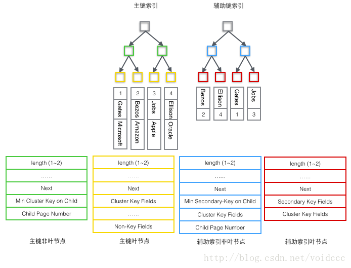

## 索引     
索引是帮助mysql高效获取数据的数据结构。myisam和innodb都使用了这种数据结构作为索引

## 索引的管理       
1. 索引有很多种类型：普通索引，唯一索引，主键索引，组合索引，全文索引等
2. 创建方式         
    create index index_name on table_name (column_name)
3. 修改表结构的方式添加索引     
    alter table table_name add index index_name (column_name)
4. 删除索引     
    drop index index_name on table_name     

    alter table table_name drop index index_name
5. 最左匹配原则     
    创建组合索引，以最左边的为准，只要查询条件中带有最左边的列，那么查询就会使用到索引

6. 为什么不对表中的每一列创建一个索引？     
    1）创建索引和维护索引要耗费时间，这种时间随着数据量的增加而增加         
    2）索引需要占物理空间，处理数据表占数据空间之外，每一个索引还要占一定的物理空间，如果要建立聚簇索引，那么需要的空间更大     
    3）当对表中的数据进行增加，删除和修改的时候，索引也要动态的维护，这样就降低数据的维护速度
7. 为什么需要使用联合索引       
    1）减小开销，建一个联合索引(col1,col2,col3)，实际上相当于建立（col1）,(col1,col2),(col1,col2,col3)三个索引。每多一个索引，都会增加写操作的开销和磁盘空间的开销。对于大量数据的表，使用联合索引会大大的减少开销。        
    2）覆盖索引，对于联合索引（col1，col2，col3），如果有如下的sql：select * from table_name where col1  = 1 and col2 =2 ,msyql可以直接通过遍历索引取得数据，而无需回表，这减少了很多随机io操作。   
    3）效率高，索引列越多，通过索引筛选出的数据越少。有1000W条数据的表，有如下sql:select from table where col1=1 and col2=2 and col3=3,假设每个条件可以筛选出10%的数据，如果只有单值索引，那么通过该索引能筛选出1000W10%=100w条数据，然后再回表从100w条数据中找到符合col2=2 and col3= 3的数据，然后再排序，再分页；如果是联合索引，通过索引筛选出1000w10% 10% *10%=1w，效率提升可想而知！

## 索引的优缺点以及场景     
### 优点  
* 创建唯一性索引，保证数据库表中的每一行数据的唯一性
* 大大加快数据的检索速度    
* 使用分组和排序字句进行数据检索时，同样可以显著较少查询时间
### 缺点    
* 创建索引和维护要耗费时间，这种时间随着数据量的增加而增加
* 索引需要占据物理空间
* 表中数据进行增加，删除，修改的时候，索引也要动态维护，这样就降低了数据的维护速度
### 场景    
* 匹配全值：索引中所有列都指定具体值，即索引中的所有列都有等值匹配的条件
* 匹配值的范围查询 ：索引值能够进行范围查找
* 匹配最左前缀
* 仅仅对索引查询：当查询的列都在索引中时，查询效率更高，避免使用select * ，需要哪些字段，就只查哪些字段。

### 失效场景        
* 以%开头like查询
* 对索引列进行函数运算，例：where ‘age’ + 10 = 30
* 使用负向查询（not， not in，not like，<>, != ,!>, !<）
* 用or分隔开的条件，如果or前有索引， or后无索引，那么涉及的索引也不会被使用

## B-tree
  
    B-tree每个节点最多可以有d个分支(叉)，d称为B-tree的度，如上图所示，他的每个节点可以有4个元素，5个元素，于是他的度为5.b-tree中的元素是有序，正式满足有序的关系，才能高效的查找；首先冲根节点进行二分查找，找到就返回对应的值，否则进入相应的区间节点递归查找，直到找到对应的元素或找到null指针，找到nill指针表示失败。这个查找十分高效，其时间复杂度为O(logN)（以d为低，当d很大时，树的高度就很低），因为每次检索最多只需要检索书高h个节点

## B+tree
  
### Myisam引擎的索引结构
1. myisam引擎的索引结构为B+tree，其中B+tree的数据域存储的内容为实际数据的地址，也就是说他的索引和实际的数据是分开的，只不过是用索引指向了实际的数据，这种索引就是所谓的非聚簇索引

### innodb引擎的索引结构
1. innodb引擎的索引结构同样也是B+tree，但是innodb的索引文件本身就是数据文件，即B+tree的数据域存储的就是实际的数据，这种索引就是聚簇索引。这个索引的key就是数据表的主键，因此innodb表数据文件本身就是主索引。

2. 因为innodb的数据文件本身是要按主键聚集，所以innodb要求表必须有主键，如果没有显式指定，则mysql系统会自动选择一个可以唯一标示数据记录的列作为主键，如果不存在这种列，则mysql自动为innodb表生成一个隐含字段作为主键，这个字段长6个字节，类型为长整型。

3. 并且和myisam不同，innodb的辅助索引数据域存储的也是相应记录主键的值而不是地址，所以当以辅助索引查找时，会先根据辅助索引找到主键，再根据主键索引找到实际的数据。 

## mysql的innodb索引详解        
1. 当数据库一条记录里包含了多个字段时，一颗B+tree就只能存储主键，如果检索的是非主键字段，则主键索引失去作用，又变成顺序查找。这时因为在第二个要检索的字段上简历第二套索引，这个索引由单独的B+tree来组织，。有两种数据存储方式可以解决多个B+tree访问同一套表数据问题，一种叫聚簇索引，另一种种叫非聚簇索引。对于聚簇索引存储来说，行数据和主键B+tree存储在一起，辅助键B+tree只存储辅助键和主键，主键和非主键B+tree几乎是两种类型的树，对于非聚簇索引存储主键B+tree在叶子结点存储指向数据行的指针，而非主键。

2. Myisam使用的是非聚簇索引，非聚簇索引的两颗B+tree看上去没什么不同，节点的结构完全一致只是存储的内容不同而已，主键索引B+tree存储了主键，辅助键索引B+tree存储了辅助键。由于索引树是独立的，通过辅助键索引B+tree检索无需访问主键的索引树

3. 聚簇索引和非聚簇索引的区别   

    其中id为主索引，name为辅助索引

     
     
    
    聚簇索引的优势在哪？    
    1）由于行数据和叶子节点存储在一起，这样主键和行数据是一起被载入内存的，找到叶子节点就可以立刻将数据返回了，如果按照主键id来组织数据，获得数据更快。 
    2）辅助索引使用主键作为指针而不是使用地址值作为指针的好处是，减少了当出现行移动或者数据页分裂时辅助索引的维护工作，使用主键值当作指针会让辅助索引占用更多的空间，换来的好处时innodb在移动时无须更新辅助索引中的这个指针。也就是说行的位置会随着数据库里数据的修改而发生变化。使用聚簇索引就可以保证不管这个主键B+tree树的节点如何变化，辅助索引树都不会受影响

4. page结构 
    page是整个innodb存储的最基本构件，也是innodb磁盘管理的最小单位，与数据库相关的所有内容都存储在这种page结构中。page分为好几种类型。常见的有数据页(b-tree node)，undo页(Undo log Page)，系统页(system page)，事务数据页(transaction system  page)等。单个page的大小是16k，每个page使用一个32位的int值来唯一标识，这也正好对应innodb最大64TB的存储容量（16kb * 2^32 = 64tb）
     

    每个page都有通用的头和尾，但是中部的内容根据page的类型不同而发生变化。page的头部信息如下：
     
    page的头部保存了两个指针，分别指向前一个page和后一个page，头部还有page的类型信息和用来唯一标示page的编号。根据这两个指针我们知道page链接起来就是一个双向链表的结构。
     
    我们主要关注数据和索引的存储，他们都位于page的user records部分，user records占据page的大部分空间，user records由一条条的record组成，每条记录代表索引树上的一个节点(非叶子结点合叶子结点）。在一个page内部单链表到头尾由固定的两条记录来表示,字符串形式的”infimum“代表开头，“supremum”代表结尾。这两个存储在system records的段里，这个system record和user records是两个平行的段。InnoDB存在4种不同的Record，它们分别是1主键索引树非叶节点 2主键索引树叶子节点 3辅助键索引树非叶节点 4辅助键索引树叶子节点。这4种节点的Record格式有一些差异，但是它们都存储着Next指针指向下一个Record 

       
    user records在page内以单链表的形式存在，最初数据是按照插入的先后顺序排列的，但是随着新数据的插入和旧数据的删除，数据物理顺序会变的混乱

      
5. 现在看下如何定位一个Record：

    1）通过根节点开始遍历一个索引的B+树，通过各层非叶子节点最终到达一个Page，这个Page里存放的都是叶子节点。

    2） 在Page内从"Infimum"节点开始遍历单链表（这种遍历往往会被优化），如果找到该键则成功返回。如果记录到达了"supremum"，说明当前Page里没有合适的键，这时要借助Page的Next Page指针，跳转到下一个Page继续从"Infimum"开始逐个查找。

             
6. 根据B+tree节点的不同，user records可以被分成四种格式     

    1）主索引树非叶节点（绿色）     
    * 子节点存储主键里最小的值（Min Cluster Key on Child），这是B+树必须的，作用是在一个Page里定位到具体记录的位置。
    * 最小的值所在的Page的编号（Child Page Number），作用是定位Record。
    
    2）主索引树叶子节点（黄色）     
    * 主键（Cluster Key Fields），B+树必须的，也是数据行的一部分
    * 除去主键以外的所有列（Non-Key Fields），这是数据行的除去主键的其他所有列的集合。
    
    * 这里的1和2两部分加起来就是一个完整的数据行。

    3）辅助索引树非叶节点非（蓝色） 
    * 子节点里存储的辅助键值里的最小的值（Min Secondary-Key on Child），这是B+树必须的，作用是在一个Page里定位到具体的记录的位置。

    * 主键值（Cluster Key Fields），非叶子节点为什么要存储主键呢？因为辅助索引是可以不唯一的，但是B+树要求键的值必须唯一，所以这里把辅助键的值和主键的值合并起来作为在B+树中的真正键值，保证了唯一性。但是这也导致在辅助索引B+树中非叶节点反而比叶子节点多了4个字节。（即下图中蓝色节点反而比红色多了4字节）

    * 最小的值所在的Page的编号（Child Page Number），作用是定位Record。

    4）辅助索引树叶子节点（红色）      
    * 辅助索引键值（Secondary Key Fields），这是B+树必须的。

    * 主键值（Cluster Key Fields），用来在主索引树里再做一次B+树检索来找到整条记录。
    

由于辅助索引的B+树与主键索引有相似的结构，这里只画出了主键索引树的结构图，只包含了"主键非叶节点"和"主键叶子节点"两种节点，也就是上图的的绿色和黄色的部分。
    
