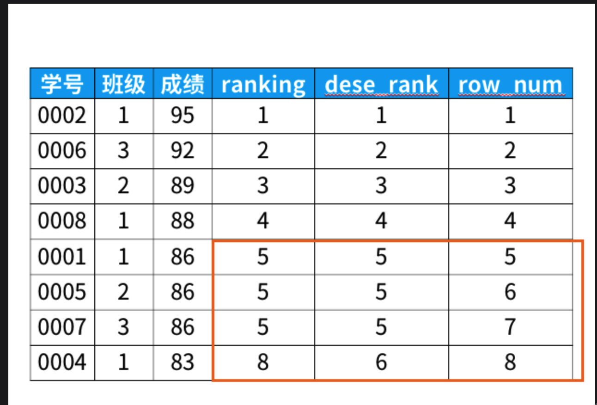

1. 想要了解班级内同学的考试情况，现有一张成绩表表名为A，每行都包含以下内容（已知表中没有重复内容，但所有的考试结果都录入在了同一张表中，一个同学会有多条考试结果

    student_id， student_name ，course_name, score

    (1) 每门课程的到成绩的同学人数          
    > select course_name, count(distinct student_id) from table_name where score != null group by course_name     
    
    (2) 每门课程的平均成绩 
    > select course_name, avg(score) from table_name group by course_name
    
    (3) 查询平均成绩大于60分学生的学号和平均成绩
    > select student_id, avg(score) from table_name group by student_id having avg(score)>60;

    (4) 查询各科最高分和最低分
    > select course_name, max(socre), min(score) from table_name group by coure_name

    (5) 查询每门课被选修的学生数        
    > select count(distinct student_id) from table_name group by course_name

    (6) 查询至少选修了两门课的学生学号      
    > selet  student_id, count(course_name) from table_name group by student_id having count(course_name) >= 2

    (7) 查询同名同姓学生名单并统计各名人数      
    > select count(*) from table_name group by student_name having count(*) >= 2 
    
    (8) 查询不及格的课程并按照课程号从大到小排列    
    > select * from table_name where score < 60 order by course_name desc

    (9) 查询每门课程的平均成绩，结果按平均成绩升序排序，平均成绩相同时按照课程号降序排序        
    > select avg(score) as avgscore from table_name group by course_name order by avgscore asc, course_name desc        
    
    (10) 查询所有课程成绩小于60分的学生     
    > select count(course_name) , student_id from table_name where score < 60  group by student_id  having count(course_name) = 6  

    (11) 查询各科成绩前两名 (top n 问题https://leetcode-cn.com/problems/department-top-three-salaries/solution/tu-jie-sqlmian-shi-ti-jing-dian-topnwen-ti-by-houz/)   
    > select * from table_name group by course_name order by score

    (12) 查询出每门课的及格人数和不及格人数  （case when）  
    > select  course_name , sum (case when score >= 60 then 1 else 0 end) as 及格人数, sum (case when score < 60 then 1 else 0 end) as 不及格人数 from table_name  group by course_name;    

    (13) 按学生的平均成绩排名       
    > select 学号 ,avg(成绩), now_number() over(order by avg(score) desc) from table_name group by student_id 

2. 窗口函数 
    ```golang
    select *,
    rank() over (order by 成绩 desc) as ranking,
    dense_rank() over (order by 成绩 desc) as dese_rank,
    row_number() over (order by 成绩 desc) as row_num
    from 班级;

    ```
    举个例子，如上sql，结果如下：
    

    从上面的结果可以看出：  
    * rank函数：这个例子中是5位，5位，5位，8位，也就是如果有并列名次的行，会占用下一名次的位置。比如正常排名是1，2，3，4，但是现在前3名是并列的名次，结果是：1，1，1，4。

    * dense_rank函数：这个例子中是5位，5位，5位，6位，也就是如果有并列名次的行，不占用下一名次的位置。比如正常排名是1，2，3，4，但是现在前3名是并列的名次，结果是：1，1，1，2。

    * row_number函数：这个例子中是5位，6位，7位，8位，也就是不考虑并列名次的情况。比如前3名是并列的名次，排名是正常的1，2，3，4。


3. top N问题解决        
步骤一：按课程分组(partition by 课程号)，并按成绩降序排列(order by 成绩 desc)，套入窗口函数的语法，就是下面的sql语句：
举例：
    ```golang
    select *,
        dense_rank() over(partition by 课程号
                        order by 成绩 desc) as排名
    from 成绩表;
    ```
    结果：  
    

    步骤二：筛选出前3高的成绩，所以我们在上一步基础上加入一个where字句来筛选出符合条件的数据。（where 排名 <=3）

    ```golang
    select 课程号,学号,成绩,排名 from
    (select *,
        dense_rank() over (partition by 课程号
                    order by 成绩 desc) as 排名
    from 成绩表) as aa
    where 排名 <=3;
    ```
