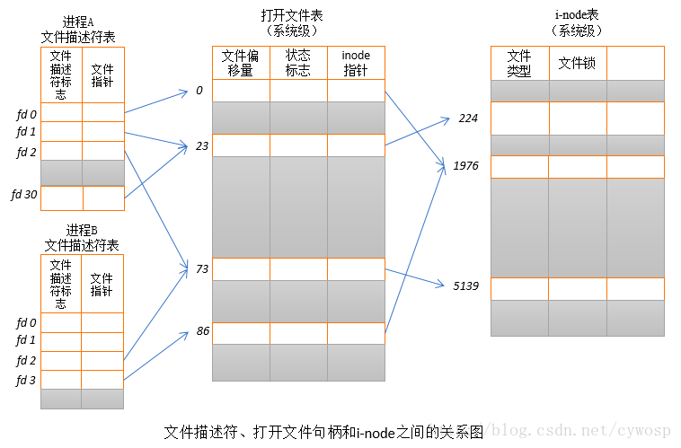

# 文件描述符合socket
首先我们都知道tcp/ip是传输层的协议，解决数据如何在网络中传输。http是应用层协议，主要解决如何包装数据。
socket是对tcp/ip协议的封装，socket本身并不是协议，而是一个调用接口。通过socket我们才能使用tcp/ip协议。
从而形成了我们知道的一些最基本的函数接口，比如：create，listen，connect，accept，send，read和write等等

## 概述
在Linux系统中一切皆可以被看做是文件，文件又可以分为普通文件，目录文件，链接文件和设备文件。文件描述符是内核为了高效管理已被打开的文件所创建的索引。
其是一个非负整数，用于指代被打开的文件，所有执行I/O操作(包括socket操作)的系统调用都通过文件描述符。

程序刚启动的时候，0是标准输入，1是标准输出，2是标准错误。如果此时去打开一个新的文件，他的文件描述符是3。

## 文件描述限制
在编写文件操作或者网络通信的时候，一般我们会遇到"Too many open file"的问题。这主要是因为文件描述符是系统的一个重要资源，虽说系统内存有多少就可以
打开多少，但是在实际实现过程中，内核是会做出相应处理的，一般最大打开 文件数会是系统内存的10%(单位KB, 称之为系统限制)。同时系统为了不让某一个进程耗
费掉所有的文件资源，其也会对单个进程最大打开文件数做默认处理(称之为用户级别限制)，默认值为1024。

## 文件描述符和打开文件之间的关系
每个进程都拥有自己的文件描述符，文件描述符的唯一性是进程+文件描述符ID确定的

## 内核维护的3个数据结构
1. 进程级的文件描述符表
2. 系统级的打开文件描述符表
3. 文件系统的i-node表

进程级的描述符表的每一条目记录了单个文件描述符的相关信息
1. 控制文件描述符操作的一组标志(目前，此类标志仅定义了一个，即close-on-exec标志)
2. 对打开文件句柄的引用

内核对所有打开的文件维护有一个系统级的描述符表格，有时也称之为文件表(open file table)，并将表格中各条目称之为打开文件句柄。一个打开文件句柄存储了与
一个文件相关的全部信息，如下所示：
1. 当前文件偏移量(调用read()和write()时更新，或使用lseek()直接修改)
2. 打开文件时所使用的状态标识(即，open()的flags参数)
3. 文件访问模式(如，调用open()所设置的只读模式，只写模式或读写模式)
4. 与信号驱动相关的设置
5. 与该文件i-node对象的引用
6. 文件类型和访问权限
7. 一个指针，指向该文件所持有的锁列表
8. 文件的各种属性，包括文件大小以及与不同类型操作相关的时间戳

下图展示了文件描述符，打开的文件句柄以及i-node之间的关系，图中，两个进程拥有诸多打开的文件描述符

在进程A中，文件描述符1和30都指向了同一个打开的文件句柄(标号23)，这可能是通过调用dup()，dup2()，fcntl()或者对同一个文件多次调用了open()函数而形成的
进程A的文件描述符2和进程B的文件描述符2都指向了同一个打开的文件句柄(标号73)。这种情形可能是调用fork()后出现的情况，即进程A，进程B之间是父子进程