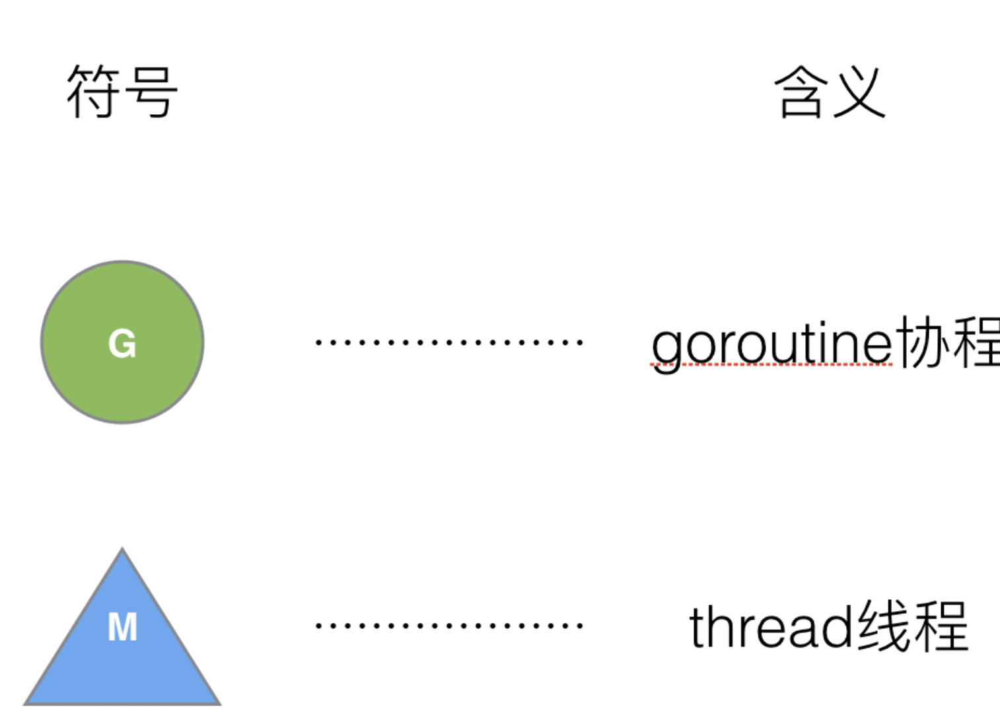
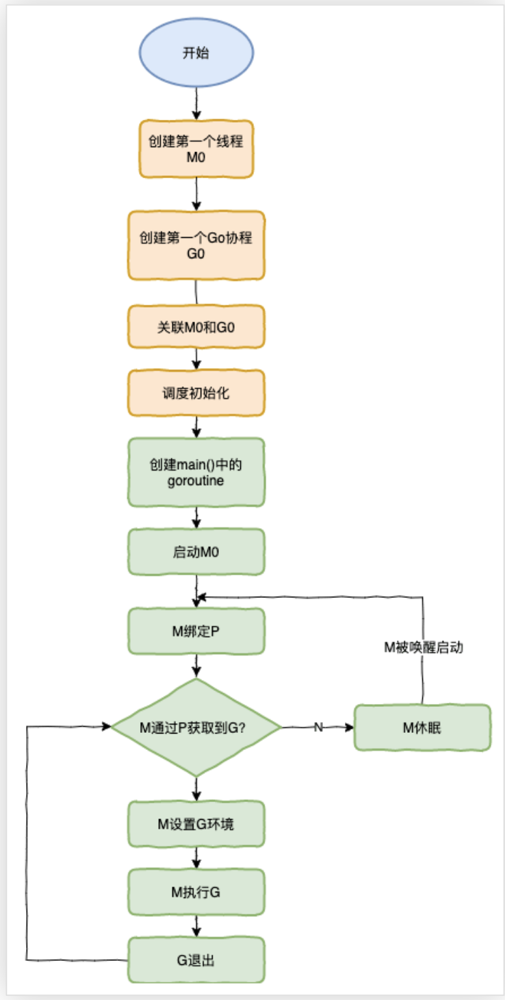

## 线程和协程和进程
1. 概念         

    进程： 

        进程是并发执行程序在执行过程中资源分配和管理的基本单位(资源分配的最小单位)。每个进程都有自己的独立的内存空间，不同进程通过进程间通信来通信。由于进程比较重量，占据独立内存，所以上下文切换开销(栈，寄存器，虚拟内存，文件句柄等)比较大


    线程：

        一个进程可以包含多个线程，每个线程使用其所属进程的栈空间。线程基本上只拥有一点在运行中必不可少的资源（如程序计数器，一组寄存器和栈），线程间的通信主要通过共享内存，上下文切换很快，资源开销少但相比进程不够稳定容易丢失数据

    协程：

        协程是一种用户态的轻量级线程，协程的调度完全由用户控制。协程拥有自己的寄存器上下文和栈。协程调度切换时，将寄存器上下文和栈保存到其他地方，在切回来的时候，恢复先前保存的寄存器上下文和栈，直接操作栈则基本没有内核切换的开销，可以不加锁的访问全局变量，所以上下文的切换非常快。
2. 区别

    进程与线程
        
        线程是进程中的一个执行单位，也是进程内的可调度实体
        1）地址空间：线程是资源分配和拥有的单位，进程内至少一个线程，他们共享进程的地址空间，而进程有自己独立的地址空间
        2）线程是处理器调度的基本单位,但进程不是     
        3）二者均可并发执行
        4）每个独立的线程都有一个程序运行入口，顺序执行序列和程序的出口，但是线程不能够独立运行，必须依存在应用程序中，由应用程序提供多个线程执行控制
    协程和线程
        1）一个线程可以多个协程，一个协程也可以单独拥有多个协程
        2）线程进程都是同步机制，而协程是异步的
        3）协程可以保留上一次调用时的状态，每次过程重入时，就相当于进入上一次的调用状态
        4）​ 线程由CPU调度是抢占式的，协程由用户态调度是协作式的，一个协程让出CPU后，才执行下一个协程。

3. 协程来提高CPU利用率
    
    多线程多进程提高了系统的并发能力，但是会随之带来高内存占用，调度的高损耗CPU。然后工程师发现一个线程可以分为内核态线程，和用户态线程。一个用户态线程必须绑定一个内核态线程，但是CPU并不知道用户态线程的存在，他只知道她运行的是一个内核态线程（linux的PCB进程控制快）    

    这样，我们再去细化去分类一下，内核线程依然叫 “线程 (thread)”，用户线程叫 “协程 (co-routine)”。既然一个协程可以绑定一个线程，那么多个协程可以绑定在一个或者多个线程上

    N:1

        N个协程绑定1个线程，优点是协程在用户态线程即可完成切换，不会陷入内核态，这种切换非常轻量快速。但是也有缺点，一个进程的所有协程都绑定在一个线程上，

        缺点：
            某个程序用不了硬件的多核加速能力
            一旦某协程阻塞，造成线程阻塞，本进程的其他协程都无法执行了根本没有并发能力
      

    M:N         
    
        M 个协程绑定 1 个线程，是 N:1 和 1:1 类型的结合，克服了以上 2 种模型的缺点，但实现起来最为复杂。协程和线程是有区别的，线程是CPU调度是抢占式的，协程式用户态调度是协作式的，一个协程让出CPU后，才执行下一个协程。        
## go语言的goroutine（参考博客：https://learnku.com/articles/41728）
        go为了提供更容易使用的并发方法，使用了goroutine和channel。goroutine来自协程的概念，让一组可复用的函数运行在一组线程之上，即使有协程阻塞，该线程的其他协程也可以被runtime调度，转移到其他可运行的线程上。最关键的是程序员看不到这些底层的细节，这就降低了编程的难度，提供了更容易的并发。

        在go中，协程被成为goroutine，非常轻量，一个goroutine只占用几KB。虽然一个 goroutine 的栈只占几 KB，但实际是可伸缩的，如果需要更多内容，runtime会自动为goroutine分配。

        Goroutine特点：
            占用内存更小（几 kb）
            调度更灵活 (runtime 调度)

1. 被废弃的goroutine调度器  
大部分的文章都会用G代表协程，用M代表线程    
     
下面我们来看看被废弃的golang 调度器是如何实现的？
          
M想要执行，放回G都必须访问全局G队列，并且M有多个，即多个线程访问同一资源需要加锁保证互斥/同步，所以全局 G队列是有互斥锁进行保护的。

    老调度器的缺点：
    
    1. 创建、销毁、调度 G 都需要每个 M 获取锁，这就形成了激烈的锁竞争。

    2. M 转移 G 会造成延迟和额外的系统负载。比如当 G 中包含创建新协程的时候，M 创建了 G’，为了继续执行 G，需要把 G’交给 M’执行，也造成了很差的局部性，因为 G’和 G 是相关的，最好放在 M 上执行，而不是其他 M’。

    3. 系统调用 (CPU 在 M 之间的切换) 导致频繁的线程阻塞和取消阻塞操作增加了系统开销。

2. Goroutine调度器的GMP模型的设计思想   

        在新的调度器中除了M和G,又引进了P(Processor处理器)，Processor它包含了运行goroutine的资源，如果线程想要运行goroutine，必须先获取P， P中还包含了可运行的G队列

    2.1 GMP模型    

        在go中，线程是运行goroutine的实体，调度器的功能是把可运行的goroutine分配到工作线程上。
              
    
        1）全局队列：存放等待运行的G
        2）P的本地队列：同全局队列类似，存放的也是等待运行的G，存的数量有限，不超过256个。新建G`时G`优先加入P的本地队列，如果队列满了，则会把本地队列中一半的G移动到全局队列
        3）P列表：所有P都在程序启动时创建，并保存在数组中，最多有GOMAXPROCS个
        4）M：线程想要运行任务就得获取P，从P的本地队列获取G， P队列为空时，M也会尝试从全局队列拿一批G放到P的本地地队列，或从其他P的本地队列偷一半放到自己P的本地队列。M运行G，G执行之后，M会从P获取下一个G，不断重复下去。
    

    goroutine的调度器和OS调度器是通过M结合起来的，每个M都代表了1个内核线程，OS调度器负责把内核线程分配到CPU的核上进行执行

    2.2 有关P和M的个数问题

    1. P的数量：由启动时环境变量$GOMAXPROCS或者时由runtime的方法GOMAXPROCS()决定。这意味着程序执行的任意时刻都只有$GOMAXPROCS个goroutine在同时运行。
    2. M的数量：    

        * go语言本身的限制： go程序启动时，会设置M的最大数量，默认是10000，但是内核很难支撑这么多的线程数，所以这个限制可以忽略。
        * runtime/debug中的SetSetMaxThreads函数，设置M的最大数量
        * 一个M阻塞了，会创建新的M出来

        M和P的数量没有绝对的关系，一个M阻塞了，P就会去创建或者切换另一个M，所以即使P的默认数量是1，也有可能创建出来很多的M。

    2.3 P和M何时会被创建   
  
    1. P何时被创建：在确定了P的最大数量n后，运行时系统会根据这个数量创建对应数量的P
    2. M何时被创建：没有足够的M来关联P并运行其中的可运行的G。比如所有的M都被阻塞了，而P中还有很多就绪任务，就会去寻找空闲的M,而没有空闲的就会去创建新的M

    2.4 调度器的设计策略        

        复用线程：避免频繁的创建，销毁线程，而是对线程的复用    
            1）work stealing机制
            当本线程无可用的G时，尝试从其他线程绑定的P偷取G，而不是销毁线程
            2）hand off机制    
            当本线程因为G进行系统调用阻塞时，线程释放绑定的P，把P转移给其他空闲的线程执行。
                利用并行：GOMAXPROCS设置P的数量，最多有GOMAXPROCS个线程分布运行在多个CPU上同时运行。GOMAXPROCS也限制了并发的程度，比如GOMAXPROCS = 核数/2，则最多利用了一半的CPU核进行并行。    
                抢占：在coroutine(协作程序)中要等待一个协程主动让出CPU才执行下一个协程，在GO中，一个goroutine最多占用CPU 10ms，防止其他goroutine被饿死，这就是goroutine不同于 coroutine的一个地方。     
                全局G队列：在新的调度器中依然有全局G队列，但是功能已经被弱化，当M执行work stealing从其他P偷不到G时，它可以从全局G队列获取G
    2.5 go func()调度流程 
            
    从上图我们可以分许出几个结论：      
    1. 我们通过go func()创建一个goroutine
    2. 有两个存储G的队列，一个是局部调度器P的本地队列，另一个是全局的G队列。新创建的G会现保存在P的本地队列中，如果P的本地队列已经满了就会保存在全局的队列中
    3. G只能运行在M中，一个M必须持有一个P，M和P是1:1的关系。M会从P的本地队列中弹出一个可执行状态的G来执行，如果P的本地队列为空，就会向其他的MP组合偷取一个可执行的G来执行
    4. 一个M调度G的过程是个循环机制
    5. 当M执行某一个G时如果发生了阻塞，M就会阻塞，如果当前有一些G在执行，runtime会把这个线程M从P中摘除（detach），然后在创建一个新的操作系统线程(如果有空闲的线程可用就复用空闲线程) 来服务于这个P
    6. 当M系统调用结束时候，这个G会尝试获取一个空闲的P执行，并放入到这个P的本地队列中。如果获取不到P，那么这个线程M会变成休眠状态，加入到空闲线程中，然后这个会被放入到全局队列中。 

    2.6 调度器的生命周期        

    
    
    特殊的 M0 和 G0     

    M0 ：

        M0是启动程序后的编号为0的主线程，这个M对应的实例会在全局变量runtime.m0中，不需要在heap上分配，M0负责执行初始化操作和启动第一个G， 在之后M0就和其他的M一样了。
    G0 ：  

        G0是每次启动一个M都会第一个创建的goroutine，G0仅负责调度G，G0不指向任何可执行的函数，每个M都会有一个自己的G0。在调度或者系统调用时会使用G0的栈空间，全局变量的G0是M0的G0

    如下我们追踪一段代码
    ```golang
    package main

    import "fmt"

    func main() {
        fmt.Println("Hello world")
    }
    ```
    1. runtime创建最初的线程M0和G0，并把两者关联
    2. 调度器初始化：初始化M0，栈，垃圾回收，以及创建和初始化由 GOMAXPROCS个P构成的P列表
    3. 示例代码中的main函数是main.main，runtime中也有一个main函数--runtime.main，代码经过编译后，runtime.main会调用main.main，程序启动的时候会为runtime.main，创建goroutine，称它为 main goroutine 吧，然后把 main goroutine 加入到 P 的本地队列。
    4. 启动M0，M0已经绑定了P，会从P的本地队列获取G，获取到main goroutine
    5. G拥有栈，M根据G中的栈信息和调度信息设置运行环境
    6. M运行G
    7. G 退出，再次回到 M 获取可运行的 G，这样重复下去，直到 main.main 退出，runtime.main 执行 Defer 和 Panic 处理，或调用 runtime.exit 退出程序。

    调度器的生命周期几乎占满了一个Go程序的一生，runtime.main的goroutine执行之前都是为了调度器作准备工作，runtime.main 的 goroutine 运行，才是调度器的真正开始，直到 runtime.main 结束而结束。