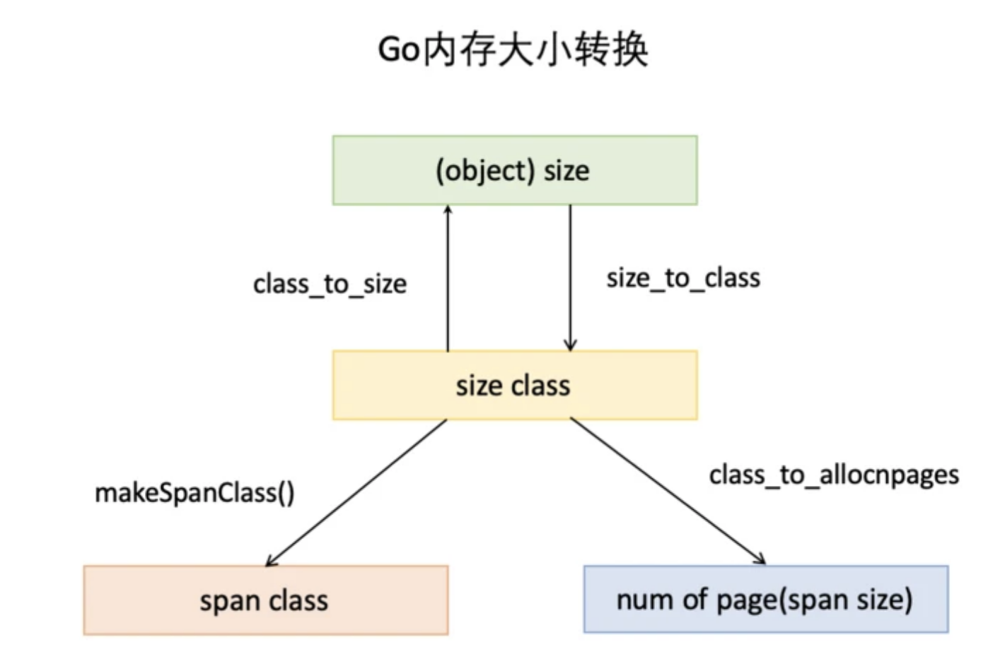

1. 简述：  
    有关go内存是在堆上分配，还是栈上分配。这个是在编译期间，通过逃逸分析来定的，其主体思想是通过：假设有变量v，及指向v的指针p，如果p的生命周期大于v，则v的内存分配要在堆上分配

2. 内存按块管理：                   
    内存块一般是由空闲链表来管理：维护一个类似链表的数据结构。当用户程序申请内存时，空闲链表的分配器会依次遍历空闲的内存块，找到足够大的内存，然后申请新的资源并修改链表。因为分配内存时，需要遍历链表，时间复杂度为O(n)。为了提高效率，将内存块分成多个链表，每个链表中的内存块的大小相同(不同的链表不同)，申请内存时先找到满足条件的链表，再从链表中选择合适的内存块，减少遍历的内存块数

3. 内存分配算法(tcmalloc)   
    在tcmalloc内存管理内部分为两部分：线程内存和页堆        
    * 每一个线程都可以获得一个用于无锁分配小对象的缓存，这样可以让并行程序分配小对象(<=32kb)非常高效。go中的叫做mcache(挂在每一个P)
    * tcmalloc管理的堆由一组页组成，一组连续的页被称为span，当分配的对象大于32kb，将使用页堆进行内存分配

    做法： 为每个线程预分配一块缓存，线程申请小内存时，可以直接从缓存分配，这样做有两个好处：  
    * 为线程预分配缓存需要进行1次系统调用，后续线程申请小内存，从缓存分配，都是在用户态执行，没有系统调用，缩短了内存总体的分配和释放时间
    * 多个线程同时申请小内存时，从各自的缓存分配，访问的是不同的地址空间，无需加锁。

    tcmalloc的几个关键概念：            

    * page： 操作系统对内存管理以页为单位   
    * span：一组连续的page被称为span，span是tcmalloc中内存管理的基本单位    
    * threadcache：每个线程各自的cache，一个cache包含多个空闲内存块链表，每个内存块链表的内存块大小都是一样的，不同的内存块链表的内存块大小不同，访问无锁
    * centralcache：是所有线程共享的缓存，也是保存的空闲内存块链表，链表数量与threadcache中链表的数量是相同的。当threadcache中内存块不足时，会从centralcache中获取，当threadcache中的内存块过多时，会放回centralcache。由于centralcache时共享的，所以它的访问时需要加锁的。
    * pageheap：pageheap是堆内存的抽象。pageheap存的也是若干链表，链表保存的也是span，当centralcache没有内存时，会从pageheap取，把1个span拆成若干内存块，添加到对应大小的链表中，当CentralCache内存多的时候，会放回PageHeap。pageheap也是需要加锁的。           

    上文提到了小，中， 大的对象，go内存的管理中也有类似的概念。tcmalloc中也有相应的定义： 

    * 小对象：0～256kb
    * 中对象：257～1Mb
    * 大对象：>1Mb

    小对象的分配流程：ThreadCache -> CentralCache -> HeapPage       

    中对象的分配流程：直接在pageheap中选择适当大小即可，128page的span所保存的最大内存就是1Mb

    大对象分配流程：从large span set选择合适数量的页面组成span，用来存储数据。
4. go的内存管理     
前面提到了go内存管理源自tcmalloc，它比tcmalloc多了：逃逸分析和垃圾回收。

go的内存分配器主要包含以下几个核心组件：   
    * heapArena：保留整个虚拟地址空间
    * mheap：分配的堆，再页大小为8KB的粒度上进行管理
    * mspan：是mheap上管理的一连串页
    * mcentral：收集了给定大小等级的所有span
    * mcache：为pre-P的缓存
        
        * page：和tcmalloc中的page相同，x64下的1个page的大小是8kb。上图的最下方，1个浅蓝色长方形代表1个page。
        * span：与tcmalloc中的span相同，span是内存管理的基本单位，go中叫做mspan，一组连续的Page组成1个Span，上图中1个淡紫色长方形为1个span。
        * mcache：mcache和tcmalloc中的threadcache类似，mcache保存的是各种大小的span，并按照span class分类，小对象直接从mcache分配，起到缓存作用，并且可以无锁访问       
        不同点：mcache与threadcache的不同点，tcmalloc中是每个线程1个threadcache，go中是每个P拥有1个mcache，因为在go程序中，当前最多拥有gomaxprocs个线程在用户态运行，所以最多需要gomaxprocs个mcache就可以保证各线程对mcache的无锁访问，线程的运行又是和p绑定的，把mcache交给p刚刚好
        * mcentral：mcentral与tcmalloc中的centralcache类似，是所有的线程共享的缓存，需要加锁访问，它按照span class对span分类，串联成链表，当mcache的某个级别span的内存被分配光时，他会向mcentral申请一个当前级别的span。    
        不同点：centralcache是每个级别的span有一个链表，mcentral是每个级别的span有两个链表。
        * mheap：mheap与tcmalloc中的pageheap类似，他是堆内存的抽象，把从OS申请出得内存页组织成span，并保存起来。当mcentral的span不够用时会向mheap申请，mheap的span不够用时会向OS申请，向OS的申请是按照页来的，然后把申请来的内存页生成span组织起来，同时也需要加锁访问  
        不同点：mheap把span组织成了树结构，而不是链表，而且还是两颗树，然后把span分配到heapArena进行管理，它包含地址映射和span是否包含指针等位图，这样做的主要原因是为了保持高效的利用内存：分配，回收和再利用  

5. 大小转换     
除了以上内存管理组织概念，还有几个重要概念是内存分配，组织和地址转换的基础

    * object size：代码中简称size。指申请的内存对象大小
    * size class：代码中简称class，他是size的级别，相当于是把size归类到一定大小的区间段，比如size[1，8]属于size class 1，size(8，16]属于size class 2。
    * span class：指span的级别，但span class的大小与span的大小并没有正比关系。span class主要是和size class做对应，1个size class 对应2个span class，2个span class的span 大小相同，只是功能不同。1个用来存放包含指针的对象，一个用来存放不包含指针的对象，不包含指针对象的span就无需GC扫描了
    * num of page：代码中简称npage，代表page的数量，其实就是span包含的数量，用来分配内存

6. Go内存分配原理       
go中的内存分类并不像tcmalloc那样分成小，中，大对象。但是他的小对象中又细分了一个tiny对象。tiny对象指大小在1byte到16byte之间且不包含指针的对象。小对象和大对象只用大小划分。小对象是在mcache中分配的，而大对象是直接从mheap分配的，从小对象的内存分配看起。

