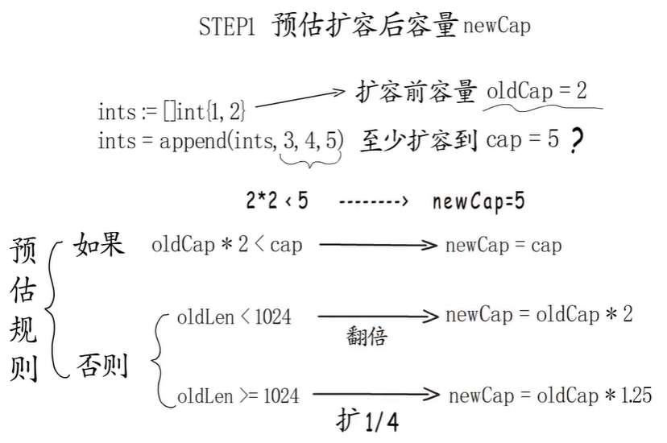

1. 基本概念
* 在slice中len和cap时是两个完全不同的概念，len代表了元素个数，cap说明slice空间可以容纳多少个元素。
* 在对 slice 进行 append 操作时, 如果 cap 容量足够，则直接在当前slice后面附加上添加的值，并将 len 修改为当前元素的个数。
* 如果 cap 容量不够，则重新创建一个slice, 并将之前的slice 复制到新的slice中然后将添加的值附加到新的slice上。

2. 扩容规则         

