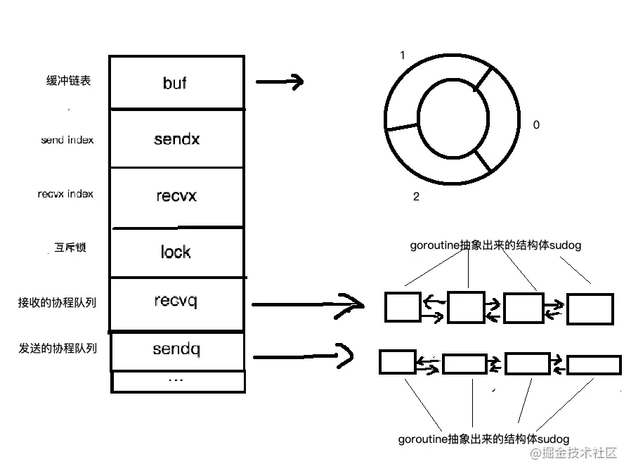

## go的并发模型 
我们先从线程讲起，无论语言层面何种并发模型，到了操作系统层面一定是以线程的形态存在。而操作系统根据资源访问权限的不同，体系架构分为用户空间和内核空间；内核空间主要操作访问cpu资源，i/o资源，内存资源等硬件资源，为上层的应用提供最基本的基础资源，用户空间就是上层应用程序的固定活动空间。用户空间不可以直接访问资源，必须通过系统调用，库函数，shell脚本来调用内核空间提供的资源。

我们现在的计算机语言中描述的线程一般是用户态的线程，和内核态的线程还是有区别的。

* 线程模型的实现可以分为以下几种        
    * M:1
    * 1:1

## 多线程   
多线程是目前流行的并发场景的解决方案，由于线程的更加轻量级，创建和销毁的成本都很低。并且线程之间的通信和共享内存非常方便，和多进程的开销相比小的多

但是多线程也有缺点，一个缺点是开销。虽然线程的开销要比进程小的多，但是如果创建和销毁的比较频繁，消耗依然比较大。针对这个问题，就有了线程池的设计。创建一大批线程放入线程池，需要用的时候再拿出来，用完再放回线程池，代替了销毁和创建两个操作

## 协程     
也叫做轻量级线程，本质上仍然是线程。和多线程最大的区别在于，协程的调度是用户程序而不是操作系统

## 共享内存和CSP
我们常见的多线程模型是通过共享内存的方式实现通信，但是共享内存是有很多问题的，比如资源抢占问题，一致性问题。我们需要引入多线程锁，原子操作等等限制来保证程序的执行结果的正确性。

除了共享内存的模型外，还有一个经典模型就是csp模型，中文名叫通信顺序进程，是一种并发编程模型，是一种强大的并发数据模型，用于描述两个独立的并发实体通过共享的通讯channel(管道)进行通信的并发模型。相对于actor模型，csp模型中channel是第一类对象，他不关注发送消息的实体，而关注与发送消息时使用的channel。

具体到golang中，只使用了理论中process/channel，对应到golang中就是goroutine/channel，

## channel      
goroutine和channel是go语言并发编程的两大基石。goroutine用于执行并发任务，channel用于goroutine之间的同步，通信。


channel在goroutine之间架起了一条管道，在管道里传输数据，实现goroutine间的通信；由于它是线程安全的，所以使用起来非常方便；channel还提供先进先出的特性；可以影响goroutine的唤醒和阻塞。
```golang
chan T // 声明一个双向通道
chan<-  T // 声明一个只能用于发送的通道
<-chan T // 声明一个只能用于接受的通道copy
```
channel在未初始化之前的默认值是nil，使用make进行初始化，可以传递一个非0的数值，构造一个缓冲型的channel，；不传或者传0都是非缓冲型的。go语言通过channel实现CSP通信模型，主要用于goroutine之间的消息传递和事件通知。
## channel的数据类型       
channel是引用类型的数据，在作为参数传递的时候，传递的是内存地址
```golang
func main() {
    ch1 := make(chan int)
    fmt.Printf("%T,%p\n",ch1,ch1)

    test1(ch1)
}

func test1(ch chan int){
    fmt.Printf("%T,%p\n",ch,ch)
}


输出：  

chan int,0xc00008c060
chan int,0xc00008c060
```

我们可以看到ch和ch1的地址是一样的，说明他们是同一个通道

## channel的使用       
channel通道在使用的时候，需要注意以下几点： 
* 用于goroutine，传递信息
* 通道 ，每个都有相关联的数据类型，nil chan 不能使用，就和nilmap一样不能直接赋予键值对。
* 使用通道传递数据： chan <- data 发送数据到通道。 data <- chan，从通道中获取数据
* 阻塞：发送数据： chan <- data 阻塞的，直到另一条goroutine，读取数据来解除阻塞；读取数据：data <- chan 也是阻塞的，直到有一条goroutine，写入数据解除阻塞。
* 本身channel就是同步的，意味着同一时间，只能有一条goroutine来操作
## channle的底层实现原理        
1. 基础结构
    ```golang
    type hchan struct {
       qcount   uint           // channel通道中元素个数
       dataqsiz uint           // 环形队列中数据大小
       buf      unsafe.Pointer // 存放实际元素的位置，数组实现的循环队列
       elemsize uint16  // channnel类型大小
       closed   uint32  // channnel是否关闭
       elemtype *_type // channel中元素类型
       sendx    uint   // 发送的goroutine在buf中的位置
       recvx    uint   // 接收的goroutine在buf中的位置
       recvq    waitq  // 等待读取的goroutine队列
       sendq    waitq  // 等待写入的goroutine队列
    ```
    

    * buf： 是带有缓冲的channel所持有的特有结构，用来存储缓存数据。是个循环链表。
    * sendx和recvx用于记录buf这个循环链表中发送或者接收的index
    * lock是个互斥锁
    * recvq和sendq分别是接收或者发送的goroutine抽象出来的结构体（sudog）的队列。是个双向列表。

2. channel中的sendx和recvx
    如果想让goroutine以先进先出的方式进入一个结构体，肯定会使用锁的机制。正好channel 包含一个互斥锁

    * channel中队列是如何实现的 
        channel中有个缓存buf，是用来缓存数据的队列。这个队列是个循环链表   
        > ch := make(chan int, 3)
        * 当使用send和recv的时候，首先锁住hchan这个结构体
        * 然后send数据
        * 我们加入3个数据，这个时候buf满了，队列塞不进去了
        * 然后recv的过程也是个逆向操作，也是需要加锁的
        * recvx和sendx是根据循环链表buf变动而变动的
    * send和recv的细化操作
        * 每一步操作可以细化为加锁
        * 把数据从goroutine中copy到队列中（或者从队列中copy到goroutine中）
        * 释放锁
    * 当channel缓存满了之后会发生什么？这其中原理是怎么样的     
        * 我们知道go的goroutine是用户态的线程，用户态的线程是需要自己去调度的，go运行时的scheduler去帮我们完成调度这件事。
        * goroutine的阻塞操作实际上是调用send或者recv主动触发的，当有goroutine往一个缓存已经满了的channel中send的时候，调度器会将当前阻塞的goroutine 挂起，让出线程(M)，让其他可以被运行的G使用当前线程（M）。同时挂起的goroutine也会被抽象成含有G1指针和send元素的sudog结构体保存到sendq中被等待唤醒
        * 那么被放入的goroutine什么时候被唤起呢？这个时候假如有另一个goroutine G2，从缓存已满的channel 接收了一个数据，channel会将等待队列中的G1推出，将G1当时send的数据推到缓存中，然后调用go的scheduler，唤醒G1，并将G1放在可运行的goroutine队列中
    * 当recv一个空channel时，由数据send过来，会发生什么     
        * 加入G2协程在recv一个空buf的channel，G2会被抽象成含有G2指针和recv空元素的sudog结构保存在hchan的recvq中等待被唤醒
        * 此时恰好有个goroutine G1向channel中推送数据ch <-1 
        * G1并没有锁住channel，然后将数据放在缓存中，而是直接将数据从G1直接拷贝到G2的栈中，在唤醒过程中，G2无需再获得channel的锁，然后再从缓存中取数据
## golang waitgroup原理刨析         
sync.waitgroup时golang中常用的并发措施，我们可以用它来等待一批goroutine的结束       
1. waitgroup的使用      
    ```golang
    func main() {
        var wg sync.WaitGroup
        for i := 1; i <= 5; i++ {
            wg.Add(1)
            go func() {
                defer wg.Done()
                println("hello")
            }()
        }

        wg.Wait()
    }
    ``` 
    waitgroup的用法非常简单： 使用add添加需要等待的个数，使用done来通知waitgroup任务已完成，使用wait来等待所有的goroutine结束
2. WaitGroup 的实现逻辑         
    基本结构
    ```golang
    type WaitGroup struct {
        noCopy noCopy
        state1 [3]uint32
    }
    ```
    其中noCopy时golang源码中检测禁止拷贝的技术。如果程序中有waitgroup的赋值行为，使用go vet检查程序时，就会发现有报错。但是noCopy不会影响程序的正常编译和运行       

    state1 [3]uint32字段中包含了waitgroup的所有状态数据。这个字段的设计比较复杂。后面再讲

    如果不考虑内存对齐和和并发安全等方面的因素，waitgroup可以近似看成下面的代码：
    ```golang
    type WaitGroup struct {
        counter int32
        waiter  uint32
        sema    uint32
    }
    ```
    * counter代表目前尚未完成的个数，waitgroup.add(n)将会导致counter += n， 而waitgroup.done()将会导致counter--
    * waiter代表目前已经调用waitgroup.wait的goroutine的个数
    * sema对应于golang中的runtime内部的信号量的实现。waitgroup中会用sema中两个相关的的函数，runtime_semacquire和runtime_semrelease。runtime_semacquire表示增加一个信号量，并挂起当前goroutine，runtime_Semrelease表示减少一个信号量并唤醒sema上其中一个正在等待的goroutine  

    waitgroup的的整个调用过程可以简单描述成如下：
    * 当调用waitgroup.add(n)时，counter 将会自增: counter += n
    * 当调用waitGroup.Wait()时，会将waiter++。同时调用runtime_Semacquire(semap)，增加信号量，并挂起当前 goroutine
    * 当调用waitgroup.done时，会将counter--，如果自减后的counter等于0， 说明waitgroup的等待过程已经结束，则需要调用runtime_Semrelease释放信号量。唤醒正在WaitGroup.Wait 的 goroutine。  

    WaitGroup 的底层内存结构

        我们回来看到WaitGroup中的state1的内存结构。state1长度为3的uint32的数组，其中state1包含了三个变量的语义和行为，其内存结构如下：
    
    * 我们在图中提到了golang的内存对齐的概念。简单来说，如果变量时64位对齐(64位操作系统)，则该变量的起始位置时8的倍数。如果变量时32位对齐(32位操作系统) ，则该变量的起始地址是4的倍数。
    * 从上图可以看出，当state1是32位对齐和64位对齐的情况下，state1中每个元素的顺序和含义也是不一样的
        * 当state1是32位对齐：state1数组的第一位是sema，第二位是counter，第三位是waiter
        * 当state1是64位对齐：state1数组的第一位是counter，第二位是waiter，第三位是sema。       
    
     [3]uint32 存储变量的是什么呢，涉及两个前提          
    * 在waitgroup的真实逻辑中， counter和waiter被合在一起，组成64位整数对外提供使用，当需要变化counter和waiter的值时，也是通过atomic来原子操作这64位整数
    * 在 32 位系统下，如果使用 atomic 对 64 位变量进行原子操作，调用者需要自行保证变量的 64 位对齐，否则将会出现异常


    WaitGroup的无锁实现 

    * 我们在上文讲到，在waitgroup中，其实是把counter和waiter看成是一个64位整数进行处理。counter和waiter在改变时需要保证并发安全。对于这种场景我们最容易想到的是通过mutex或者rwmutex锁，在需要读写时counter或者waiter时，加锁完事。但是我们知道加锁必然会造成额外的新能开销。

    * WaitGroup直接把counter和waiter看成一个统一的64位变量。其中counter是这个变量的高32位，waiter时低32位。在需要改变counter时，将累加值左移32，然后相加

    * 在 Wait 函数中通过cas操作atomic.CompareAndSwapUint64(statep, state, state+1)，来对waiter进行自增操作如果cas操作返回false，说明state变量有修改，有可能是 counter 发生了变化，这个时候需要重试检查逻辑条件。
    * 因为wait是可以复用的，因此在wait结束的时候将waiter--，重置状态。但是这肯定会涉及到原子变量操作。如果调用wait的goroutine比较多，那这个原子操作也会随之进行很多次。但是waitGroup这里直接在done的时候，当counter等于0的时候，直接将counter+waiter整个64位整数全部置为0


## CAS是什么？      
cas中文意思是比较并替换。cas有3个操作数：内存地址V，旧的预期值A，即将更新的目标值B 。CAS指令执行时，当且仅当内存地址V的值与旧的预期值A相等时，将内存地址V的值修改为B，否则就什么都不做。整个比较并替换的操作是一个原子操作。
## 相关面试题       
1. 通道的关注点：  
    * 对一个关闭的通道在发送数据会导致panic
    * 对一个关闭的通道进行接受会一直获取值，直到通道为空
    * 对一个关闭的并且没有值的通道执行接受会得到对应类型的零值
    * 关闭一个已经关闭的通道会导致panic
    * 通道可以作为参数在函数中传递，当作参数传递时，复制的是引用
    * 缓冲通道中的值放满之后，再往通道内发送数据，操作会被阻塞。当数据被接受后，会通知最早被阻塞的goroutine，重新发送数据。接受是一样的

2. select ：    
    ```golang
    c1 := make(chan int ,10)
    c2 := make(chan int ,10)
    c3 := make(chan int ,10)
    var i1, i2 int

    c1 <- 10
    c3 <- 20
    select {
       case i1 = <-c1:
          fmt.Printf("received i1=%d \n", i1)  // 输出 received i1=10
       case c2 <- i2:
          fmt.Printf("sent %d \n", i2 ) // 输出 sent 0 
       case i3, ok := (<-c3):  // 等价于 i3, ok := <-c3
          if ok {
             fmt.Printf("received i3=%d \n", i3) // 输出received i3=20
          } else {
             fmt.Printf("c3 is closed\n")
          }
       default:
          fmt.Printf("no communication\n")
    }
    ```
    select再满足多个case时，会在满足条件的case中随机执行一个。当select语句没有满足条件的case时，且没有定义default时，当前select所在协程会陷入阻塞状态。
