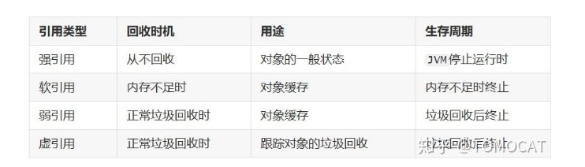
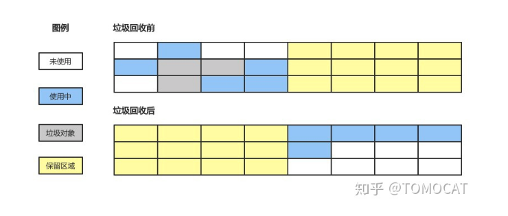
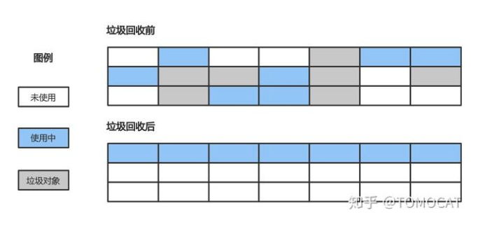

再讲三色标记算法之前先普及点知识，知道即可
## 根对象
        根对象在垃圾回收的术语中又叫做根集合，它是垃圾回收器在标记过程中最先检查的对象，包括：
        * 全局变量：程序在编译期间就能确定的存在于程序整个生命周期的变量
        * 执行栈：每个goroutine都包含自己的执行栈，这些执行栈上包含栈上的变量及指向分配的堆内存区块的指针
        * 寄存器：寄存器的值可能就表示一个指针，参与计算的这些指针可能指向某些赋值器的堆内存区块
## 可达性分析算法
       追踪式垃圾收集中有标记-清除，标记-复制，标记-整理，这三种垃圾收集算法虽然处理方式各不相同，但是处理的的第一阶段都是追踪阶段，此阶段正是使用的可达性分析算法进行遍历和标记的。

       1. 原理
       从根集合里面的每一个GC Roots的引用关系遍历GC堆的对象图，遍历的路径成为引用链，如果GC堆中某个对象没有到Root set引用链，就称该对象不可达，
 

        2. 引用的定义
        可达性算法中判断对象是否可达依赖于引用的定义，java中的引用从强到弱分为四类，不同的引用类型可以满足多样化的场景：
        * 强引用：使用object obj = new object()定义的引用，这类对象无论什么情况下都不会被垃圾回收机制回收清理
        * 软引用：用于描述有用但非必需的对象，只有在内存不足的时候才会回收该对象，适合实现内存敏感的高速缓存
        * 弱引用：用于描述非必须对象，同软引用相比有更短的生命周期，在垃圾回收时会直接回收
        * 虚引用：一个对象与虚引用关联时在任何时候都可以被垃圾回收器回收，因此并不会影响该对象的生命周期，主要用于跟踪对象被GC回收的活动；虚引用必须和引用队列联合使用，当回收一个对象时如果发现它还有虚引用，就会在回收对象的内存之前将这个虚引用加入到与之关联的引用队列中，这样程序可以通过判断引用队列是否加入虚引用来判断被引用的对象是否将进行垃圾回收
 
## 标记-清除算法
        最基础的追踪算法，分为标记和清除两个步骤：
        * 标记：记录需要回收的来及对象
        * 清除： 在标记完成后回收垃圾对象的内存空间 
 

        优点：  
        * 算法吞吐量较高
        * 空间利用率高，同标记-复制相比不需要额外的空间复制对象，也不需要像引用计数算法为每个对象设置引用计数器
        
        缺点：
        *清除后产生大量的内存碎片空间，导致程序在运行时没法为较大的对象分配内存空间，导致提前进行下一次垃圾回收。
## 标记-复制算法
        将内存分成大小相同的两块，当某一块的内存使用完了之后就将使用中的对象挨个复制到另一块内存中，最后将当前内存恢复未使用的状态   
     
        优点：
        * 标记-清除算法需要在清除阶段对大量垃圾对象扫描，标记-复制只需要从GC Root对象出发，将“可到达”的对象复制到另一块内存后，直接清理当前这块内存，因此提升了垃圾回收的效率
        * 解决了内存碎片化问题

        缺点：
        * 同标记-清除法相比，在可到达对象占比比较高的情况下有复制对象的开销。
        * 内存利用率比较低，相当于可利用的内存仅有一半
## 标记-整理算法
        标记-整理算法综合了标记-清除，标记-复制算法的优势，既不会产生内存碎片化问题，也不会有一半内存空间浪费的问题。该方法首先标记出所有可达对象，然后将存活的对象移动到内存空间的一端，最后清理掉端边界以外的内存
     
        优点：  
        * 避免了内存碎片化的问题
        * 在对象存活率比较高的情况下，标记-整理算法由于不需要复制对象效率较高，

        缺点：
        * 整理过程较为复杂，需要多次遍历内存导致STW时间比标记-清除算法更长
## 三色标记法
        标记类算法都有一个共同的瑕疵-STW，。三色标记法是对标记阶段的改进，在不暂停程序的情况下即可完成对象的可达性分析。

        GC线程将对象分成三类：
          * 白色：为搜索对象，在回收周期开始时所有对象都是白色，在回收结束时所有的白色都是垃圾对象。
          * 灰色：正在搜索对象，但是对象身上还有一个或多个引用没有扫描
          * 黑色：已搜索完对象，所有的引用都被扫描完

        具体流程：
          * 初始所有对象都是白色对象
          * 从GC Root对象出发，扫描所有可达对象并标记为灰色，放入待处理队列
          * 从队列取出一个灰色对象并标记为黑色，将其引入对象标记为灰色放入队列
          * 重复上一步骤，致到灰色对象队列为空
          * 此时所有剩下的白色对象就是垃圾对象
        
        优点：
          * 不需要STW
        缺点：
          * 如果程序垃圾对象的产生速度大于垃圾对象的回收速度时，可能导致程序中的垃圾对象越来越多而无法及时回收
          * 线程切换和上下文转换的消耗会使垃圾回收的总体成本上升，从而降低系统的吞吐量
## 读写屏障
1. 三色标记法的并发问题 
         
        假如在执行三色标记法之前有上面的对象集，则三色标记法的执行过程如下：
       
三色标记法在执行后，堆内存中只剩下了D对象会被当作垃圾清理掉，如果用户在标记执行过程中建立了从A对象到D对象的引用，，那么后续在访问D对象的时候就会出错。这种没有指向合法地址的指针一般被称为野指针。
2. 读写屏障技术         

        解决三色标记法并发问题的最简单的方法是STW，保证标记过程不会受干扰。另一种思路就是使用赋值器屏障技术，使得赋值器在进行指针写操作时同步垃圾回收器，保证不破坏弱三色不变性  

        屏障技术：      
          * 内存屏障只是对应一段特殊的代码
          * 内存屏障这段代码在编译期间生成
          * 内存屏障本质上在运行期间拦截内存写操作，相当于一个 hook 调用
        屏障技术包括：          
          * 插入写屏障
          * 删除写屏障
          * 混合写屏障（旁白：其实本质上是两个，混合写屏障就是插入写屏障和删除写屏障的混合）
          内存屏障本质就是编译器帮你生成了一段hook代码，这三个屏障的本质区别就是hook的时机不同而已。

193 : 是什么条件筛选出来的
下次触发时机命中的用户数以及具体的名单
事故回顾