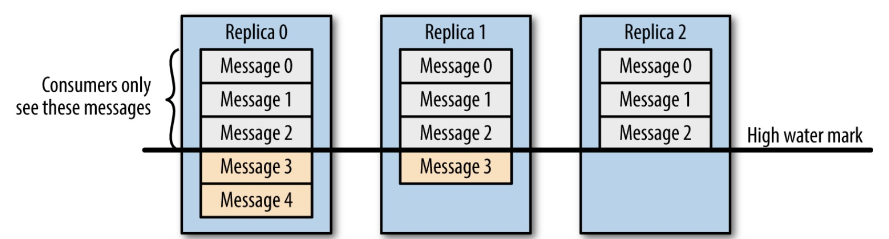
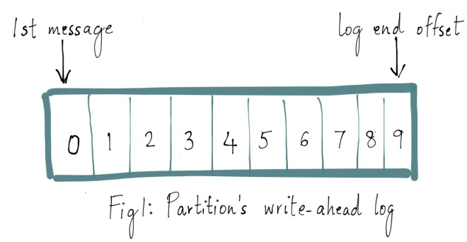
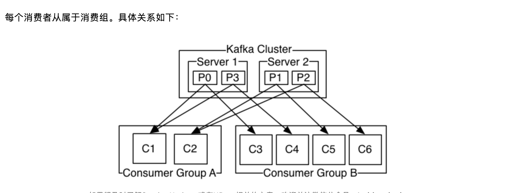
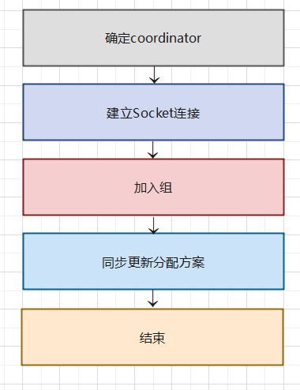

## 基本概念

1. 是什么？         
    * 利用高效可靠的消息传递机制进行平台无关的数据交流。
    * 基于数据通信，来进行分布式系统的集成
    * 通过提供消息传递和消息排队模型，可以在分布式环境下扩展进程间的通信
2. 特点     
    * 高吞吐量，低延迟，：kafka每秒可以处理几十万的条消息，他的延迟可最低只有几毫秒，每个topic可以分多个partition，consumer group 对partition进行consume操作
    * 支持热扩展
    * 高并发

3. 有什么用途？
    * 异步处理
    * 日常系统解耦
    * 提速，广播等
    * 具体点：消息，网站活动追踪，检测指标，日志聚合，事件采集，提交日志
    * 解耦
    * 削峰
    * 缓冲
    * 异步通信
4. 基础架构  

    
    基本构成：  
    1）Producer ：消息生产者，就是向 kafka broker 发消息的客户端。
    2）Consumer ：消息消费者，向 kafka broker 取消息的客户端。     
    3）topic：可以理解成一个队列，一个topic又分为一个或多个区（partition）      
    4）consumer group：这是kafka用来实现一个topic消息的广播（发给所有的consumer）和单播（发送给任意一个consumer）的手段。一个topic可以有多个consumer group，每个消费组可以有多个消费者，使用多分区+多消费者的方式可以极大的提高数据下游的处理速度。同一个消费组中的消费者不会重复消费消息，同样的，不同消费者消费消息的时互不影响，

    5）broker：一台kafka服务器就是一个broker，一个集群由很多broker组成。一个broker可以容纳多个topic     
    6）partition：为了实现扩展性，一个非常大的topic可以分到多个broker上，每个partition是一个有序的队列，partition中的每条消息都会被分配一个有序的id（offset）,将消息发给consumer，kafka只保证按一个partition中的消息的顺序，不保证一个topic的整体顺序（多个partition间）      
    7）offset：Offset 是消息在分区中的唯一标识，Kafka 通过它来保证消息在分区内的顺序性。
5. 分区的目的？         
    * 分区对于kafka集群的好处：实现负载均衡
    * 分区对于消费者来说，可以提高并发度，提高效率
6. kafka如何做到消息的有序性的      
    kafka中的每个partition中的消息在写入时都是有序的，而且单独一个partition只能由一个消费者去消费

7. kafka的高可靠性是怎么实现的      
    * topic分区副本         
    > Kafka 是没有副本的概念的，那时候人们只会用 Kafka 存储一些不重要的数据，因为没有副本，数据很可能会丢失。但是随着业务的发展，支持副本的功能越来越强烈，所以为了保证数据的可靠性，Kafka 从 0.8.0 版本开始引入了分区副本（详情请参见 KAFKA-50）。也就是说每个分区可以人为的配置几个副本（比如创建主题的时候指定 replication-factor，也可以在 Broker 级别进行配置 default.replication.factor），一般会设置为3。

    > kafka可以保证单个分区里的事件是有序的，分区可以在线（可用），也可以离线（不可用）。在众多的分区副本里面，又一个副本是leader，其余的副本是follower，所以读写操作都是经过leader进行的，同时follower会定期的去leader上复制数据，当leader挂了的时候，其中一个follower会重新成为leader。通过分区副本，引入了数据冗余，同时提供了kafka的数据可靠性

    > kafka的分区副本架构是kafka可靠性保证的核心，把消息写入多个副本可以使kafka在发生崩溃时仍能保证消息的持久性。

    * producer往broker发送消息      
    > 如果我们要往 Kafka 对应的主题发送消息，我们需要通过 Producer 完成。前面我们讲过 Kafka topic对应了多个分区，每个分区下面又对应了多个副本；为了让用户设置数据可靠性， Kafka 在 Producer 里面提供了消息确认机制。也就是说我们可以通过配置来决定消息发送到对应分区的几个副本才算消息发送成功。可以在定义 Producer 时通过 acks 参数指定（在 0.8.2.X 版本之前是通过 request.required.acks 参数设置的，详见 KAFKA-3043）。这个参数支持以下三种值：

    > acks = 0：意味着如果生产者能够通过网络把消息发送出去，那么就认为消息已成功写入 Kafka 。在这种情况下还是有可能发生错误，比如发送的对象无能被序列化或者网卡发生故障，但如果是分区离线或整个集群长时间不可用，那就不会收到任何错误。在 acks=0 模式下的运行速度是非常快的（这就是为什么很多基准测试都是基于这个模式），你可以得到惊人的吞吐量和带宽利用率，不过如果选择了这种模式， 一定会丢失一些消息。

    > acks = 1：意味若 Leader 在收到消息并把它写入到分区数据文件（不一定同步到磁盘上）时会返回确认或错误响应。在这个模式下，如果发生正常的 Leader 选举，生产者会在选举时收到一个 LeaderNotAvailableException 异常，如果生产者能恰当地处理这个错误，它会重试发送悄息，最终消息会安全到达新的 Leader 那里。不过在这个模式下仍然有可能丢失数据，比如消息已经成功写入 Leader，但在消息被复制到 follower 副本之前 Leader发生崩溃。

    > acks = all（这个和 request.required.acks = -1 含义一样）：意味着 Leader 在返回确认或错误响应之前，会等待所有同步副本都收到悄息。如果和 min.insync.replicas 参数结合起来，就可以决定在返回确认前至少有多少个副本能够收到悄息，生产者会一直重试直到消息被成功提交。不过这也是最慢的做法，因为生产者在继续发送其他消息之前需要等待所有副本都收到当前的消息。

    > 另外，Producer 发送消息还可以选择同步（默认，通过 producer.type=sync 配置） 或者异步（producer.type=async）模式。如果设置成异步，虽然会极大的提高消息发送的性能，但是这样会增加丢失数据的风险。如果需要确保消息的可靠性，必须将 producer.type 设置为 sync。

    * leader选举        
    > 再介绍leader选举之前，让我们先来了解一下 ISR（in-sync replicas）列表。每个分区的 leader 会维护一个 ISR 列表，ISR 列表里面就是 follower 副本的 Borker 编号，只有ISR里的成员才有被选为leader的可能。

    > 所以当leader挂了，Kafka会从ISR列表中选择第一个 follower 作为新的 Leader，因为这个分区拥有最新的已经 commited 的消息。通过这个可以保证已经 commited 的消息的数据可靠性。

    综上所述，为了保证数据的可靠性，我们最少需要配置一下几个参数：
    * producer 级别：acks=all（或者 request.required.acks=-1），同时发生模式为同步 producer.type=sync
    * topic 级别：设置 replication.factor>=3，并且 min.insync.replicas>=2；
    * broker 级别：关闭不完全的 Leader 选举，即 unclean.leader.election.enable=false；

8. 数据一致性   
    这里介绍的数据一致性主要是说不论是老的 Leader 还是新选举的 Leader，Consumer 都能读到一样的数据。那么 Kafka 是如何实现的呢？

    
    假设分区的副本为3，其中副本0是 Leader，副本1和副本2是 follower，并且在 ISR 列表里面。虽然副本0已经写入了 Message4，但是 Consumer 只能读取到 Message2。因为所有的 ISR 都同步了 Message2，只有 High Water Mark 以上的消息才支持 Consumer 读取，而 High Water Mark 取决于 ISR 列表里面偏移量最小的分区，对应于上图的副本2，这个很类似于木桶原理。

    这样做的原因是还没有被足够多副本复制的消息被认为是“不安全”的，如果 Leader 发生崩溃，另一个副本成为新 Leader，那么这些消息很可能丢失了。如果我们允许消费者读取这些消息，可能就会破坏一致性。试想，一个消费者从当前 Leader（副本0） 读取并处理了 Message4，这个时候 Leader 挂掉了，选举了副本1为新的 Leader，这时候另一个消费者再去从新的 Leader 读取消息，发现这个消息其实并不存在，这就导致了数据不一致性问题。

    当然，引入了 High Water Mark机制，会导致 Broker 间的消息复制因为某些原因变慢，那么消息到达消费者的时间也会随之变长（因为我们会先等待消息复制完毕）。延迟时间可以通过参数 replica.lag.time.max.ms 参数配置，它指定了副本在复制消息时可被允许的最大延迟时间。

9. 副本复制协议     
    kafka的topic中的每个分区都有一个预写日志，我们写入kafka的消息就存储在这里。这里的每条消息都有一个唯一的偏移量，用于标识他在当前分区日志中的位置。如下图
    
    kafka中的每个partition都被复制了n次，其中n是主体的复制因子。这允许kafka在集群服务器发生故障时自动切换到这些副本，以便再出现故障时消息仍然是可用的。kafka的复制是以分区为粒度的，分区的预写日志备份到了n个服务器上。 在 n 个副本中，一个副本作为 leader，其他副本成为 followers。顾名思义，producer 只能往 leader 分区上写数据（读也只能从 leader 分区上进行），followers 只按顺序从 leader 上复制日志。

10. isr, osr，ar是什么？    
* isr：副本同步队列
* osr：从副本同步队列中因超过阈值而剔除的副本，新加入的副本也会先放入osr
* ar：所有的副本，等于isr+osr

11. LEO、HW、LSO、LW等分别代表什么
* LEO：是 LogEndOffset 的简称，代表当前日志文件中下一条
* HW ： 水位或水印（watermark）一词，也可称为高水位(high watermark)，通常被用在流式处理领域（比如Apache Flink、Apache Spark等），以表征元素或事件在基于时间层面上的进度。在Kafka中，水位的概念反而与时间无关，而是与位置信息相关。严格来说，它表示的就是位置信息，即位移（offset）。取 partition 对应的 ISR中 最小的 LEO 作为 HW，consumer 最多只能消费到 HW 所在的位置上一条信息。
* LSO ： 对未完成的事务而言，LSO 的值等于事务中第一条消息的位置
* LW：Low Watermark 低水位, 代表 AR 集合中最小的 logStartOffset 值。

11. 消费者和消费者组什么关系？

12. 数据传输的事务有几种？
数据传输的事务定义通常有以下三种级别：     

13. Kafka消费者是否可以消费指定分区消息？
 kafka consumer消费消息的时候，向borker发出fetch请求去消费特定分区的消息，consumer指定消息在日志中的偏移量（offset），就可以消费从这个位置开始的消息，consumer拥有了offset的控制权，可向后回滚去重新消费之前的消息，

 14. Kafka消息是采用Pull模式，还是Push模式？    
    customer应该从brokes拉取消息还是brokers将消息推送到consumer，也就是pull还push。在这方面，Kafka遵循了一种大部分消息系统共同的传统的设计：producer将消息推送到broker，consumer从broker拉取消息。

        有些消息系统（Scribe和Apache Flume）采用了push
    模式，，将消息推送到下游consumer。有broker决定消息的推送速率，对不同消费速率的consumer就不太好处理，消费系统一直致力于让下游consumer以最大的速率消费消息，但是不幸的是，push模式下，当broker的推送速率远大于下游的consumer的消费速率，消费端造成消息堆积影响数据的处理不说，consumer也是扛不住的。
    
        Pull模式下，consumer就可以根据自己的消费能力去决定这些策略。但是也是有缺点的，，如果broker没有可供消费的消息，将导致consumer不断在循环中轮询，直到新消息到达。为了避免这点，Kafka有个参数可以让consumer阻塞知道新消息到达(当然也可以阻塞知道消息的数量达到某个特定的量这样就可以批量发

15. kafka 高效文件存储设计特点      
* kafka把topic中一个partition大文件分成多个小文件段，通过多个小文件段，就很容易定期清除或删除已经消费完文件，减少磁盘占用，
* 通过索引信息可以快速定位message和确定response的最大大小
* 通过index元数据全部映射到memory，可以避免segment file的IO磁盘操作。
* 通过索引文件稀疏存储，可以大幅降低index文件元数据占用空间大小

16. Kafka创建Topic时如何将分区放置到不同的Broker中
* 副本因子不能大于 Broker 的个数；
* 第一个分区（编号为0）的第一个副本放置是随机从brokerlist选择的
* 他分区的第一个副本放置位置相对于第0个分区依次往后移。也就是如果我们有5个 Broker，5个分区，假设第一个分区放在第四个 Broker 上，那么第二个分区将会放在第五个 Broker 上；第三个分区将会放在第一个 Broker 上；第四个分区将会放在第二个 Broker 上，依次类推；
* 剩余的副本相对于第一个副本放置位置其实是由 nextReplicaShift 决定的，而这个数也是随机产生的；

17. kafka是如何实现高吞吐率的       
Kafka是分布式消息系统，需要处理海量的消息，Kafka的设计是把所有的消息都写入速度低容量大的硬盘，以此来换取更强的存储能力，但实际上，使用硬盘并没有带来过多的性能损失。kafka主要使用了以下几个方式实现了超高的吞吐率：

* 顺序读写
* 零拷贝
* 文件分段
* 批量发送
* 数据压缩。

18. kafka的幂等是如何实现的         
实现幂等的关键点在于服务端可以区分请求是否重复，过滤掉重复的请求。要区分重复的请求有两点：  
    * 唯一标示：要想区分请求是否重复，请求中就得有唯一标示。
    * 记录下已处理过的请求标示，光有唯一标识还不够，这需要记录下那些请求是否已经处理过的，这样当收到新的请求时，用新请求中的标识和处理记录进行对比，如果处理记录中有同样的标示，表明重复，可以拒绝掉。

    * 为了实现producer的幂等性，kafka引入了producer Id(pid)和sequence number。
    * PId： 每个新的producer 在初始化的时候都会被分配一个唯一的pid，这个pid对用户不可见，
    * sequence number： 对于每个pid，该producer发送的数据的每个\<topic partition>都对应一个从0开始的单调递增的sequence number

    kafka可能存在多个生产者，会同时生产消息，但对kafka来说，只需要保证每个生产者内部的消息是幂等就可以了，所以引入了pid来标识不同的生产者

    对于kafka来说，要解决的是生产者发送消息幂等问题。也即需要区分每条消失是否重复，Kafka通过为每条消息增加一个Sequence Numbler，通过Sequence Numbler来区分每条消息。每条消息对应一个分区，不同的分区产生的消息不可能重复。所有Sequence Numbler对应每个分区

19. kafka中的Zookeeper      
    1. 架构如下
        *  Broker注册： broker是分布式部署并且之间相互独立，zookeeper用来管理注册到集群的所有broker节点。
        * topic注册：在kafka中同一个topic的消息会被分成多个分区并将其分布在多个broker上，这些分区信息及broker的对应关系都是由zookeeper维护
        * 生产者负载均衡：由于同一个 Topic 消息会被分区并将其分布在多个 Broker 上，因此，生产者需要将消息合理地发送到这些分布式的 Broker 上。
        * 消费者负载均衡：与生产者类似，Kafka 中的消费者同样需要进行负载均衡来实现多个消费者合理地从对应的 Broker 服务器上接收消息，每个消费者分组包含若干消费者，每条消息都只会发送给分组中的一个消费者，不同的消费者分组消费自己特定的 Topic 下面的消息，互不干扰。

20. kafka简报        
* 简单讲下 Kafka 的架构?Producer、Consumer、Consumer Group、Topic、Partition。
* Kafka 是推模式还是拉模式，推拉的区别是什么?Kafka Producer 向 Broker 发送消息使用 Push 模式，Consumer 消费采用的 Pull 模式。拉取模式，让 consumer 自己管理 offset，可以提供读取性能。
* Kafka 如何广播消息?Consumer group。
* Kafka 的消息是否是有序的?Topic 级别无序，Partition 有序。
* Kafka 是否支持读写分离?不支持，只有 Leader 对外提供读写服务。
* Kafka 如何保证数据高可用?副本，Ack，HW。
* Kafka 中 zookeeper 的作用?集群管理，元数据管理。
* 是否支持事务?0.11 后支持事务，可以实现“exactly once”。
* 分区数是否可以减少?不可以，会丢失数据。

21. kafka使用简报       
* Kafka Producer 的执行过程?拦截器，序列化器，分区器和累加器。
* Kafka Producer 有哪些常见配置?Broker 配置，Ack 配置，网络和发送参数，压缩参数，Ack 参数。
* 如何让 Kafka 的消息有序?Kafka 在 Topic 级别本身是无序的，只有 Partition 上才有序，所以为了保证处理顺序，可以自定义分区器，将需顺序处理的数据发送到同一个 Partition。
* Producer 如何保证数据发送不丢失?Ack 机制，重试机制。
* 如何提升 Producer 的性能?批量，异步，压缩。
* 如果同一 group 下 consumer 的数量大于 part 的数量，kafka 如何处理?多余的 Part 将处于无用状态，不消费数据。
* Kafka Consumer 是否是线程安全的?不安全，单线程消费，多线程处理
* 讲一下你使用 Kafka Consumer 消费消息时的线程模型，为何如此设计?拉取和处理分离。
* Kafka Consumer 的常见配置?Broker, 网络和拉取参数，心跳参数。
Consumer 什么时候会被踢出集群?奔溃，网络异常，处理时间过长提交位移超时。
* 当有 Consumer 加入或退出时，Kafka 会作何反应?进行 Rebalance。
* 什么是 Rebalance，何时会发生 Rebalance?Topic 变化，Consumer 变化。

22. kafka的高可用和性能     
* Kafka 如何保证高可用?通过副本来保证数据的高可用，Producer Ack、重试、自动 Leader 选举，Consumer 自平衡。
* Kafka 的交付语义?交付语义一般有 at least once、at most once 和 exactly once。Kafka 通过 Ack 的配置来实现前两种。
Replic 的作用?实现数据的高可用。
* 什么是 AR，ISR?AR：Assigned Replicas。AR 是主题被创建后，分区创建时被分配的副本集合，副本个 数由副本因子决定。
* ISR：In-Sync Replicas。Kafka 中特别重要的概念，指代的是 AR 中那些与 Leader 保 持同步的副本集合。

    在 AR 中的副本可能不在 ISR 中，但 Leader 副本天然就包含在 ISR 中。关于 ISR，还有一个常见的面试题目是如何判断副本是否应该属于 ISR。

    目前的判断依据是：Follower 副本的 LEO 落后 Leader LEO 的时间，是否超过了 Broker 端参数 replica.lag.time.max.ms 值。如果超过了，副本就会被从 ISR 中移除。

* Leader 和 Flower 是什么?见上文。
* Kafka 中的 HW 代表什么?高水位值 (High watermark)。这是控制消费者可读取消息范围的重要字段。
一个普通消费者只能“看到”Leader 副本上介于 Log Start Offset 和 HW(不含)之间的 所有消息。水位以上的消息是对消费者不可见的。

* Kafka 为保证优越的性能做了哪些处理?Partition 并发、顺序读写磁盘、Page Cache 压缩、高性能序列化(二进制)、内存映射、无锁 Offset 管理、Java NIO 模型。

22. 什么是Rebalance     
Rebalance本质上是一种协议，规定了consumer group下的所有consumer 如何达成一致来分配topic的每个分区。比如某个group下有20个consumer，它订阅了一个具有100个分区的topic，正常情况下Kafka 平均会为每个 Consumer 分配 5 个分区。这个分配的过程就叫 Rebalance。

23. 什么时候会rebalance     
Rebalance 的触发条件有三种：
    * 组成员发生新的变化（新的consumer加入，已有 Consumer 主动离开组或已有 Consumer 崩溃了——这两者的区别后面会谈到， 崩溃并不一定是指consumer进程挂了或者所在机器宕机了，而是kafka长时间没有收到consumer的心跳上报）
    * 订阅数发生变更
    * 订阅主题的分区数发生变更
如何进行组内分区分配： 
    * Kafka 默认提供了两种分配策略：Range 和 Round-Robin。当然 Kafka 采用了可插拔式的分配策略，你可以创建自己的分配器以实现不同的分配策略。
    * range的分配策略主要是基于范围的思想，他将单个topic的分区按照顺序排列，然后把这些分区划分成固定的大小的分区段并依次分配给每个consumer
    * round-robin策略则会把所有topic的所有分区顺序摆开，然后轮询式地分配给各个consumer。
    * sticky策略：实现目标为分区的分配尽可能的均匀，分配给消费者的分区数最多相差一个，另外，在此基础上，尽可能保持分区的分配与上次分配的保持相同    
    * 通常意义上认为，如果group下所有consumer实例的订阅是相同的，那么使用round-robin会带来更公平的分配方案，否则使用range策略的效果更好。

24. Rebalance协议   
rebalance本质上是一组协议。group与coordinator共同使用这组协议完成group的rebalance。

    Kafka中提供了下面5个协议来处理rebalance相关事宜：
    * JoinGroup请求：consumer请求加入组。
    * SyncGroup请求：group leader把分配方案同步更新到组内所有成员中。
    * Heartbeat请求：consumer定期向coordinator汇报心跳表明自己依然存活。
    * LeaveGroup请求：consumer主动通知coordinator该consumer即将离组。
    *DescribeGroup请求：查看组的所有信息，包括成员信息、协议信息、分配方案以及订阅信息等。该请求类型主要供管理员使用。coordinator不使用该请求执行rebalance。

    在rebalance过程中，coordinator主要处理consumer发过来的JoinGroup和SyncGroup请求，当consumer主动离组时会发送LeaveGroup请求给coordinator。在成功rebalance之后，组内所有consumer都需要定期地向coordinator发送Hearbeat请求。而每个consumer也是根据Hearbeat请求的响应中是否包含REBALANCE_IN_PROGRESS来判断当前group是否开启了新一轮rebalance。

25. Rebalance流程   
    
    目前rebalance主要分为两步：加入组和同步更新分配方案
    * 加入组：
    1） 这一步中组内所有consumer（即group.id相同的所有consumer实例）向coordinator发生JoinGroup请求  
    2）当收集全JoinGroup请求后，coordinator从中选择一个consumer担任group的leader，并把所有成员信息以及它们的订阅信息发送给leader。  
    3）leader是某个consumer实例，coordinator通常是Kafka集群中的一个broker。另外leader负责整个group的所有成员制定分配方案。
    * 同步更新分配方案：        
    1）这一步中leader开始制定分配方案，即根据前面提到的分配策略决定每个consumer都负责哪些topic的哪些分区。
    2） 一旦分配完成，leader会把这个分配方案封装进SyncGroup请求并发送给coordinator,在此b过程中，每个组内成员都会发送SyncGroup请求,但是只有leader发送的SyncGroup请求中包含分配方案
    3） coordinator接收到分配方案后把属于每个consumer的方案单独抽取出来作为SyncGroup请求的response返还给各自的consumer。

26. rebalance中的generation？       
类似于JVM中的generation,consumer设计了rebalance generation用于标识某次rebalance以更好地隔离每次rebalance上的数据。

generation数值从0开始，每次rebalance后generation号会加1，可以用来保护consumer group,防止无效offset提交。例如，当上一届的consumer由于某种原因offset提交延时了，当rebalance后该consumer group生成了新一届的consumer group组成员，由于延迟的offset携带的是旧的generation信息，因此在提交时会被拒绝。此时日志会报ILLEGAL_GENERATION异常。

27. kafka提交offset机制     
    kafka对于offset的处理有两种提交方式：   
    1）自动提交     
    2）手动提交：   
    * 同步提交: 同步模式下提交失败的时候一直尝试提交,消费者线程会一直阻塞，在broker对提交的请求作出响应之前，会一直阻塞直到偏移量提交操作成功
    * 异步提交：异步手动提交offset时，消费者线程不会阻塞，提交失败的时候也不会进行重试，并且可以配合回调函数在broker做出响应的时候记录错误信息
