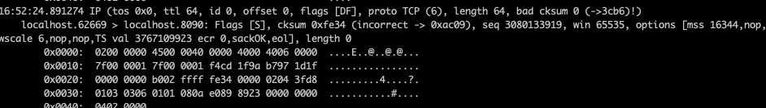
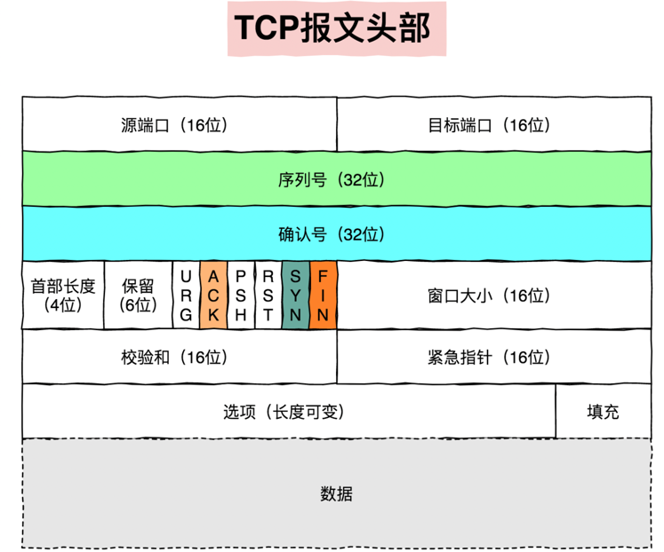
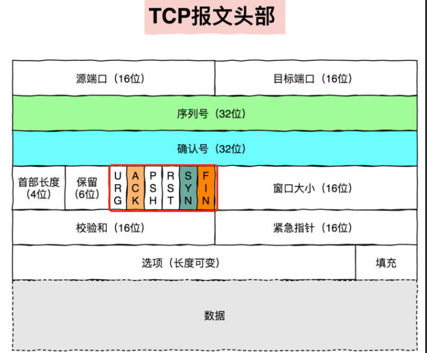
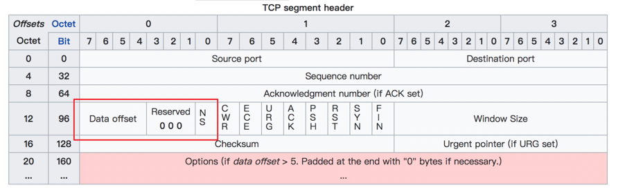

# tcpdump核心参数图解
由于网络上的流量，数据包非常多，所以我们学习抓包的过程，其实就是在学习如何定义一个过滤器的过程。在tcpdump的世界里，过滤器的实现
是通过一个又一个的参数组合起来的，一个参数不够精准，那就再加一个，直到过滤出我们感兴趣的数据包。

在我们正常认知中，都是通过主程序名+参数名+参数值的方式来进行过滤，但是tcpdump不太一样。当我们想要通过host参数指定host ip进行过滤
，我们需要如下操作：
```go
tcpdump src host 192.168.10.100
```
这里通过增加src这样的限定词，来缩小查询范围。但是我们可能会有如下疑问：
1. 除了src，dst，是否还有其他可以用的限定词
2. src，host应该如何理解和定义
3. 为什么需要增加src这样的限定词，他的背后代表了什么

如果我此时在src前在增加一些参数，例如：
```go
tcpdump tcp src host 192.168.10.100
```
那么这个时候tcp src host这些参数代表什么意思? 这些参数的不确定性导致了我们对于tcpdump的学习就比较困难了，我们没法灵活使用tcpdump。
因此在学习tcpdump之前我们需要了解一些基础知识

tcpdump命令的选项如上：         
option：     
    
    -c：指定抓取的包数量
    -i interface：指定tcpdump需要监听的接口，默认会抓取第一个网络接口
    -n：对地址以数字显示，否则显示为主机名，也就是说-n选项不做主机名解析。
    -nn：除了-n的作用外，还把端口显示为数值，否则显示为端口服务名
    -P：指定要抓取的包是流入还是流出的包，可以给定值为in，out和inout
    -s len：设置tcpdump的数据包抓取长度为len，如果不设置将会是65535字节。
        对于要抓取得数据包较大时，长度设置不够可能会产生包截断，若出现包截断
        输出行中会出现[Iproto]的标识。但是len越长，包的处理是将就越长，并且
        会减少tcpdump可缓存的数据包的数量，从而会导致数据包的丢失，所以再能抓取我们想要包的前提下，抓取长度越小越好。

proto：

    tcp， udp ， icmp，若未给定协议类型，则匹配所有可能的类型

type：

    host, net, port, portrange，这些词后面需要再接参数

direction：
    
    根据数据流向进行过滤，可识别的关键字：src(源过滤)，dst(目标过滤)，同时你可以使用逻辑运算符进行组合，比如src or dst

# 理解tcpdump的输出
## 2.1 输出内容
这里我随便抓一个请求的抓包，我们细看下：

从上面的输出，可以总结出：

第一列：时分秒毫秒，16:52:24.891274   
第二列：网络协议 IP     
第三列：发送方的IP地址+端口号，我这里是在本地测试，所以IP地址为localhost，端口为62669        
第四列：箭头 > ，表示数据流向        
第五列：接收方IP地址+端口，我这里是在本地测试，所以IP地址为localhost，端口为8090       
第六列：冒号      
第七列：数据包内容，数据包内容，包括Flags 标识符，seq 号，ack 号，win 窗口，数据长度 length，其中 [S.] 表示开始连接 标志位为 1，更多标识符见下面

## 2.2 Flags标识符

使用tcpdump抓包后，会遇到tcp报文Flags，有以下几种：
* [S]：SYN(开始连接)，当SYN被置为1，而ack为0时，说明这是一个请求连接报文段，若对方同意建立连接，则会在应答报文中将SYN和ACK都置为1
* [P]：PSH(推送数据)，允许应用程序随时从该套接字读取和写入，接收方和发送方都有对应的缓冲区，缓冲区允许更有效的传输数据，但是当为了发送一两个字符的数据包，但是需要填满大型缓冲区才会发送，这样的体验太过于糟糕，PSH标识的作用就在这里，当PSH被置为1时，会被立即推出，当接收端收到PSH被置为1的数据包，会立刻将该分段上交到对应的应用程序。
* [F]：FIN(结束连接)，用来释放一个连接，当FIN被置为1时，说明次报文的放松方的数据已经发送完毕，要求释放连接
* [R]：RST(重置连接)，当该位有效时，表明TCP连接中出现严重错误，比如一方中途出现崩溃，或者网络极度拥塞，导致大面积丢包，数据长时间无法到达对方，则接下来的传输必须重新建立，该位还可以用来拒绝一个非法的报文段。
* [U]：URG用于通知接收方，数据段内某些数据需要紧急处理，应该被优先考虑。目前正在被逐渐淘汰，原因是定义和是线上比较混乱。
* [A]：确认ACK， 当且仅当ACK被置为1时，确认号字段才有效，说明此报文的发送方数据已经发送完毕，要求释放连接。
* [.]：没有Flag(意思是除了上面四种类型外的情况，有可能是ACK，也有可能是URG)

我们知道tcp是面向连接的，可靠的，基于字节流的传输层通信协议，通信双方通过约定好的方式去解读和设置这些报文头部的flags，从而来保证数据的可靠性的。

# 常规过滤规则
## 3.1 基于IP地址过滤：host
使用host可以指定host ip进行过滤

    tcpdump host 192.168.10.100

数据包ip可以在细分为源ip和目标ip两种
    
    根据源ip进行过滤
    tcpdump -i eth2 src 192.168.10.100
    根据目标IP进行过滤
    tcpdump -i eth2 dst 192.168.10.100


## 3.2基于网段进行过滤
如果你的ip范围是一个网段，可以直接如下指定
    
    tcpdump net 192.168.10.0/24

网段同样可以细分为源网段和目标网段

    根据源网段进行过滤 
    tcpdump src net 192.168
    根据目标网段进行过滤
    tcpdump dst net 192.168

## 3.3 基于端口进行过滤：port
使用port就可以指定端口进行过滤
    
    tcpdump port 8088

同样端口过滤也可以分为源端口和目标端口
    
    tcpdump src port 8088
    
    tcpdump dst port 8088

如果你想指定两个端口可以如下书写
    
    tcpdump port 8088 or port 8090

如果想抓取的是一个端口范围
    
    tcpdump portrange 8000-8088

对于一些常见协议的默认端口，我们可以直接使用协议名，而不使用具体的端口号，比如http = 80， https=443
    
    tcpdump tcp prot http

## 3.4 基于协议进行过滤：proto
常见的网络协议有：tcp，udp，icmp，http，ip，ipv6等
如果只想看icmp的包，可直接写成如下：

    tcpdump icmp
## 3.5 基于IP协议的版本进行过滤
当你想看tcp的包，也许会这样写

    tcpdump tcp

这样写是没问题的，但是不够精准，为什么这么说呢？
ip根据版本的不同，可以在细分为ipv4和ipv6两种，如果只指定tcp其实两种都是包括的。那么问题是我们如何区分这两种呢
如果是ipv4的包，写成如下：
    
    tcpdump ip proto 6

如果是ipv6的包，写成如下：
    
    tcpdump ip6 proto 6

# 4 可选参数解析
## 4.1 设置不解析域名提升速度
* -n：不把ip转化为域名，直接显示ip，避免执行DNS lookups的过程，速度会快很多
* -nn：不把协议和端口号转化成名字，速度快很多
* -N：不打印host的域名部分。比如，如果设置了此选项，tcpdump将会打印nic，而不是nic.ddn.mil

## 4.2 控制详细内容的输出
* -v：产生详细的输出，比如包TTL，id标识，数据包长度，以及IP包的一些选项。同时他还会打开一些附加包完整性的检测，比如对IP或ICMP包头部的校验和
* -vv：产生比-v更详细的输出，比较少使用
* -vvv：产生比-vv更详细的输出，比较少使用

## 4.3 控制时间的显示
* -t：在每行输出中不输出时间
* -tt：在每行输出中输出时间戳
* -ttt：输出每两行打印的时间间隔(以毫秒为单位)
* -tttt：在每行打印的时间戳之前添加日期的打印（此种选项，输出的时间最直观）

## 4.4显示数据包的头部
* -x：以16进制的形式打印每个包的头部数据（不包含数据链路层的头部）
* -xx：以16进制的形式打印每个包的头部数据（包含数据链路层的头部）
* -X：以16进制和ASCII码形式打印出每个包的数据(不包括连接层的头部)
* -XX：以16进制和ASCII码形式打印出每个包的数据(包括连接层的头部)

## 4.5 过滤指定网卡的数据包
* -i：指定过滤的网卡接口，如果要查看所有网卡，可以-i any

## 其他常用参数
* -A：以ASCII码方式显示每一个数据包(不显示链路数据层头部信息)，在抓取包含网页数据的数据包是，可方便查看数据
* -I：基于行的输出，便于保存查看
* -q：简洁打印输出。即打印很少协议相关信息，层而输出行都比较简短
* -c：捕获count个包tcpdump就退出
* -s：tcpdump默认只会截取前96字节的内容，要想截取所有的报文内容，可以使用-s number，number标识你要截取的报文字节数，如果是0，表示截取报文全部内容
* -S：使用就对序列号，而不是相对序列号

# 过滤规则组合
* and：所有的条件都需要满足，可以表示为&&
* or：只要有一个条件满足就可以，可以表示为||
* not：取反，也可以使用!

举个例子，我想抓一个来自10.5.2.3，发送给任意主机的3389端口的包
    
    tcpdump src 10.5.2.3 and dst prot 3389 
而在单个过滤器中，常常会判断一条件是否成立，这时候，就要用下面两个符号
* =：判断二者相等
* == ：判断二者相等
* != ：判断二者不相等

当你使用这两个符号时，tcpdump还提供了一些关键字的接口来方便我们进行判断，
* if：表示网卡接口名
* proc：表示进程名
* pid：表示进程id
* svc：表示service class
* dir：表示方向，in和out
* eproc：表示effective process name
* epid：表示effective process ID

比如我现在要过滤来自进程名为nc发出的流经en0网卡的数据包，或者不流经en0的入方向数据包，可以写成如下：

    tcpdump "(if=en0 and proc=nc) || (if != en0 and dir=in)"

# 5 特殊过滤规则
## 5.1 根据tcpflags进行过滤
tcpdump支持我们根据数据包的标志位进行过滤

    proto [expr:size]
* proto：可以使熟知的协议之一，如ip，tcp，arp，udp，ipv4等
* expr：可以是数值，也可以是一个表达式，表示与指定的协议头开始处的字节偏移量
* size：可选，表示从字节偏移量处开始取得字节数量


tcpflags可以理解为一个别名常量，代表着tcp报文头一个字节的标识位，如上图所示。一个字节有八位，那么各个flag都有自己的值分别如下：
* tcp-fin：1
* tcp-syn：2
* tcp-rst：4
* tcp-push：8
* tcp-ack：16
* tcp-urg：32

我们在过滤时由于数字比较难记忆，所以就会有别名常量的产生。因此在书写时，如下：

    tcpdump -i eth0 "tcp[tcpflags] & tcp-syn != 0 "

如果我想捕获多种包
    
    tcpdump -i eth0 "tcp[tcpflags] == tcp-syn or tcp[tcpflags] == tcp-ack"

## 5.2 基于mac地址进行过滤
其中ehost是记录在/etc/ethers里的name
    
    tcpdump ether host [ehost]
    tcpdump ether dst  [ehost]
    tcpdump ether src  [ehost]


# 如何抓取更精准的包
如果我只想抓取HTTP的POST请求该如何写？先给出答案

    tcpdump -s 0 -A -vv 'tcp[((tcp[12:1] & 0xf0) >> 2):4]'

* tcp[n]：表示tcp报文里的第n个字节
* tcp[n:c]：表示tcp报文里从第n个字节开始取c个字节，tcp[12:1]表示从报文的第12个字节(因为有第0个字节，所以这里的12其实表示的是13)
开始算起取第一个字节，也就是8bit。这8bit其实就是下图中红框圈起来的位置，而在这里我们只用前面4个bit，也就是实际数据在整个报文首部中的偏移量

* &：是位运算符里的and操作符
* \>> ：是位操作里的右移操作
* 0xf0：是 10 进制的 240 的 16 进制表示