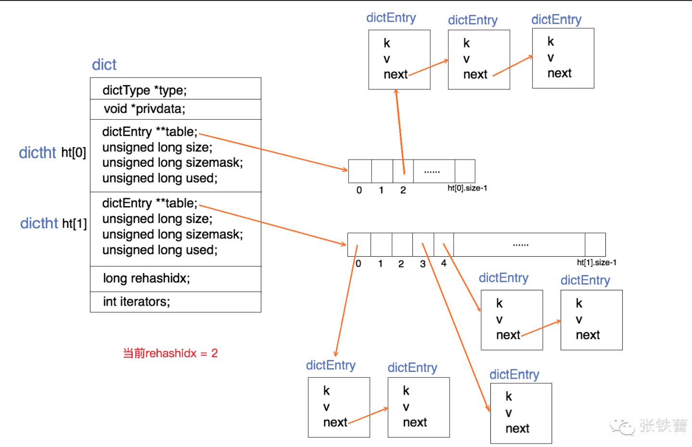

<!-- TOC -->

- [DICT](#dict)
    - [dict具体实现](#dict具体实现)
    - [详解](#详解)
    - [dict的创建](#dict的创建)
    - [dict的查找](#dict的查找)
    - [增量式重哈希_dictRehashStep的实现](#增量式重哈希_dictrehashstep的实现)
    - [dict的插入（dictAdd）](#dict的插入dictadd)
    - [dictReplace在dictAdd基础上实现](#dictreplace在dictadd基础上实现)
    - [dict的删除（dictDelete）](#dict的删除dictdelete)
- [SDS](#sds)
    - [构成](#构成)
    - [SDS的一些基础函数](#sds的一些基础函数)
    - [sds的创建和销毁](#sds的创建和销毁)
    - [sds的连接（追加）操作](#sds的连接追加操作)
    - [浅谈sds和string的关系](#浅谈sds和string的关系)
- [ROBJ](#robj)
    - [robj的数据结构定义](#robj的数据结构定义)
    - [string robj的编码过程](#string-robj的编码过程)
    - [string robj的解码过程](#string-robj的解码过程)
    - [在谈sds和string的关系](#在谈sds和string的关系)
- [ZIPLIST](#ziplist)
    - [什么是ziplist](#什么是ziplist)
    - [ziplist的数据结构定义](#ziplist的数据结构定义)

<!-- /TOC -->
# DICT
## dict解释
1. dict是一个用于维护key和value映射关系的数据结构，与很多语言中的map类似。redis的一个database中所有key和value的映射，就是使用一个dict来维护的，不过这只是他在reids中的一个用途而已


2. dict本质上是为了解决算法中的查找问题，一般查找问题的解法有两个大类：一个是基于各种平衡树，一个是基于哈希表。我们平时使用的各种map，大都是居于哈希表实现的。在不要求数据有序存储，且能保持较低的哈希值冲突概率的前提下，基于哈希表的查找性能是非常高效的，接近O(1)，而且实现简单。

3. 在redis中，dict也是一个基于哈希表的算法，和传统的哈希算法类似，他采用某个哈希函数从key计算得到在哈希表中的位置，采用拉链法解决冲突，并在装载因子超过预定值时自动扩展内存，引发重哈希。redis的dict实现最显著的一个特点，就在于他的重哈希，他采用了一种称为增量式重哈希的方法。 在需要扩展内存时避免一次性对所有的key进行重哈希，而是将重哈希的操作分散到对于dict的各个增删改查的操作中去。这种方法能做到每次只对一小部分key进行重哈希，而每次重哈希之间不影响dict的操作。dict之所以这样设计，是为了避免重哈希期间单个请求的响应时间剧烈增加，这与前面提到的“快速响应时间”的设计原则是相符的。
## dict具体实现
代码实现
```golang
typedef struct dictEntry {
    void *key;
    union {
        void *val;
        uint64_t u64;
        int64_t s64;
        double d;
    } v;
    struct dictEntry *next;
} dictEntry;

typedef struct dictType {
    unsigned int (*hashFunction)(const void *key);
    void *(*keyDup)(void *privdata, const void *key);
    void *(*valDup)(void *privdata, const void *obj);
    int (*keyCompare)(void *privdata, const void *key1, const void *key2);
    void (*keyDestructor)(void *privdata, void *key);
    void (*valDestructor)(void *privdata, void *obj);
} dictType;

/* This is our hash table structure. Every dictionary has two of this as we
 * implement incremental rehashing, for the old to the new table. */
typedef struct dictht {
    dictEntry **table;
    unsigned long size;
    unsigned long sizemask;
    unsigned long used;
} dictht;

typedef struct dict {
    dictType *type;
    void *privdata;
    dictht ht[2];
    long rehashidx; /* rehashing not in progress if rehashidx == -1 */
    int iterators; /* number of iterators currently running */
} dict;
```

图表示意


结合上面的代码和结构图示意，可以很清楚地看出dict的结构和组成：
* 一个指向dictType结构的指针（type）。他通过自定义的方式使得dict的key和value能够存储任何类型的数据。
* 一个私有域的指针（prividata）。由调用者在创建dict的时候传进来
* 两个哈希表（ht[2]）。只有在重哈希的过程中ht[0]和ht[1]才都有效，平时只有ht[0]有效。
* 当前重哈希索引(rehashidx)。如果rehsashindex = -1 ,表示当前没有在重哈希过程中；否则，表示当前正在重哈希，并且他的值记录了当前重哈希进行到了哪一步
* 当前正在进行遍历的iterators的个数


## 详解
* dictType：包含若干函数指针，用于dict的调用者对设计key和value的各种操作的自定义
    * hashFunction，对key进行哈希计算的哈希算法
    * keyDup和valueDup，分别定义key和value的拷贝函数，用于在需要的时候对key和value进行深拷贝，而不仅仅是传递传递对象指针
    * keyCompare，定义两个key的比较操作，在根据key进行查找时会用到。
    * keyDestructor和valDestructor，分别定义对key和value的析构函数。
* 私有数据指针（privdata）就是在dictType的某些操作被调用时会传回给调用者。
* dictht结构：  
    * 一个dictEntry指针数组(table)，key的哈希值最终映射到在这个数组的某个位置上（对应一个bucket）。如果多个key映射到了同一个位置上，就发生了冲突，那么就拉出一个dictEntry链表
    * size：标示dicyEntry指针数组的长度，他总是2的指数
    * sizemask：用于将哈希值映射到table的位置索引。他的值等于（size - 1），比如7，15，31，63，等等。也就是用二进制表示的各个bit全是1的数字。每个key先经过hashFunction计算得到一个哈希值， 然后计算(哈希值&sizemask)得到table上的位置。相当于计算取余（哈希值%size）
    * used：记录dict中现有的数据个数，它与size的比值就是装载因子。这个比值越大，哈希冲突发生的概率就越大。  

dictEntry结构中包含k,v和指向下一个的next指针。k是void指针，这意味着它可以指向任何类型。v是个union(集合)，当它的值是uint64_t，int64_t或者double类型时，就不需要额外的存储，这有利于减少内存碎片。当然v也可以是void指针，以便与存储任何类型的数据


## dict的创建
```C
    dict *dictCreate(dictType *type,
            void *privDataPtr)
    {
        dict *d = zmalloc(sizeof(*d));

        _dictInit(d,type,privDataPtr);
        return d;
    }

    int _dictInit(dict *d, dictType *type,
            void *privDataPtr)
    {
        _dictReset(&d->ht[0]);
        _dictReset(&d->ht[1]);
        d->type = type;
        d->privdata = privDataPtr;
        d->rehashidx = -1;
        d->iterators = 0;
        return DICT_OK;
    }

    static void _dictReset(dictht *ht)
    {
        ht->table = NULL;
        ht->size = 0;
        ht->sizemask = 0;
        ht->used = 0;
    }
```
* dictCreate为dict的数据结构分配空间并为各个变量初始化，其中两个哈希表ht[0]和ht[1]没有分配空间，table指针都赋值为null，这意味着要等第一个指针插入时才会真正分配空间


## dict的查找
```C
    dictEntry *dictFind(dict *d, const void *key)
    {
        dictEntry *he;
        unsigned int h, idx, table;

        if (d->ht[0].used + d->ht[1].used == 0) return NULL; /* dict is empty */
        if (dictIsRehashing(d)) _dictRehashStep(d);
        h = dictHashKey(d, key);
        for (table = 0; table <= 1; table++) {
            idx = h & d->ht[table].sizemask;
            he = d->ht[table].table[idx];
            while(he) {
                if (key==he->key || dictCompareKeys(d, key, he->key))
                    return he;
                he = he->next;
            }
            if (!dictIsRehashing(d)) return NULL;
        }
        return NULL;
    }
```
* 如果当前正在进行重哈希，那么将重哈希过程向前推进一波(即调用_dictRehashStep)。实际上，除了查找，插入和删除也都会触发这一动作
* 计算key的哈希值，(调用dictHashKey,里面的实现会调用前面提到的hashFunction)
* 现在第一个哈希表ht[0]上进行查找。在table数组上滴味道哈希值对应的位置(如前所述，通过哈希值与sizemask进行按位与)，然后在对应的dictEndtry链表上进行查找，查找的时候和key进行对比，这个时候调用dictCompareKeys，它里面的实现会调用到前面提到的keyCompare。如果找到就返回该项，否则就下一步
* 判断当前是否在重哈希，如果没有，那么在ht[0]上的查找结果就是最终结果（没找到，返回null）。否则，在ht[1]上查找

## 增量式重哈希_dictRehashStep的实现
```C
static void _dictRehashStep(dict *d) {
    if (d->iterators == 0) dictRehash(d,1);
}

int dictRehash(dict *d, int n) {
    int empty_visits = n*10; /* Max number of empty buckets to visit. 最大访问空桶数*/
    if (!dictIsRehashing(d)) return 0;

    while(n-- && d->ht[0].used != 0) {
        dictEntry *de, *nextde;

        /* Note that rehashidx can't overflow as we are sure there are more
         * elements because ht[0].used != 0 */
        assert(d->ht[0].size > (unsigned long)d->rehashidx);
        while(d->ht[0].table[d->rehashidx] == NULL) {
            d->rehashidx++;
            if (--empty_visits == 0) return 1;
        }
        de = d->ht[0].table[d->rehashidx];
        /* Move all the keys in this bucket from the old to the new hash HT */
        while(de) {
            unsigned int h;

            nextde = de->next;
            /* Get the index in the new hash table */
            h = dictHashKey(d, de->key) & d->ht[1].sizemask;
            de->next = d->ht[1].table[h];
            d->ht[1].table[h] = de;
            d->ht[0].used--;
            d->ht[1].used++;
            de = nextde;
        }
        d->ht[0].table[d->rehashidx] = NULL;
        d->rehashidx++;
    }

    /* Check if we already rehashed the whole table... */
    if (d->ht[0].used == 0) {
        zfree(d->ht[0].table);
        d->ht[0] = d->ht[1];
        _dictReset(&d->ht[1]);
        d->rehashidx = -1;
        return 0;
    }

    /* More to rehash... */
    return 1;
}
```
* dictRehash每次将重哈希至少向前推进n步（除非不到n步整个哈希就结束了），每一步都将ht[0]上某一个bucket(即一个dictEntry链表)上的每一个dictEntry移动到ht[1]上，他在ht[1]上的位置根据ht[1]上的sizemask进行重新计算。rehashidx记录了当前尚未迁移(有待迁移)的ht[0]的bucket位置。
* 如果dictRehash被调用的时候，rehashidx指向的bucket里一个dictEntry也没有，那么他就没有可迁移的数据，这时它尝试在ht[0].table中不断向后遍历，直到找到下一个存有数据的bucket位置。如果一直找不到，最多走n*10步，本次重哈希暂告结束

* 最后如果ht[0]上的数据都迁移到了ht[1]上了（即d->ht[0].used == 0），那么整个重哈希结束，ht[0]变成ht[1]的内容，而ht[1]重置为空。根据以上对重哈希过程的分析，我们容易看出，本文前面的dict结构图中所展示的正是rehashidx=2时的情况，前面两个bucket（ht[0].table[0]和ht[0].table[1]）都已经迁移到ht[1]上去了。
## dict的插入（dictAdd）
* dictAdd插入新的一对key和value，如果key已经存在，则插入失败
* dictrePlace也是插入一对key和value，不过在key存在的时候，他会更新value
```C
    int dictAdd(dict *d, void *key, void *val)
    {
        dictEntry *entry = dictAddRaw(d,key);

        if (!entry) return DICT_ERR;
        dictSetVal(d, entry, val);
        return DICT_OK;
    }

    dictEntry *dictAddRaw(dict *d, void *key)
    {
        int index;
        dictEntry *entry;
        dictht *ht;

        if (dictIsRehashing(d)) _dictRehashStep(d);

        /* Get the index of the new element, or -1 if
        * the element already exists. */
        if ((index = _dictKeyIndex(d, key)) == -1)
            return NULL;

        /* Allocate the memory and store the new entry.
        * Insert the element in top, with the assumption that in a database
        * system it is more likely that recently added entries are accessed
        * more frequently. */
        ht = dictIsRehashing(d) ? &d->ht[1] : &d->ht[0];
        entry = zmalloc(sizeof(*entry));
        entry->next = ht->table[index];
        ht->table[index] = entry;
        ht->used++;

        /* Set the hash entry fields. */
        dictSetKey(d, entry, key);
        return entry;
    }

    static int _dictKeyIndex(dict *d, const void *key)
    {
        unsigned int h, idx, table;
        dictEntry *he;

        /* Expand the hash table if needed */
        if (_dictExpandIfNeeded(d) == DICT_ERR)
            return -1;
        /* Compute the key hash value */
        h = dictHashKey(d, key);
        for (table = 0; table <= 1; table++) {
            idx = h & d->ht[table].sizemask;
            /* Search if this slot does not already contain the given key */
            he = d->ht[table].table[idx];
            while(he) {
                if (key==he->key || dictCompareKeys(d, key, he->key))
                    return -1;
                he = he->next;
            }
            if (!dictIsRehashing(d)) break;
        }
        return idx;
    }
```
以上是dictAdd的关键代实现代码。我们需要注意以下几点：   
* 它也会触发推进一步重哈希
* 如果正在重哈希中，它会把数据插入到ht[1]；否则插入到ht[0]
* 在对应的bucket中插入数据的时候，总是插入到dictEntry
的头部。因为新数据接下来被访问的概率比较高，这样再次查找它时比较的次数比较少。
* _dictKeyIndex在dict中寻找插入位置，如果不在重哈希过程中，他只查找ht[0]，否则两个都查找
* _dictKeyIndex可能触发dict内存扩展(_dictExpandIfNeeded，他将哈希表长度扩展为原来的两倍)

## dictReplace在dictAdd基础上实现
```C
    int dictReplace(dict *d, void *key, void *val)
    {
        dictEntry *entry, auxentry;

        /* Try to add the element. If the key
        * does not exists dictAdd will suceed. */
        if (dictAdd(d, key, val) == DICT_OK)
            return 1;
        /* It already exists, get the entry */
        entry = dictFind(d, key);
        /* Set the new value and free the old one. Note that it is important
        * to do that in this order, as the value may just be exactly the same
        * as the previous one. In this context, think to reference counting,
        * you want to increment (set), and then decrement (free), and not the
        * reverse. */
        auxentry = *entry;
        dictSetVal(d, entry, val);
        dictFreeVal(d, &auxentry);
        return 0;
    }
```
在key已经存在的情况下，dictReplace会同时调用dictAdd和dictFind

## dict的删除（dictDelete）
* dictDelete也会触发推进一步重哈希(_dictRehashStep)
* 如果当前不在重哈希过程中，它只在ht[0]中查找要删除的key，否则两个都找
* 删除成功后会调用key和value的析构函数


# SDS
## 基本 
sds正是在Redis中被广泛使用的字符串结构，与其他语言环境中出现的字符串相比，它具有如下的特征：    
* 可动态扩展内存，sds表示的字符串其内容可以修改，也可以追加
* 二进制安全。sds能存储任意二进制数据，而不仅仅是可打印字符
* 与传统的C语言字符串类型兼容
在这里我们可以简单的认为string(对外暴露数据结构)的底层实现就是sds。
## 构成
sds是二进制安全的，所以不能像C语言那样以字符’\0’来标识结束，所以它必然有个长度字段。sds一共有5种类型的header，字符串的长度就存在这5个header中。之所以有5种，是为了能让不同长度的字符串可以使用不同大小的header。这样短字符串就能使用较小的header，从而节省内存

一个sds字符串的完整结构，由在内存地址上前后相邻的两部分组成：
除了sdshdr5之外，其他4个header的结构都包含3个字段   
```golang
struct __attribute__ ((__packed__)) sdshdr5 {
    unsigned char flags; /* 3 lsb of type, and 5 msb of string length */
    char buf[];
};
struct __attribute__ ((__packed__)) sdshdr8 {
    uint8_t len; /* used */
    uint8_t alloc; /* excluding the header and null terminator */
    unsigned char flags; /* 3 lsb of type, 5 unused bits */
    char buf[];
};
struct __attribute__ ((__packed__)) sdshdr16 {
    uint16_t len; /* used */
    uint16_t alloc; /* excluding the header and null terminator */
    unsigned char flags; /* 3 lsb of type, 5 unused bits */
    char buf[];
};
struct __attribute__ ((__packed__)) sdshdr32 {
    uint32_t len; /* used */
    uint32_t alloc; /* excluding the header and null terminator */
    unsigned char flags; /* 3 lsb of type, 5 unused bits */
    char buf[];
};
struct __attribute__ ((__packed__)) sdshdr64 {
    uint64_t len; /* used */
    uint64_t alloc; /* excluding the header and null terminator */
    unsigned char flags; /* 3 lsb of type, 5 unused bits */
    char buf[];
};

```
* len： 表示字符传的真正长度（不包含NULL结束符在内）
* alloc：表示字符串的最大容量（不包含最后多余的那个字节）
* flags：总是占用一个字节，其中的最低3个bit用来表示header的类型。header的类型共有5中，常量定义如下：
    ```C
    define SDS_TYPE_5  0
    define SDS_TYPE_8  1
    define SDS_TYPE_16 2
    define SDS_TYPE_32 3
    define SDS_TYPE_64 4
    ```


        上图是sds的一个内部结构的例子，图中展示了两个sds字符串s1和s2的内存结构，一个使用sdshdr8类型的header，另一个使用sdsher16类型的header。但是他们都表达了同样的一个长度为6的字符串的值："titlei"。


sds的字符指针(s1和s2)就是指向真正的数据(字符数组)开始的位置，而header位于内存地址较低的方向，

```C
define SDS_TYPE_MASK 7
define SDS_TYPE_BITS 3
define SDS_HDR_VAR(T,s) struct sdshdr##T *sh = (void*)((s)-(sizeof(struct sdshdr##T)));
define SDS_HDR(T,s) ((struct sdshdr##T *)((s)-(sizeof(struct sdshdr##T))))
define SDS_TYPE_5_LEN(f) ((f)>>SDS_TYPE_BITS)
```
其中SDS_HDR用来从sds字符串获取header起始位置的指针，比如SDS_HDR(8,s1)表示s1的header指针，SDS_HDR(16, s2)表示s2的header指针。        

在使用SDS_HDR之前我们通过由sds字符指针获得header类型的方法是，先向低地址方向偏移1个字节的位置，得到flags字段，比如，s1[-1]和s2[-1]分别获得了s1和s2的flags值。然后取flahs的最低3个bit得到header的类型    

* 由于s1[-1] == 0x01 == SDS_TYPE_8，因此s1的header类型是sdshdr8。
* 由于s2[-1] == 0x02 == SDS_TYPE_16，因此s2的header类型是sdshdr16。
有了header指针，就能很快定位到他的len和alloc字段：  
* s1的header中，len的值为0x06 ，表示字符串数据长度为6，alloc的值为0x80,表示字符数组最大容量为128
* s2的header中，len的值为0x0006，表示数据长度为6，alloc的值为0x03E8,表示字符数组最大容量为1000(图中是按照小端地址构成的)            

至此我们清晰的知道，sds字符串的header，其实隐藏在真正的字符串数据的前面(低地址方向)，这样的定义有以下好处：
* header和数据相邻，而不用分成两块内存空间来单独分配。这有利于减少内存碎片，提高存储效率
* 虽然haeder有多个类型，但是sds可以用统一的char *来表达。且它与传统的C语言字符串保持类型兼容。如果一个sds里面存储的是可打印字符串，那么我们可以直接把它传递给C语言，比如使用strcmp比较字符串大小，或者使用printf进行打印。      

header有一些需要我们注意的地方：    
* 在各个header的定义中使用了__attribute__ ((packed))，是为了让编译器以紧凑模式分配内存。保证header和sds的数据部分是前后相邻的可以按照固定向低地址方向偏移1个字节的方式来获取flags字段
* 在各个header的定义中最后有一个char buf[]，注意到这是一个没有指明长度的字符数组。它在这里只是起到一个标记的作用，表示在flags字段后面就是一个字符数组
* sdshdr5与其他几个header结构不同，它不包含alloc字段，而长度使用flags的高5位来存储，因此不能为字符串分配空余空间。如果字符串需要动态增长，那么它就必然要重新分配内存才行。所以说，这种类型的sds字符串更适合存储静态的短字符串（长度小于32）。

至此我们清楚的知道sds的字符串数据是紧跟着header后面的，这样做有以下好处：
* header和数据相邻，而不是分成两块内存空间来单独存储，这样有利于减少内存碎片，提高存储下效率
* header虽然有5种类型，但是sds可以用统一的的char *表示，且它与传统的C语言字符串保持类型兼容。如果一个sds里面存储的是可打印字符串，那么我们可以直接把它传给C函数，比如使用strcmp比较字符串大小，或者使用printf进行打印。

## SDS的一些基础函数
* sdslen(const sds s): 获取sds字符串长度。
* sdssetlen(sds s, size_t newlen): 设置sds字符串长度。
* sdsinclen(sds s, size_t inc): 增加sds字符串长度。
* sdsalloc(const sds s): 获取sds字符串容量。
* sdssetalloc(sds s, size_t newlen): 设置sds字符串容量。
* sdsavail(const sds s): 获取sds字符串空余空间（即alloc - len）。
* sdsHdrSize(char type): 根据header类型得到header大小。
* sdsReqType(size_t string_size): 根据字符串数据长度计算所需要的header类型

这里我们挑选sdslen和sdsReqType的代码，察看一下。
```C
static inline size_t sdslen(const sds s) {
    unsigned char flags = s[-1];
    switch(flags&SDS_TYPE_MASK) {
        case SDS_TYPE_5:
            return SDS_TYPE_5_LEN(flags);
        case SDS_TYPE_8:
            return SDS_HDR(8,s)->len;
        case SDS_TYPE_16:
            return SDS_HDR(16,s)->len;
        case SDS_TYPE_32:
            return SDS_HDR(32,s)->len;
        case SDS_TYPE_64:
            return SDS_HDR(64,s)->len;
    }
    return 0;
}

static inline char sdsReqType(size_t string_size) {
    if (string_size < 1<<5)
        return SDS_TYPE_5;
    if (string_size < 1<<8)
        return SDS_TYPE_8;
    if (string_size < 1<<16)
        return SDS_TYPE_16;
    if (string_size < 1ll<<32)
        return SDS_TYPE_32;
    return SDS_TYPE_64;
}
```
更前面分析类似，sdslen[-1]向地地址方向偏移一个字节，得到flags；然后与SDS_TYPE_MASK进行按位与，得到header类型，然后根据不同的header类型，调用SDS_HDR得到header起始指针，进而获得len字段。        

通过sdsReqType的代码，很容易看到：

* 长度在0和2^5-1之间，选用SDS_TYPE_5类型的header。
* 长度在2^5和2^8-1之间，选用SDS_TYPE_8类型的header。
* 长度在2^8和2^16-1之间，选用SDS_TYPE_16类型的header。
* 长度在2^16和2^32-1之间，选用SDS_TYPE_32类型的header。
* 长度大于2^32的，选用SDS_TYPE_64类型的header。能表示的最大长度为2^64-1。

## sds的创建和销毁
```C
sds sdsnewlen(const void *init, size_t initlen) {
    void *sh;
    sds s;
    char type = sdsReqType(initlen);
    /* Empty strings are usually created in order to append. Use type 8
     * since type 5 is not good at this. */
    if (type == SDS_TYPE_5 && initlen == 0) type = SDS_TYPE_8;
    int hdrlen = sdsHdrSize(type);
    unsigned char *fp; /* flags pointer. */

    sh = s_malloc(hdrlen+initlen+1);
    if (!init)
        memset(sh, 0, hdrlen+initlen+1);
    if (sh == NULL) return NULL;
    s = (char*)sh+hdrlen;
    fp = ((unsigned char*)s)-1;
    switch(type) {
        case SDS_TYPE_5: {
            *fp = type | (initlen << SDS_TYPE_BITS);
            break;
        }
        case SDS_TYPE_8: {
            SDS_HDR_VAR(8,s);
            sh->len = initlen;
            sh->alloc = initlen;
            *fp = type;
            break;
        }
        case SDS_TYPE_16: {
            SDS_HDR_VAR(16,s);
            sh->len = initlen;
            sh->alloc = initlen;
            *fp = type;
            break;
        }
        case SDS_TYPE_32: {
            SDS_HDR_VAR(32,s);
            sh->len = initlen;
            sh->alloc = initlen;
            *fp = type;
            break;
        }
        case SDS_TYPE_64: {
            SDS_HDR_VAR(64,s);
            sh->len = initlen;
            sh->alloc = initlen;
            *fp = type;
            break;
        }
    }
    if (initlen && init)
        memcpy(s, init, initlen);
    s[initlen] = '\0';
    return s;
}

sds sdsempty(void) {
    return sdsnewlen("",0);
}

sds sdsnew(const char *init) {
    size_t initlen = (init == NULL) ? 0 : strlen(init);
    return sdsnewlen(init, initlen);
}

void sdsfree(sds s) {
    if (s == NULL) return;
    s_free((char*)s-sdsHdrSize(s[-1]));
}

```
sdsnewlen创建一个长度为initlen的字符串，并使用init指向的字符数组(任意二进制数据)来初始化数据。如过init为null，那么使用全0来初始化数据，他的实现中，我们需要注意：   
* 要创建一个长度为0的空字符串，那么不使用SDS_TYPE_5类型的header，而是转而使用SDS_TYPE_8类型的header。这是因为创建的空字符串一般接下来的操作很可能是追加数据，但SDS_TYPE_5类型的sds字符串不适合追加数据（会引发内存重新分配）。
* 需要的内存空间一次性进行分配，其中包含三部分：header，数据，最后的多余字节(hdrlen+initlen+1)
* 初始化的sds字符串数据最后会追加一个null结束符（s[initlen] = ‘\0’，这是为什么字符数组比最大容量还要大1的原因）
## sds的连接（追加）操作
```C
sds sdscatlen(sds s, const void *t, size_t len) {
    size_t curlen = sdslen(s);

    s = sdsMakeRoomFor(s,len);
    if (s == NULL) return NULL;
    memcpy(s+curlen, t, len);
    sdssetlen(s, curlen+len);
    s[curlen+len] = '\0';
    return s;
}

sds sdscat(sds s, const char *t) {
    return sdscatlen(s, t, strlen(t));
}

sds sdscatsds(sds s, const sds t) {
    return sdscatlen(s, t, sdslen(t));
}

sds sdsMakeRoomFor(sds s, size_t addlen) {
    void *sh, *newsh;
    size_t avail = sdsavail(s);
    size_t len, newlen;
    char type, oldtype = s[-1] & SDS_TYPE_MASK;
    int hdrlen;

    /* Return ASAP if there is enough space left. */
    if (avail >= addlen) return s;

    len = sdslen(s);
    sh = (char*)s-sdsHdrSize(oldtype);
    newlen = (len+addlen);
    if (newlen < SDS_MAX_PREALLOC)
        newlen *= 2;
    else
        newlen += SDS_MAX_PREALLOC;

    type = sdsReqType(newlen);

    /* Don't use type 5: the user is appending to the string and type 5 is
     * not able to remember empty space, so sdsMakeRoomFor() must be called
     * at every appending operation. */
    if (type == SDS_TYPE_5) type = SDS_TYPE_8;

    hdrlen = sdsHdrSize(type);
    if (oldtype==type) {
        newsh = s_realloc(sh, hdrlen+newlen+1);
        if (newsh == NULL) return NULL;
        s = (char*)newsh+hdrlen;
    } else {
        /* Since the header size changes, need to move the string forward,
         * and can't use realloc */
        newsh = s_malloc(hdrlen+newlen+1);
        if (newsh == NULL) return NULL;
        memcpy((char*)newsh+hdrlen, s, len+1);
        s_free(sh);
        s = (char*)newsh+hdrlen;
        s[-1] = type;
        sdssetlen(s, len);
    }
    sdssetalloc(s, newlen);
    return s;
}
```
sdscatlen将t指向的长度为len的任意二进制数据追加到sds字符串s的后面。本文开头演示的string的append命令内部调用sdscatlen来实现的。sdsMakeRoomFor可以用来保证字符串s有足够的空间来追加长度为len的数据。      

sdsMakeRoomFor的实现：  
* 如果原来的字符床中的空余空间足够使用（avail>addlen）,那么他什么也不做，直接返回
* 如果需要分配空间，他会比实际请求的要多分配一些，以防备接下来继续追加。它在字符串已经比较厂的情况下要多分配SDS_MAX_PREALLOC = 1MB个字节
* 如果需要更换header，那么整个字符串空间（包括header）都需要重新分配（s_malloc），并拷贝原来的数据到新的位置。
* 如果不需要更换header，那么调用一个比较特殊的s_realloc
，试图在原来的地址上重新分配空间。s_realloc方法会做如下操作：它尽量在原来分配好的地址位置重新分配，如果原来的地址位置有足够的空余空间完成重新分配，那么它返回的新地址与传入的旧地址相同；否则，它分配新的地址块，并进行数据搬迁
## 浅谈sds和string的关系
现在我们回头看看本文开头给出的string操作的例子
* append操作使用sds的sdscatlen来实现
* setbit和getrange都是先根据key取到整个sds字符串，然后再从字符串选取或修改指定部分。由于sds就是一个字符数组，所以对它的某一部分进行操作似乎比较简单。


# ROBJ
从redis的使用角度来看，一个redis节点包含多个database(非cluster模式下是16个，cluster模式下是1个) 而一个database维护了从key space到object space的的映射关系。整个映射关系的key是string类型，而value可以是多种数据类型，比如： string，list，hash等。我们可以看到，key的类型是固定的string，而value可能的类型可以是多个。


从redis内部实现来看，在前面第一篇文章中，我们已经提到过，一个database内的这个映射关系是用一个dict来维护的。dict的key是固定用一种数据结构来表达就够了，这就是动态字符串sds。而value则比较复杂，为了在同一个dict内能够存储不同类型的value，这就需要一个通用的数据结构，这个通用数据结构就是robj（redis object）。例如： 如果value是个list，那么它的内部存储结构一般情况下是个quicklist；如果value是一个string，那么它的内部存储结构一般情况下是一个sds。当然实际情况更复杂一点，比如一个string类型的value，如果它的值是一个数字，那么Redis内部还会把它转成long型来存储，从而减小内存使用。而一个robj既能表示一个sds，也能表示一个quicklist，甚至还能表示一个long型。

## robj的数据结构定义
```C
/* Object types */
define OBJ_STRING 0
define OBJ_LIST 1
define OBJ_SET 2
define OBJ_ZSET 3
define OBJ_HASH 4

/* Objects encoding. Some kind of objects like Strings and Hashes can be
 * internally represented in multiple ways. The 'encoding' field of the object
 * is set to one of this fields for this object. */
define OBJ_ENCODING_RAW 0     /* Raw representation */
define OBJ_ENCODING_INT 1     /* Encoded as integer */
define OBJ_ENCODING_HT 2      /* Encoded as hash table */
define OBJ_ENCODING_ZIPMAP 3  /* Encoded as zipmap */
define OBJ_ENCODING_LINKEDLIST 4 /* Encoded as regular linked list */
define OBJ_ENCODING_ZIPLIST 5 /* Encoded as ziplist */
define OBJ_ENCODING_INTSET 6  /* Encoded as intset */
define OBJ_ENCODING_SKIPLIST 7  /* Encoded as skiplist */
define OBJ_ENCODING_EMBSTR 8  /* Embedded sds string encoding */
define OBJ_ENCODING_QUICKLIST 9 /* Encoded as linked list of ziplists */

typedef struct redisObject {
    unsigned type:4;
    unsigned encoding:4;
    unsigned lru:LRU_BITS; /* lru time (relative to server.lruclock) */
    int refcount;
    void *ptr;
} robj;
```
一个robj包含如下5个字段：
* type：对象的数据类型。占4个bit位。可能的取值有5种：OBJ_STRING, OBJ_LIST, OBJ_SET, OBJ_ZSET, OBJ_HASH，分别对应redis对外暴露的5种数据结构
* encoding：对象的内部表示方式(编码)，占4个bit位，可能的取值有10种，即前面代码中的10个OBJ_ENCODING_XXX常量
* lru：做LRU替换算法， 占24个bit
* refcount：引用计数，它允许robj对象在某些情况下被共享
* ptr：数据指针。指向真正的数据。比如，一个代表string的robj，他的ptr可能指向一个sds结构；一个代表list的robj，它的ptr可能指向一个quicklist           


这里特别需要仔细查看的是encoding字段。对于一个type字段，还可能对应不同的encoding，这说明同样一个数据类型可能存在不同的内部表示方式。而不同的内部表示方式，在内存占用和查找性能上会有所不同。比如，当type = OBJ_STRING的时候，表示这个robj存储的是一个string，这是encoding可以是下面3种种的一种
* OBJ_ENCODING_RAW：string采用原生的表示方式，即用sds来表示
* OBJ_ENCODING_INT：string采用数字的表示方式，实际上是个long
* OBJ_ENCODING_EMBSTR：string采用一种特殊的嵌入式的sds来表示。  

再举一个例子：当type = OBJ_HASH的时候，表示这个robj存储的是一个hash，这时encoding可以是下面2种中的一种：

* OBJ_ENCODING_HT: hash采用一个dict来表示。
* OBJ_ENCODING_ZIPLIST: hash采用一个ziplist来表示（ziplist的具体实现我们放在后面的文章讨论）。

本文剩余10种encoding解释：
* OBJ_ENCODING_RAW: 最原生的表示方式。其实只有string类型才会用这个encoding值（表示成sds）。
* OBJ_ENCODING_INT: 表示成数字。实际用long表示。
* OBJ_ENCODING_HT: 表示成dict。
* OBJ_ENCODING_ZIPMAP: 是个旧的表示方式，已不再用。在小于Redis 2.6的版本中才有。
* OBJ_ENCODING_LINKEDLIST: 也是个旧的表示方式，已不再用。
* OBJ_ENCODING_ZIPLIST: 表示成ziplist。
* OBJ_ENCODING_INTSET: 表示成intset。用于set数据结构。
* OBJ_ENCODING_SKIPLIST: 表示成skiplist。用于sorted set数据结构。
* OBJ_ENCODING_EMBSTR: 表示成一种特殊的嵌入式的sds。
* OBJ_ENCODING_QUICKLIST: 表示成quicklist。用于list数据结构。


我们来总结下robj的作用：    
* 为多种数据类型提供一种统一的表达方式
* 允许同一类型的数据采用不同的内部表示，从而在某些情况下尽量节省内存
* 支持对象共享和引用计数，当对象被共享的时候只占用一份内存拷贝，进一步节省内存
 
## string robj的编码过程       
 当我们执行redis的set 命令的时候，redis首先将接收到的value值(string类型)表示成一个type = OBJ_STRING，并且encoding = OBJ_ENCODING_RAW的robj对象，然后在存入内部存储之前先执行一个编码过程，试图将它表示成另一种更节省内存的encoding方式。这一过程的核心代码，是object.c中的tryObjectEncoding函数。
```C
robj *tryObjectEncoding(robj *o) {
    long value;
    sds s = o->ptr;
    size_t len;

    /* Make sure this is a string object, the only type we encode
     * in this function. Other types use encoded memory efficient
     * representations but are handled by the commands implementing
     * the type. */
    serverAssertWithInfo(NULL,o,o->type == OBJ_STRING);

    /* We try some specialized encoding only for objects that are
     * RAW or EMBSTR encoded, in other words objects that are still
     * in represented by an actually array of chars. */
    if (!sdsEncodedObject(o)) return o;

    /* It's not safe to encode shared objects: shared objects can be shared
     * everywhere in the "object space" of Redis and may end in places where
     * they are not handled. We handle them only as values in the keyspace. */
     if (o->refcount > 1) return o;

    /* Check if we can represent this string as a long integer.
     * Note that we are sure that a string larger than 21 chars is not
     * representable as a 32 nor 64 bit integer. */
    len = sdslen(s);
    if (len <= 21 && string2l(s,len,&value)) {
        /* This object is encodable as a long. Try to use a shared object.
         * Note that we avoid using shared integers when maxmemory is used
         * because every object needs to have a private LRU field for the LRU
         * algorithm to work well. */
        if ((server.maxmemory == 0 ||
             (server.maxmemory_policy != MAXMEMORY_VOLATILE_LRU &&
              server.maxmemory_policy != MAXMEMORY_ALLKEYS_LRU)) &&
            value >= 0 &&
            value < OBJ_SHARED_INTEGERS)
        {
            decrRefCount(o);
            incrRefCount(shared.integers[value]);
            return shared.integers[value];
        } else {
            if (o->encoding == OBJ_ENCODING_RAW) sdsfree(o->ptr);
            o->encoding = OBJ_ENCODING_INT;
            o->ptr = (void*) value;
            return o;
        }
    }

    /* If the string is small and is still RAW encoded,
     * try the EMBSTR encoding which is more efficient.
     * In this representation the object and the SDS string are allocated
     * in the same chunk of memory to save space and cache misses. */
    if (len <= OBJ_ENCODING_EMBSTR_SIZE_LIMIT) {
        robj *emb;

        if (o->encoding == OBJ_ENCODING_EMBSTR) return o;
        emb = createEmbeddedStringObject(s,sdslen(s));
        decrRefCount(o);
        return emb;
    }

    /* We can't encode the object...
     *
     * Do the last try, and at least optimize the SDS string inside
     * the string object to require little space, in case there
     * is more than 10% of free space at the end of the SDS string.
     *
     * We do that only for relatively large strings as this branch
     * is only entered if the length of the string is greater than
     * OBJ_ENCODING_EMBSTR_SIZE_LIMIT. */
    if (o->encoding == OBJ_ENCODING_RAW &&
        sdsavail(s) > len/10)
    {
        o->ptr = sdsRemoveFreeSpace(o->ptr);
    }

    /* Return the original object. */
    return o;
}
```
* 第一步检查，检查type，确保只对string类型的对象进行操作。
* 第二步检查，检查encodng。sdsEncodedObject是定义sdsEncodedObject是定义在server.h中的一个宏，确保只对OBJ_ENCODING_RAW和OBJ_ENCODING_EMBSTR编码的string对象进行操作。这两种编码的string都采用sds来存储，可以尝试进一步编码处理。
* 第三步检查，检查refcount。引用计数大于1的共享对象。不做编码处理，因为需要更新所有的引用地方，这不容易。
* 试图将字符串转成64位long，

##  string robj的解码过程
当我们需要获取字符串的值，比如执行get命令的时候，我们需要执行与前面讲的编码过程相反的操作--解码。
```C
robj *getDecodedObject(robj *o) {
    robj *dec;

    if (sdsEncodedObject(o)) {
        incrRefCount(o);
        return o;
    }
    if (o->type == OBJ_STRING && o->encoding == OBJ_ENCODING_INT) {
        char buf[32];

        ll2string(buf,32,(long)o->ptr);
        dec = createStringObject(buf,strlen(buf));
        return dec;
    } else {
        serverPanic("Unknown encoding type");
    }
}
```
* 编码为OBJ_ENCODING_RAW和OBJ_ENCODING_EMBSTR的字符串robj对象，不做变化，原封不动返回。站在使用者角度，这两种编码没有任何去呗，内部封装都是sds。
* 编码为数字的字符串robj对象，将long重新转为十进制字符串的形式，然后调用createStringObject转为sds的表示。这里由long转成的sds字符串长度肯定不超过20，而根据createStringObject的实现，它们肯定会被编码成OBJ_ENCODING_EMBSTR的对象
```C
robj *createStringObject(const char *ptr, size_t len) {
    if (len <= OBJ_ENCODING_EMBSTR_SIZE_LIMIT)
        return createEmbeddedStringObject(ptr,len);
    else
        return createRawStringObject(ptr,len);
}
```
## robj的引用计数操作   
```golang
void incrRefCount(robj *o) {
    o->refcount++;
}

void decrRefCount(robj *o) {
    if (o->refcount <= 0) serverPanic("decrRefCount against refcount <= 0");
    if (o->refcount == 1) {
        switch(o->type) {
        case OBJ_STRING: freeStringObject(o); break;
        case OBJ_LIST: freeListObject(o); break;
        case OBJ_SET: freeSetObject(o); break;
        case OBJ_ZSET: freeZsetObject(o); break;
        case OBJ_HASH: freeHashObject(o); break;
        default: serverPanic("Unknown object type"); break;
        }
        zfree(o);
    } else {
        o->refcount--;
    }
}
```
我们特别关注一下将引用计数减1的操作decrRefCount。如果只剩下最后一个引用了（refcount已经是1了），那么在decrRefCount被调用后，整个robj将被释放。

注意：Redis的del命令就依赖decrRefCount操作将value释放掉。

## 在谈sds和string的关系
* 确切的说，string在redis中是用robj来表示的
* 用来表示string的robj可能编码成3种内部表示：OBJ_ENCODING_RAW，OBJ_ENCODING_EMBSTR，OBJ_ENCODING_INT其中前两种编码使用sds来存储，最后一种OBJ_ENCODING_INT编码直接把string存成了long类型
* 在对string进行incr，decr等操作，如果它内部是OBJ_ENCODING_INT编码，那么可以直接进行加减操作； 如果它内部是OBJ_ENCODING_RAW或OBJ_ENCODING_EMBSTR编码， 那么redis先试图把sds存储的字符串转成long型，如果能成功，再进行加减操作
* 对一个内部表示成long型的string执行append, setbit, getrange这些命令，针对的仍然是string的值（即十进制表示的字符串），而不是针对内部表示的long型进行操作。比如字符串”32”，如果按照字符数组来解释，它包含两个字符，它们的ASCII码分别是0x33和0x32。当我们执行命令setbit key 7 0的时候，相当于把字符0x33变成了0x32，这样字符串的值就变成了”22”。而如果将字符串”32”按照内部的64位long型来解释，那么它是0x0000000000000020，在这个基础上执行setbit位操作，结果就完全不对了。因此，在这些命令的实现中，会把long型先转成字符串再进行相应的操作


经过了本文的讨论，我们很容易看出，robj所表示的就是redis对外暴露的第一层面的数据结构：string，list，hash，set，sort set。而每一种数据结构的底层实现所对应的是哪个（或哪些）第二层面的数据结构（dict，sds，ziplist，quicklist，skiplist等），则通过不同的encoding来区分，可以说。robj是联结两个层面的数据结构桥梁

# ZIPLIST
## 什么是ziplist
ziplist是一个经过特殊编码的双向链表，他的设计目标就是为了提高存储效率。ziplist可以用于存储字符串或者整数，其中整数是按照真正的二进制表示编码的，而不是编码成字符串序列。他能以O(1)的时间复杂度在表的两端提供push和pop操作。           

实际上ziplist是将表中每一项放在前后连续的地址空间内，一个ziplist整体占用一大块内存。它是一个表（list），但其实不是一个链表，所以ziplist不会造成大量的内存碎片。另外ziplist为了在细节上节省内存，对于值的存储采用了变长的编码方式。

## ziplist的数据结构定义
宏观上看，ziplist的内存结构如下：           
``` <zlbytes><zltail><zllen><entry>...<entry><zlend>```         

各个部分在内存上是前后相邻的，他们分别的含义如下：      
* ```<zlbytes>```：32bit，表示ziplist占用的字节总数（也包括```<zlbytes>```本身占用的4个字节）
* ```<zltail>```：32bit，表示ziplist表中最后一项（entry）在ziplist中的偏移字节数。```<zltail>```的存在，使得我们可以很方便地找到最后一项（不用遍历整个ziplist），从而可以在ziplist尾端快速的执行push或pop操作。
* ```<zllen>```：16bit，表示ziplist中数据项（entry）的个数，zllen字段只有16bit，所以可以表达的最大值为2^16-1，这里需要注意，如果ziplist中数据项的个数超过2^16-1，那么```<zllen>```就不再表示数据项的个数，这时候想要知道ziplist中的数据项总数，那么只能遍历ziplist的数据项
* ```<entry>```：表示真正存放数据的数据项，长度不定，
* ```<<zlend>>```：ziplist的最后一个字节，是一个结束标记，值固定等于255

上面的定义中还值得注意的一点是：```<zlbytes>, <zltail>, <zllen>```占据多个字节，所以存储的时候就分大端存储和小端存储的区别。ziplist采用小端存储


每个```<entry>```数据项的构成： 
> ```<prevrawlen><len><data>```
我们可以看到在真正的数据data前面，只有两个字段：        
* ```<prevrawlen>```：表示前一个数据项占用的总字节数。这个的用处是为了让ziplist能够从后向前遍历(从后一项的位置，只需向前偏移prevrawlen个字节，就找到了前一项)。这个字段采用变长编码
* ```<len>```：表示当前数据项的数据长度（即data部分的长度）。也采用变长编码


而```<len>```字段就更加复杂了，它根据第1个字节的不同，总共分为9种情况（下面的表示法是按二进制表示）：
1. |00pppppp| - 1 byte。第1个字节最高两个bit是00，那么<len>字段只有1个字节，剩余的6个bit用来表示长度值，最高可以表示63 (2^6-1)。
2. |01pppppp|qqqqqqqq| - 2 bytes。第1个字节最高两个bit是01，那么<len>字段占2个字节，总共有14个bit用来表示长度值，最高可以表示16383 (2^14-1)。
3. |10__|qqqqqqqq|rrrrrrrr|ssssssss|tttttttt| - 5 bytes。第1个字节最高两个bit是10，那么len字段占5个字节，总共使用32个bit来表示长度值（6个bit舍弃不用），最高可以表示2^32-1。需要注意的是：在前三种情况下，<data>都是按字符串来存储的；从下面第4种情况开始，<data>开始变为按整数来存储了。
4. |11000000| - 1 byte。<len>字段占用1个字节，值为0xC0，后面的数据<data>存储为2个字节的int16_t类型。
5. |11010000| - 1 byte。<len>字段占用1个字节，值为0xD0，后面的数据<data>存储为4个字节的int32_t类型。
6. |11100000| - 1 byte。<len>字段占用1个字节，值为0xE0，后面的数据<data>存储为8个字节的int64_t类型。
7. |11110000| - 1 byte。<len>字段占用1个字节，值为0xF0，后面的数据<data>存储为3个字节长的整数。
8. |11111110| - 1 byte。<len>字段占用1个字节，值为0xFE，后面的数据<data>存储为1个字节的整数。
9. |1111xxxx| - - (xxxx的值在0001和1101之间)。这是一种特殊情况，xxxx从1到13一共13个值，这时就用这13个值来表示真正的数据。注意，这里是表示真正的数据，而不是数据长度了。也就是说，在这种情况下，后面不再需要一个单独的<data>字段来表示真正的数据了，而是<len>和<data>合二为一了。另外，由于xxxx只能取0001和1101这13个值了（其它可能的值和其它情况冲突了，比如0000和1110分别同前面第7种第8种情况冲突，1111跟结束标记冲突），而小数值应该从0开始，因此这13个值分别表示0到12，即xxxx的值减去1才是它所要表示的那个整数数据的值。


上面是一份真实的ziplist的数据
* 这个ziplist一共包含33个字节。字节编号从byte[0]到byte[32]。图中每个字节的值使用16进制表示。
* 头4个字节（0x21000000）是按小端（little endian）模式存储的```<zlbytes>```字段。什么是小端呢？就是指数据的低字节保存在内存的低地址中（参见维基百科词条Endianness）。因此，这里```<zlbytes>```的值应该解析成0x00000021，用十进制表示正好就是33。
* 接下来4个字节（byte[4..7]）是```<zltail>```，用小端存储模式来解释，它的值是0x0000001D（值为29），表示最后一个数据项在byte[29]的位置（那个数据项为0x05FE14）。
* 再接下来2个字节（byte[8..9]），值为0x0004，表示这个ziplist里一共存有4项数据。
* 接下来6个字节（byte[10..15]）是第1个数据项。其中，prevrawlen=0，因为它前面没有数据项；len=4，相当于前面定义的9种情况中的第1种，表示后面4个字节按字符串存储数据，数据的值为”name”。
* 接下来8个字节（byte[16..23]）是第2个数据项，与前面数据项存储格式类似，存储1个字符串”tielei”。
* 接下来5个字节（byte[24..28]）是第3个数据项，与前面数据项存储格式类似，存储1个字符串”age”。
* 接下来3个字节（byte[29..31]）是最后一个数据项，它的格式与前面的数据项存储格式不太一样。其中，第1个字节prevrawlen=5，表示前一个数据项占用5个字节；第2个字节=FE，相当于前面定义的9种情况中的第8种，所以后面还有1个字节用来表示真正的数据，并且以整数表示。它的值是20（0x14）。
* 最后1个字节（byte[32]）表示```<zlend>```，是固定的值255（0xFF）。
## ziplist的接口
```golang
unsigned char *ziplistNew(void);
unsigned char *ziplistMerge(unsigned char **first, unsigned char **second);
unsigned char *ziplistPush(unsigned char *zl, unsigned char *s, unsigned int slen, int where);
unsigned char *ziplistIndex(unsigned char *zl, int index);
unsigned char *ziplistNext(unsigned char *zl, unsigned char *p);
unsigned char *ziplistPrev(unsigned char *zl, unsigned char *p);
unsigned char *ziplistInsert(unsigned char *zl, unsigned char *p, unsigned char *s, unsigned int slen);
unsigned char *ziplistDelete(unsigned char *zl, unsigned char **p);
unsigned char *ziplistFind(unsigned char *p, unsigned char *vstr, unsigned int vlen, unsigned int skip);
unsigned int ziplistLen(unsigned char *zl);
```
* ziplist的数据类型，没有用自定义的struct之类的来表达，而就是简单的unsigned char *。这是因为ziplist本质上就是一块连续内存，内部组成结构又是一个高度动态的设计（变长编码），也没法用一个固定的数据结构来表达。
* ziplistNew: 创建一个空的ziplist（只包含<zlbytes><zltail><zllen><zlend>）。
* ziplistMerge: 将两个ziplist合并成一个新的ziplist。
* ziplistPush: 在ziplist的头部或尾端插入一段数据（产生一个新的数据项）。注意一下这个接口的返回值，是一个新的ziplist。调用方必须用这里返回的新的ziplist，替换之前传进来的旧的ziplist变量，而经过这个函数处理之后，原来旧的ziplist变量就失效了。为什么一个简单的插入操作会导致产生一个新的ziplist呢？这是因为ziplist是一块连续空间，对它的追加操作，会引发内存的realloc，因此ziplist的内存位置可能会发生变化。实际上，我们在之前介绍sds的文章中提到过类似这种接口使用模式（参见sdscatlen函数的说明）。
* ziplistIndex: 返回index参数指定的数据项的内存位置。index可以是负数，表示从尾端向前进行索引。
* ziplistNext和ziplistPrev分别返回一个ziplist中指定数据项p的后一项和前一项。
* ziplistInsert: 在ziplist的任意数据项前面插入一个新的数据项。
* ziplistDelete: 删除指定的数据项。
* ziplistFind: 查找给定的数据（由vstr和vlen指定）。注意它有一个skip参数，表示查找的时候每次比较之间要跳过几个数据项。为什么会有这么一个参数呢？其实这个参数的主要用途是当用ziplist表示hash结构的时候，是按照一个field，一个value来依次存入ziplist的。也就是说，偶数索引的数据项存field，奇数索引的数据项存value。当按照field的值进行查找的时候，就需要把奇数项跳过去。
* ziplistLen: 计算ziplist的长度（即包含数据项的个数）。

## ziplist的插入逻辑解析            
ziplistPush和ziplistinsert都是插入，只是对于插入位置的限定不同。他们在内部实现都依赖一个名为__ziplistInsert的内部函数，其代码如下：
```C
static unsigned char *__ziplistInsert(unsigned char *zl, unsigned char *p, unsigned char *s, unsigned int slen) {
    size_t curlen = intrev32ifbe(ZIPLIST_BYTES(zl)), reqlen;
    unsigned int prevlensize, prevlen = 0;
    size_t offset;
    int nextdiff = 0;
    unsigned char encoding = 0;
    long long value = 123456789; /* initialized to avoid warning. Using a value
                                    that is easy to see if for some reason
                                    we use it uninitialized. */
    zlentry tail;

    /* Find out prevlen for the entry that is inserted. */
    if (p[0] != ZIP_END) {
        ZIP_DECODE_PREVLEN(p, prevlensize, prevlen);
    } else {
        unsigned char *ptail = ZIPLIST_ENTRY_TAIL(zl);
        if (ptail[0] != ZIP_END) {
            prevlen = zipRawEntryLength(ptail);
        }
    }

    /* See if the entry can be encoded */
    if (zipTryEncoding(s,slen,&value,&encoding)) {
        /* 'encoding' is set to the appropriate integer encoding */
        reqlen = zipIntSize(encoding);
    } else {
        /* 'encoding' is untouched, however zipEncodeLength will use the
         * string length to figure out how to encode it. */
        reqlen = slen;
    }
    /* We need space for both the length of the previous entry and
     * the length of the payload. */
    reqlen += zipPrevEncodeLength(NULL,prevlen);
    reqlen += zipEncodeLength(NULL,encoding,slen);

    /* When the insert position is not equal to the tail, we need to
     * make sure that the next entry can hold this entry's length in
     * its prevlen field. */
    nextdiff = (p[0] != ZIP_END) ? zipPrevLenByteDiff(p,reqlen) : 0;

    /* Store offset because a realloc may change the address of zl. */
    offset = p-zl;
    zl = ziplistResize(zl,curlen+reqlen+nextdiff);
    p = zl+offset;

    /* Apply memory move when necessary and update tail offset. */
    if (p[0] != ZIP_END) {
        /* Subtract one because of the ZIP_END bytes */
        memmove(p+reqlen,p-nextdiff,curlen-offset-1+nextdiff);

        /* Encode this entry's raw length in the next entry. */
        zipPrevEncodeLength(p+reqlen,reqlen);

        /* Update offset for tail */
        ZIPLIST_TAIL_OFFSET(zl) =
            intrev32ifbe(intrev32ifbe(ZIPLIST_TAIL_OFFSET(zl))+reqlen);

        /* When the tail contains more than one entry, we need to take
         * "nextdiff" in account as well. Otherwise, a change in the
         * size of prevlen doesn't have an effect on the *tail* offset. */
        zipEntry(p+reqlen, &tail);
        if (p[reqlen+tail.headersize+tail.len] != ZIP_END) {
            ZIPLIST_TAIL_OFFSET(zl) =
                intrev32ifbe(intrev32ifbe(ZIPLIST_TAIL_OFFSET(zl))+nextdiff);
        }
    } else {
        /* This element will be the new tail. */
        ZIPLIST_TAIL_OFFSET(zl) = intrev32ifbe(p-zl);
    }

    /* When nextdiff != 0, the raw length of the next entry has changed, so
     * we need to cascade the update throughout the ziplist */
    if (nextdiff != 0) {
        offset = p-zl;
        zl = __ziplistCascadeUpdate(zl,p+reqlen);
        p = zl+offset;
    }

    /* Write the entry */
    p += zipPrevEncodeLength(p,prevlen);
    p += zipEncodeLength(p,encoding,slen);
    if (ZIP_IS_STR(encoding)) {
        memcpy(p,s,slen);
    } else {
        zipSaveInteger(p,value,encoding);
    }
    ZIPLIST_INCR_LENGTH(zl,1);
    return zl;
}
```
* 这个函数是在指定的位置p插入一段新的数据，待插入数据的地址指针是s，长度为slen。插入后形成一个新的数据项，占据原来p的配置，原来位于p位置的数据项以及后面的所有数据项，需要统一向后移动，给新插入的数据项留出空间。参数p指向的是ziplist中某一个数据项的起始位置，或者在向尾端插入的时候，它指向ziplist的结束标记```<zlend>```。
* 函数开始先计算出待插入位置前一个数据项的长度prevlen。这个长度要存入新插入的数据项的```<prevrawlen>```字段。
* 然后计算当前数据项占用的总字节数reqlen，它包含三部分：```<prevrawlen>```, ```<len>```和真正的数据。其中的数据部分会通过调用zipTryEncoding先来尝试转成整数。
* 由于插入导致的ziplist对于内存的新增需求，除了待插入数据项占用的reqlen之外，还要考虑原来p位置的数据项（现在要排在待插入数据项之后）的```<prevrawlen>```字段的变化。本来它保存的是前一项的总长度，现在变成了保存当前插入的数据项的总长度。这样它的```<prevrawlen>```字段本身需要的存储空间也可能发生变化，这个变化可能是变大也可能是变小。这个变化了多少的值nextdiff，是调用zipPrevLenByteDiff计算出来的。如果变大了，nextdiff是正值，否则是负值。
* 现在很容易算出来插入后新的ziplist需要多少字节了，然后调用ziplistResize来重新调整大小。ziplistResize的实现里会调用allocator的zrealloc，它有可能会造成数据拷贝
* 现在额外的空间有了，接下来就是将原来p位置的数据项以及后面的所有数据都向后挪动，并为它设置新的```<prevrawlen>```字段。此外，还可能需要调整ziplist的```<zltail>```字段。
* 最后，组装新的待插入数据项，放在位置p。

## hash与ziplist
hash是redis中可以用来存储一个对象结构的比较理想的数据类型。一个对象的各个属性，正好对应到一个hash结构的各个field。hash比序列化后再存入string的方式，在支持的操作命令上，还是有优势的：它既支持多个field同时存取（hmset/hmget），也支持按照某个特定的field单独存取（hset/hget）。          


实际上，hash随着数据的增大，其底层数据结构的实现是会发生变化的，当然存储效率也就不同。在field比较少，各个value值也比较小的时候，hash采用ziplist来实现；而随着field增多和value值增大，hash可能会变成dict来实现。当hash底层变成dict来实现的时候，它的存储效率就没法跟那些序列化方式相比了。

当我们为某个key第一次执行hset key field value的时候Redis会创建一个hash结构，这个新创建的hash底层就是一个ziplist。
```C
robj *createHashObject(void) {
    unsigned char *zl = ziplistNew();
    robj *o = createObject(OBJ_HASH, zl);
    o->encoding = OBJ_ENCODING_ZIPLIST;
    return o;
}
```
上面的createHashObject函数，出自object.c，它负责的任务就是创建一个新的hash结构。可以看出，它创建了一个type = OBJ_HASH但encoding = OBJ_ENCODING_ZIPLIST的robj对象。每执行一次hset命令，插入的field和value分别作为一个新的数据项插入到ziplist中（即每次hset产生两个数据项）。当随着数据的插入，hash底层的这个ziplist可能会变成dict。


在如下两个条件之一满足的时候，ziplist会转成dict：
* 当hash中的数据项（即field-value对）的数目超过512的时候，也就是ziplist数据项超过1024的时候（请参考t_hash.c中的hashTypeSet函数）。
* 当hash中插入的任意一个value的长度超过了64的时候（请参考t_hash.c中的hashTypeTryConversion函数）。


Redis的hash之所以这样设计，是因为当ziplist变得很大的时候，它有如下几个缺点：
* 每次插入或修改引发的realloc操作会有更大的概率造成内存拷贝，从而降低性能
* 一旦发生内存拷贝，内存拷贝的成本也相应增加，因为要拷贝更大的一块数据。
* 当ziplist数据项过多的时候，在它上面查找指定的数据项就会性能变得很低，因为ziplist上的查找需要进行遍历。    

总之，ziplist本来就设计为各个数据项挨在一起组成连续的内存空间，这种结构并不擅长做修改操作。一旦数据发生改动，就会引发内存realloc，可能导致内存拷贝。


# quickList 
redis对外暴露的list数据类型，他的底层所以依赖的内部数据结构就是quicklist。  

支持如下操作：
* lpush: 在左侧（即列表头部）插入数据。
* rpop: 在右侧（即列表尾部）删除数据。
* rpush: 在右侧（即列表尾部）插入数据。
* lpop: 在左侧（即列表头部）删除数据。  

这些操作都是O(1)复杂度，当然list也支持在任意中间位置的操作，比如lindex和linsert，但是他们都需要对list进行遍历，，所以时间复杂度为O(n)。quicklist确实是个双向链表，而且是一个ziplist的双向链表。双向链表的是有由多个节点（node）组成的。这个意思是指：quicklist的每个节点都是一个ziplist。


ziplist本身也是一个能维持数据项先后顺序的列表（按插入位置），而且是一个内存紧缩的列表（各个数据项在内存上前后相邻）。比如，一个包含3个节点的quicklist，如果每个节点的ziplist又包含4个数据项，那么对外表现上，这个list就总共包含12个数据项。quicklist的结构为什么这样设计呢？总结起来，大概又是一个空间和时间的折中：
> * 双向链表便于在表的两端进行push和pop操作，但是他的内存消耗比较大。首先，它在每个节点上除了要保存数据之外，还要额外保存两个指针；其次，双向链表的各个节点是单独的内存块，地址不连续，节点多了容易产生内存碎片。
> * ziplist由于是一整块连续内存，所以存储效率很高。但是，它不利于修改操作，每次数据变动都会引发一次内存的realloc。特别是当ziplist长度很长的时候，一次realloc可能会导致大批量的数据拷贝，进一步降低性能。 

于是结合双向列表和ziplist的优点，quicklist就应运而生了。不过，这也带来了一个新问题：到底一个quicklist节点包含多长的ziplist合适呢？  
* 每个quicklist节点上的ziplist越短，则内存碎片越多。内存碎片越多，可能在内存中产生很多无法利用的小碎片，降低存储效率。这种情况的极端是每个quicklist节点上的ziplist只包含一个数据项，这就蜕化成一个普通的双向列表了
* 每个quciklist节点上的ziplist越长，则为ziplist分配大块连续的内存空间的难度就越大。有可能出现内存里有很多小块的空闲空间（它们加起来很多），但却找不到一块足够大的空闲空间分配给ziplist的情况。这同样会降低存储效率。这种情况的极端是整个quicklist只有一个节点，所有的数据项都分配在这仅有的一个节点的ziplist里面。这其实蜕化成一个ziplist了。


可见，一个quicklist节点上的ziplist要保持一个合理的长度。那到底多长合理呢？这可能取决于具体应用场景。实际上，Redis提供了一个配置参数list-max-ziplist-size，就是为了让使用者可以来根据自己的情况进行调整。
* 当取正值的时候，表示按照数据项的个数来限定每个quicklist节点上的ziplist长度。比如，当这个参数配置成5的时候，表示每个quicklist节点的ziplist最多包含5个数据项
* 当取负值的时候表示占用字节数来限定每个quicklist节点上的ziplist长度。这使，他只能取-1～-5这五个值，每个值的含义如下：
    * -5: 每个quicklist节点上的ziplist大小不能超过64 Kb。（注：1kb => 1024 bytes）
    * -4: 每个quicklist节点上的ziplist大小不能超过32 Kb。
    * -3: 每个quicklist节点上的ziplist大小不能超过16 Kb。
    * -2: 每个quicklist节点上的ziplist大小不能超过8 Kb。（-2是Redis给出的默认值）
    * -1: 每个quicklist节点上的ziplist大小不能超过4 Kb。

当列表很长的时候，最容易被访问的很可能是两端的数据，中间的数据被访问的频率比较低（访问起来性能也很低）。如果应用场景符合这个特点，那么list还提供了一个选项，能够把中间的数据节点进行压缩，从而进一步节省内存空间。Redis的配置参数list-compress-depth就是用来完成这个设置的。这个参数表示一个quicklist两端不被压缩的节点个数

redis对于quicklist内部节点的压缩算法，采用LZF算法(https://blog.csdn.net/yitouhan/article/details/108035859)

## quicklist的数据结构定义
``` golang
typedef struct quicklistNode {
    struct quicklistNode *prev;
    struct quicklistNode *next;
    unsigned char *zl;
    unsigned int sz;             /* ziplist size in bytes */
    unsigned int count : 16;     /* count of items in ziplist */
    unsigned int encoding : 2;   /* RAW==1 or LZF==2 */
    unsigned int container : 2;  /* NONE==1 or ZIPLIST==2 */
    unsigned int recompress : 1; /* was this node previous compressed? */
    unsigned int attempted_compress : 1; /* node can't compress; too small */
    unsigned int extra : 10; /* more bits to steal for future usage */
} quicklistNode;

typedef struct quicklistLZF {
    unsigned int sz; /* LZF size in bytes*/
    char compressed[];
} quicklistLZF;

typedef struct quicklist {
    quicklistNode *head;
    quicklistNode *tail;
    unsigned long count;        /* total count of all entries in all ziplists */
    unsigned int len;           /* number of quicklistNodes */
    int fill : 16;              /* fill factor for individual nodes */
    unsigned int compress : 16; /* depth of end nodes not to compress;0=off */
} quicklist;
```

quicklistNode结构代表quicklist的一个节点，其中各个字段的含义如下：
* prev: 指向链表前一个节点的指针
* next：指向链表后一个节点的指针
* zl：数据指针。如果当前节点的数据没有压缩，那么它指向一个ziplist结构。否则，它指向一个quicklistLZF结构。
* sz：表示al指向的ziplist的总大小（包括zlbytes, zltail, zllen, zlend和各个数据项），需要注意的是如果ziplist被压缩了，那么它指向的还是压缩前的ziplist大小。
* count：当前ziplist中的数据项数量，这个字段只有16bit。稍后我们会一起计算一下这16bit是否够用。
* encoding: 表示ziplist是否压缩了（以及用了哪个压缩算法）。目前只有两种取值：2表示被压缩了（而且用的是LZF压缩算法），1表示没有压缩。
* container: 是一个预留字段。本来设计是用来表明一个quicklist节点下面是直接存数据，还是使用ziplist存数据，或者用其它的结构来存数据（用作一个数据容器，所以叫container）。但是，在目前的实现中，这个值是一个固定的值2，表示使用ziplist作为数据容器。
* recompress: 当我们使用类似lindex这样的命令查看了某一项本来压缩的数据时，需要把数据暂时解压，这时就设置recompress=1做一个标记，等有机会再把数据重新压缩。
* attempted_compress: 这个值只对Redis的自动化测试程序有用。我们不用管它。
* extra: 其它扩展字段。目前Redis的实现里也没用上。

quicklistLZF结构表示一个被压缩过的ziplist。其中：
* sz：表示压缩后的ziplist的大小
* compressed：是个柔相数组，存放被压缩后的ziplist字节数组，


真正表示quicklist的数据结构是同名的quicklist这个struct
* head: 指向头节点（左侧第一个节点）的指针
* tail: 指向尾节点（右侧第一个节点）的指针
* count: 所有ziplist数据项的个数总和
* len: quicklist节点的个数
* fill：16bit，ziplist大小设置，存放list-max-ziplist-size参数的值。
* compress：16bit，节点压缩深度设置，存放list-compress-depth参数的值。


上图是一个quicklist的结构示意图，图中例子对应的ziplist大小设置为3，节点压缩深度配置设置为2。

这个例子中我们需要注意的几点是：
* 两端各有2个橙黄色的节点，是没有被压缩的。它们的数据指针zl指向真正的ziplist，中间的其它节点是被压缩过的，它们的数据指针zl指向被压缩后的ziplist结构，即一个quicklistLZF结构。
* 左侧头节点上的ziplist里有2项数据，右侧尾节点上的ziplist里有1项数据，中间其它节点上的ziplist里都有3项数据（包括压缩的节点内部）。这表示在表的两端执行过多次push和pop操作后的一个状态。

现在我们来大概计算一下quicklistNode结构中的count字段这16bit是否够用：
* 当list-max-ziplist-size参数取正值的时候，就是恰好表示一个quicklistNode结构中zl所指向的ziplist所包含的数据项个数的最大值。list-max-ziplist-size这个参数是由quicklist结构的fill字段来存储的。而fill字段是16bit，所以它所能表达的值能够用16bit来表示。
* 当这个参数取负值的时候，能够表示的ziplist最大长度是64 Kb，而ziplist的中的每一个数据项至少需要2个字节来表示；1个字节的prevrawlen，1个字节的data(len和data合二为一)，所以，ziplist中数据项的个数不会超过32 K，用16bit来表达足够了。

## quicklist的创建
当我们使用lpush或者rpush命令第一次向一个不存在的list里面插入数据的时候。redis会首先调用quicklistCreate接口创建一个空的quicklist，
```golang
quicklist *quicklistCreate(void) {
    struct quicklist *quicklist;

    quicklist = zmalloc(sizeof(*quicklist));
    quicklist->head = quicklist->tail = NULL;
    quicklist->len = 0;
    quicklist->count = 0;
    quicklist->compress = 0;
    quicklist->fill = -2;
    return quicklist;
}
```
从上面的代码可以看出，quicklist是一个不包含空余头节点的双向链表（head和tail都初始化为NULL）。

## quicklist的push操作  
quicklist的push操作是调用quicklistPush来实现的
```golang
void quicklistPush(quicklist *quicklist, void *value, const size_t sz,
                   int where) {
    if (where == QUICKLIST_HEAD) {
        quicklistPushHead(quicklist, value, sz);
    } else if (where == QUICKLIST_TAIL) {
        quicklistPushTail(quicklist, value, sz);
    }
}

/* Add new entry to head node of quicklist.
 *
 * Returns 0 if used existing head.
 * Returns 1 if new head created. */
int quicklistPushHead(quicklist *quicklist, void *value, size_t sz) {
    quicklistNode *orig_head = quicklist->head;
    if (likely(
            _quicklistNodeAllowInsert(quicklist->head, quicklist->fill, sz))) {
        quicklist->head->zl =
            ziplistPush(quicklist->head->zl, value, sz, ZIPLIST_HEAD);
        quicklistNodeUpdateSz(quicklist->head);
    } else {
        quicklistNode *node = quicklistCreateNode();
        node->zl = ziplistPush(ziplistNew(), value, sz, ZIPLIST_HEAD);

        quicklistNodeUpdateSz(node);
        _quicklistInsertNodeBefore(quicklist, quicklist->head, node);
    }
    quicklist->count++;
    quicklist->head->count++;
    return (orig_head != quicklist->head);
}

/* Add new entry to tail node of quicklist.
 *
 * Returns 0 if used existing tail.
 * Returns 1 if new tail created. */
int quicklistPushTail(quicklist *quicklist, void *value, size_t sz) {
    quicklistNode *orig_tail = quicklist->tail;
    if (likely(
            _quicklistNodeAllowInsert(quicklist->tail, quicklist->fill, sz))) {
        quicklist->tail->zl =
            ziplistPush(quicklist->tail->zl, value, sz, ZIPLIST_TAIL);
        quicklistNodeUpdateSz(quicklist->tail);
    } else {
        quicklistNode *node = quicklistCreateNode();
        node->zl = ziplistPush(ziplistNew(), value, sz, ZIPLIST_TAIL);

        quicklistNodeUpdateSz(node);
        _quicklistInsertNodeAfter(quicklist, quicklist->tail, node);
    }
    quicklist->count++;
    quicklist->tail->count++;
    return (orig_tail != quicklist->tail);
}
```
不管是在头部还是尾部插入数据，都包含两种情况：

如果头节点（或尾节点）上ziplist大小没有超过限制（即_quicklistNodeAllowInsert返回1），那么新数据被直接插入到ziplist中（调用ziplistPush）。
如果头节点（或尾节点）上ziplist太大了，那么新创建一个quicklistNode节点（对应地也会新创建一个ziplist），然后把这个新创建的节点插入到quicklist双向链表中（调用_quicklistInsertNodeAfter）。
在_quicklistInsertNodeAfter的实现中，还会根据list-compress-depth的配置将里面的节点进行压缩。它的实现比较繁琐，我们这里就不展开讨论了。


## quicklist的其它操作

* quicklist的pop操作是调用quicklistPopCustom来实现的。quicklistPopCustom的实现过程基本上跟quicklistPush相反，先从头部或尾部节点的ziplist中把对应的数据项删除，如果在删除后ziplist为空了，那么对应的头部或尾部节点也要删除。删除后还可能涉及到里面节点的解压缩问题。


* quicklist不仅实现了从头部或尾部插入，也实现了从任意指定的位置插入。quicklistInsertAfter和quicklistInsertBefore就是分别在指定位置后面和前面插入数据项。这种在任意指定位置插入数据的操作，情况比较复杂，有众多的逻辑分支。

    * 当插入位置所在的ziplist大小没有超过限制时，直接插入到ziplist中就好了；
    * 当插入位置所在的ziplist大小超过了限制，但插入的位置位于ziplist两端，并且相邻的quicklist链表节点的ziplist大小没有超过限制，那么就转而插入到相邻的那个quicklist链表节点的ziplist中；
    * 当插入位置所在的ziplist大小超过了限制，但插入的位置位于ziplist两端，并且相邻的quicklist链表节点的ziplist大小也超过限制，这时需要新创建一个quicklist链表节点插入。
    * 对于插入位置所在的ziplist大小超过了限制的其它情况（主要对应于在ziplist中间插入数据的情况），则需要把当前ziplist分裂为两个节点，然后再其中一个节点上插入数据。


# skiplist

redis使用了skiplist是为了实现sorted set这种对外的数据结构。sorted set提供的操作比较丰富，可以满足非常多的应用场景，。这也意味着sorted set相对来说实现比较复杂。我们将大体分成三个部分进行介绍：
## skiplist数据结构简介 
skiplist本质上是一种查找结构，用于解决算法中的查找问题，即根据给定的key，快速查到它所在的位置（或者对应的value）。我们在上面介绍过一般查找问题的解法分为两大类：一种是基于各种平衡树，一种是基于哈希表。但是skiplist比较特殊，他没法归在这两类里面。


skiplist顾名思义，首先他是一个list，实际上他是在有序链表的基础上发展起来的。假如我们每相邻两个有序节点增加一个指针，让指针指向下下个节点，如下图：

这样所有新增加的指针连成了一个新的链表，但它包含的节点个数只有原来的一半（上图中是7, 19, 26）。现在当我们想查找数据的时候，可以先沿着这个新链表进行查找。当碰到比待查数据大的节点时，再回到原来的链表中进行查找。比如，我们想查找23，查找的路径是沿着下图中标红的指针所指向的方向进行的：

* 23首先和7比较，再和19比较，比它们都大，继续向后比较。
* 但23和26比较的时候，比26要小，因此回到下面的链表（原链表），与22比较。
* 23比22要大，沿下面的指针继续向后和26比较。23比26小，说明待查数据23在原链表中不存在，而且它的插入位置应该在22和26之间。

在这个查找过程中，由于新增加了指针，我们不再需要与链表中每个节点逐个进行比较，这样需要比较的节点数，是原来的一半。利用同样的方式，我们可以在上层新产生的链表上，继续为每相邻的两个节点增加一个指针，从而产生第三层链表。如下图：

这个新的三层链表结构上，如果我们还是查找23，那么沿着最上层链表首先要比较的是19，发现23比19大，接下来我们就知道只需要到19的后面去继续查找，从而一下子跳过了19前面的所有节点。可以想象，当链表足够长的时候，这种多层链表的查找方式能让我们跳过很多下层节点，大大加快查找的速度。

从上面skiplist的创建和插入过程可以看出，每一个节点的层数是随机出来的，而且新插入一个节点不会影响其他节点的层数。因此插入操作只需要修改插入节点前后的指针，而不需要对很多节点都进行调整。这就降低了插入操作的复杂度。实际上，这是skiplist一个很重要的特性，这让它在插入性能明显优于平衡树的方案。

根据上图中的skiplist结构，我们很容易理解这种数据结构的名字的由来。skiplist，翻译成中文，可以翻译成“跳表”或“跳跃表”，指的就是除了最下面第1层链表之外，它会产生若干层稀疏的链表，这些链表里面的指针故意跳过了一些节点（而且越高层的链表跳过的节点越多）。这就使得我们在查找数据的时候能够先在高层的链表中进行查找，然后逐层降低，最终降到第1层链表来精确地确定数据位置。在这个过程中，我们跳过了一些节点，从而也就加快了查找速度。刚刚创建的这个skiplist总共包含4层链表，现在假设我们在它里面依然查找23，下图给出了查找路径：


执行插入操作时计算随机数的过程，是一个很关键的过程，它对skiplist的统计特性有着很重要的影响。这并不是一个普通的服从均匀分布的随机数，它的计算过程如下：
* 首先，每个节点肯定都有第1层指针（每个节点都在第1层链表里）。
* 如果一个节点有第i层(i>=1)指针（即节点已经在第1层到第i层链表中），那么它有第(i+1)层指针的概率为p。
* 节点最大的层数不允许超过一个最大值，记为MaxLevel。
```golang
randomLevel()
    level := 1
    // random()返回一个[0...1)的随机数
    while random() < p and level < MaxLevel do
        level := level + 1
    return level
```
randomlevel()的伪代码中包含两个参数，一个是p，一个是maxlevel。在redis的skiplist实现中，这两个参数的取值为：
```golang
p = 1/4
MaxLevel = 32
```

## skiplist的性能分析
平均复杂度为O(log n)

## skiplist与平衡树、哈希表的比较   
* skiplist和各种平衡树的元素都是有序排列的，而哈希表不是有序的。因此在哈希表上只能做指定key的查找，不适宜做范围查找。
* 在做范围查找的时候，平衡树比skiplist操作要复杂。在平衡树上，我们找到指定范围的小值之后，还需要以中序遍历的顺序继续寻找其它不超过大值的节点。如果不对平衡树进行一定的改造，这里的中序遍历并不容易实现。而在skiplist上进行范围查找就非常简单，只需要在找到小值之后，对第1层链表进行若干步的遍历就可以实现。

* 平衡树的插入和删除操作可能引发子树的调整，逻辑复杂，而skiplist的插入和删除只需要修改相邻节点的指针，操作简单又快速。

* 从内存占用上来说，skiplist比平衡树更灵活一些。一般来说，平衡树每个节点包含2个指针（分别指向左右子树），而skiplist每个节点包含的指针数目平均为1/(1-p)，具体取决于参数p的大小。如果像Redis里的实现一样，取p=1/4，那么平均每个节点包含1.33个指针，比平衡树更有优势。

* 查找单个key，skiplist和平衡树的时间复杂度都为O(log n)，大体相当；而哈希表在保持较低的哈希值冲突概率的前提下，查找时间复杂度接近O(1)，性能更高一些。所以我们平常使用的各种Map或dictionary结构，大都是基于哈希表实现的。

* 从算法实现难度上来比较，skiplist比平衡树要简单得多。

## Redis中的skiplist实现    
sort set底层不仅仅使用了skiplist，还使用了ziplist和dict。这几个数据结构。在此之前我们先看下redis中的一些命令。
### sorted set的命令举例        
sorted set是一个有序的数据集合，对于像类似排行榜这样的应用场景特别适合。

* 前面的6个zadd命令，将6位同学的名字和分数(score)都输入到一个key值为algebra的sorted set里面了。注意Alice和Fred的分数相同，都是87.5分。
* zrevrank命令查询Alice的排名（命令中的rev表示按照倒序排列，也就是从大到小），返回3。排在Alice前面的分别是Emily、Bob、Fred，而排名(rank)从0开始计数，所以Alice的排名是3。注意，其实Alice和Fred的分数相同，这种情况下sorted set会把分数相同的元素，按照字典顺序来排列。按照倒序，Fred排在了Alice的前面。
* zscore命令查询了Charles对应的分数。
* zrevrange命令查询了从大到小排名为0~3的4位同学。
* zrevrangebyscore命令查询了分数在80.0和90.0之间的所有同学，并按分数从大到小排列。

总结一下，sorted set中的每个元素主要表现出3个属性：
* 数据本身（在前面的例子中我们把名字存成了数据）。
* 每个数据对应一个分数(score)。
* 根据分数大小和数据本身的字典排序，每个数据会产生一个排名(rank)。可以按正序或倒序。

实际上，Redis中sorted set的实现是这样的：

* 当数据较少时，sorted set是由一个ziplist来实现的。
* 当数据多的时候，sorted set是由一个dict + 一个skiplist来实现的。简单来讲，dict用来查询数据到分数的对应关系，而skiplist用来根据分数查询数据（可能是范围查找）。

## skiplist的数据结构定义
```golang
#define ZSKIPLIST_MAXLEVEL 32
#define ZSKIPLIST_P 0.25

typedef struct zskiplistNode {
    robj *obj;
    double score;
    struct zskiplistNode *backward;
    struct zskiplistLevel {
        struct zskiplistNode *forward;
        unsigned int span;
    } level[];
} zskiplistNode;

typedef struct zskiplist {
    struct zskiplistNode *header, *tail;
    unsigned long length;
    int level;
} zskiplist;
```
* 开头定义了两个常量，ZSKIPLIST_MAXLEVEL和ZSKIPLIST_P，分别对应我们前面讲到的skiplist的两个参数：一个是MaxLevel，一个是p。
* zskiplistNode定义了skiplist的节点结构。   
    * obj字段存放的是节点数据，它的类型是一个string robj。本来一个string robj可能存放的不是sds，而是long型，但zadd命令在将数据插入到skiplist里面之前先进行了解码，所以这里的obj字段里存储的一定是一个sds
    * score字段是数据对应的分数。
    * backward字段是指向链表前一个节点的指针（前向指针）。节点只有1个前向指针，所以只有第1层链表是一个双向链表。
    * level[]存放指向各层链表后一个节点的指针（后向指针）。每层对应1个后向指针，用forward字段表示。另外，每个后向指针还对应了一个span值，它表示当前的指针跨越了多少个节点
* ziplist定义了真正的skiplist结构，它包含：
    * 头指针header和尾指针tail。
    * 链表长度length，即链表包含的节点总数。注意，新创建的skiplist包含一个空的头指针，这个头指针不包含在length计数中。
    * level表示skiplist的总层数，即所有节点层数的最大值。       

下图以前面插入的代数课成绩表为例，展示了Redis中一个skiplist的可能结构：


注意：图中前向指针上面括号中的数字，表示对应的span的值。即当前指针跨越了多少个节点，这个计数不包括指针的起点节点，但包括指针的终点节点。

假设我们在这个skiplist中查找score=89.0的元素（即Bob的成绩数据），在查找路径中，我们会跨域图中标红的指针，这些指针上面的span值累加起来，就得到了Bob的排名(2+2+1)-1=4（减1是因为rank值以0起始）。需要注意这里算的是从小到大的排名，而如果要算从大到小的排名，只需要用skiplist长度减去查找路径上的span累加值，即6-(2+2+1)=1。

可见，在查找skiplist的过程中，通过累加span值的方式，我们就能很容易算出排名。相反，如果指定排名来查找数据（类似zrange和zrevrange那样），也可以不断累加span并时刻保持累加值不超过指定的排名，通过这种方式就能得到一条O(log n)的查找路径。


## Redis中的sorted set  
我们前面提到过，Redis中的sorted set，是在skiplist, dict和ziplist基础上构建起来的:       
* 当数据较少时，sorted set是由一个ziplist来实现的。
* 当数据多的时候，sorted set是由一个叫zset的数据结构来实现的，这个zset包含一个dict + 一个skiplist。dict用来查询数据到分数(score)的对应关系，而skiplist用来根据分数查询数据（可能是范围查找）。


在这里我们先来讨论一下前一种情况——基于ziplist实现的sorted set。在本系列前面关于ziplist的文章里，我们介绍过，ziplist就是由很多数据项组成的一大块连续内存。由于sorted set的每一项元素都由数据和score组成，因此，当使用zadd命令插入一个(数据, score)对的时候，底层在相应的ziplist上就插入两个数据项：数据在前，score在后。

ziplist的主要优点是节省内存，但它上面的查找操作只能按顺序查找（可以正序也可以倒序）。因此，sorted set的各个查询操作，就是在ziplist上从前向后（或从后向前）一步步查找，每一步前进两个数据项，跨域一个(数据, score)对。随着数据的插入，sorted set底层的这个ziplist就可能会转成zset的实现,在如下两个条件之一满足的时候，ziplist会转成zset
* 当sorted set中的元素个数，即(数据, score)对的数目超过128的时候，也就是ziplist数据项超过256的时候。
* 当sorted set中插入的任意一个数据的长度超过了64的时候。
```golang
typedef struct zset {
    dict *dict;
    zskiplist *zsl;
} zset;
```

# intset    
redis里面使用intset是为了实现集合(set)这种对外的数据结构。set结构类似于数学上的集合的概念，它包含的元素无序，且不能重复。Redis里的set结构还实现了基础的集合并、交、差的操作。与Redis对外暴露的其它数据结构类似，set的底层实现，随着元素类型是否是整型以及添加的元素的数目多少，而有所变化。概括来讲，当set中添加的元素都是整型且元素数目较少时，set使用intset作为底层数据结构，否则，set使用dict作为底层数据结构。

## intset数据结构简介
intset是一个由整数组成的有序集合，从而便于在上面进行二分查找，用于快速地判断一个元素是否属于这个集合。它在内存分配上与ziplist有些类似，是连续的一整块内存空间，而且对于大整数和小整数（按绝对值）采取了不同的编码，尽量对内存的使用进行了优化。

```golang
typedef struct intset {
    uint32_t encoding;
    uint32_t length;
    int8_t contents[];
} intset;

```
各个字段含义如下：

* encoding: 数据编码，表示intset中的每个数据元素用几个字节来存储。它有三种可能的取值：INTSET_ENC_INT16表示每个元素用2个字节存储，INTSET_ENC_INT32表示每个元素用4个字节存储，INTSET_ENC_INT64表示每个元素用8个字节存储。因此，intset中存储的整数最多只能占用64bit。
* length: 表示intset中的元素个数。encoding和length两个字段构成了intset的头部（header）。
* contents: 是一个柔性数组（flexible array member），表示intset的header后面紧跟着数据元素。这个数组的总长度（即总字节数）等于encoding * length。柔性数组在Redis的很多数据结构的定义中都出现过（例如sds, quicklist, skiplist），用于表达一个偏移量。contents需要单独为其分配空间，这部分内存不包含在intset结构当中

其中需要注意的是，intset可能会随着数据的添加而改变它的数据编码：

* 最开始，新创建的intset使用占内存最小的INTSET_ENC_INT16（值为作为数据编码。
* 每添加一个新元素，则根据元素大小决定是否对数据编码进行升级。


* 新创建的intset只有一个header，总共8个字节。其中encoding = 2, length = 0。
* 添加13, 5两个元素之后，因为它们是比较小的整数，都能使用2个字节表示，所以encoding不变，值还是2。
* 当添加32768的时候，它不再能用2个字节来表示了（2个字节能表达的数据范围是-215~215-1，而32768等于215，超出范围了），因此encoding必须升级到INTSET_ENC_INT32（值为4），即用4个字节表示一个元素。
* 在添加每个元素的过程中，intset始终保持从小到大有序。
* 与ziplist类似，intset也是按小端（little endian）模式存储的（参见维基百科词条Endianness）。比如，在上图中intset添加完所有数据之后，表示encoding字段的4个字节应该解释成0x00000004，而第5个数据应该解释成0x000186A0 = 100000。


intset与ziplist相比：
* ziplist可以存储任意二进制串，而intset只能存储整数。
* ziplist是无序的，而intset是从小到大有序的。因此，在ziplist上查找只能遍历，而在intset上可以进行二分查找，性能更高。
* ziplist可以对每个数据项进行不同的变长编码（每个数据项前面都有数据长度字段len），而intset只能整体使用一个统一的编码（encoding）。

我们知道，dict是一个用于维护key和value映射关系的数据结构，那么当set底层用dict表示的时候，它的key和value分别是什么呢？实际上，key就是要添加的集合元素，而value是NULL。除了前面提到的由于添加非数字元素造成集合底层由intset转成dict之外，还有两种情况可能造成这种转换：
* 添加了一个数字，但它无法用64bit的有符号数来表达。intset能够表达的最大的整数范围为-264~264-1，因此，如果添加的数字超出了这个范围，这也会导致intset转成dict。
* 加的集合元素个数超过了set-max-intset-entries配置的值的时候，也会导致intset转成dict

对于小集合使用intset来存储，主要的原因是节省内存。特别是当存储的元素个数较少的时候，dict所带来的内存开销要大得多（包含两个哈希表、链表指针以及大量的其它元数据）。所以，当存储大量的小集合而且集合元素都是数字的时候，用intset能节省下一笔可观的内存空间。

## Redis set的并、交、差算法
### 交集
计算交集的过程大概可以分为三部分：

检查各个集合，对于不存在的集合当做空集来处理。一旦出现空集，则不用继续计算了，最终的交集就是空集。
对各个集合按照元素个数由少到多进行排序。这个排序有利于后面计算的时候从最小的集合开始，需要处理的元素个数较少。
对排序后第一个集合（也就是最小集合）进行遍历，对于它的每一个元素，依次在后面的所有集合中进行查找。只有在所有集合中都能找到的元素，才加入到最后的结果集合中。
需要注意的是，上述第3步在集合中进行查找，对于intset和dict的存储来说时间复杂度分别是O(log n)和O(1)。但由于只有小集合才使用intset，所以可以粗略地认为intset的查找也是常数时间复杂度的。因此，如Redis官方文档上所说（http://redis.io/commands/sinter），sinter命令的时间复杂度为：O（N*M）

### 并集    
计算并集最简单，只需要遍历所有集合，将每一个元素都添加到最后的结果集合中。向集合中添加元素会自动去重。

### 差集
计算差集有两种可能的算法，它们的时间复杂度有所区别。

第一种算法：

* 对第一个集合进行遍历，对于它的每一个元素，依次在后面的所有集合中进行查找。只有在所有集合中都找不到的元素，才加入到最后的结果集合中。

这种算法的时间复杂度为O(N*M)，其中N是第一个集合的元素个数，M是集合数目。

第二种算法：

* 将第一个集合的所有元素都加入到一个中间集合中。
* 遍历后面所有的集合，对于碰到的每一个元素，从中间集合中删掉它。
* 最后中间集合剩下的元素就构成了差集。

这种算法的时间复杂度为O(N)，其中N是所有集合的元素个数总和。

在计算差集的开始部分，会先分别估算一下两种算法预期的时间复杂度，然后选择复杂度低的算法来进行运算。还有两点需要注意：

* 在一定程度上优先选择第一种算法，因为它涉及到的操作比较少，只用添加，而第二种算法要先添加再删除。
* 如果选择了第一种算法，那么在执行该算法之前，Redis的实现中对于第二个集合之后的所有集合，按照元素个数由多到少进行了排序。这个排序有利于以更大的概率查找到元素，从而更快地结束查找。
