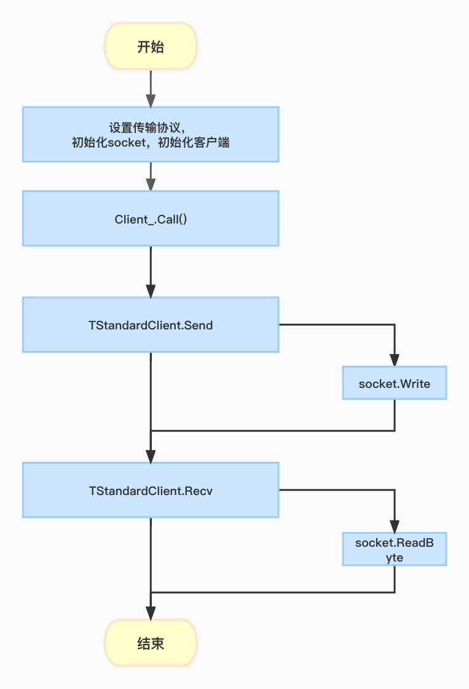

# 客户端请求流程

# 客户端请求实现
```go
func SimpleClient()  {
    var transport thrift.TTransport
	// 建立一个socket链接
    transport,  _ = thrift.NewTSocketConf("localhost:8090", &thrift.TConfiguration{
        ConnectTimeout: time.Second,
        SocketTimeout:  time.Second,
    })
	// 初始化一个配置
    conf := &thrift.TConfiguration{
        MaxFrameSize:       1024*256,
        ConnectTimeout:     time.Second,
        SocketTimeout:      time.Second,
        TBinaryStrictRead:  thrift.BoolPtr(true),
        TBinaryStrictWrite: thrift.BoolPtr(true),
    }
	// 传输协议
    protocolFactory := thrift.NewTBinaryProtocolFactoryConf(conf)
	// 传输方法
    transportFactory := thrift.NewTTransportFactory()
    transport, _ = transportFactory.GetTransport(transport)
    defer transport.Close()
    transport.Open()
	// 初始化输入，输出的传输方式
    iprot := protocolFactory.GetProtocol(transport)
    oprot := protocolFactory.GetProtocol(transport)
    handleClient(Sample.NewSimpleServiceClient(thrift.NewTStandardClient(iprot, oprot)))
}


// 初始化一个client，调用client的Add方法
func handleClient(client *Sample.SimpleServiceClient) {
	ctx := context.TODO()
	res, _ := client.Add(ctx,13,"25")
	fmt.Println("result is ", res)
}

func (p *SimpleServiceClient) Add(ctx context.Context, num1 int32, num2 string) (_r int32, _err error) {
    var _args20 SimpleServiceAddArgs
    _args20.Num1 = num1
    _args20.Num2 = num2
    var _result22 SimpleServiceAddResult
    var _meta21 thrift.ResponseMeta
    _meta21, _err = p.Client_().Call(ctx, "add", &_args20, &_result22)
    p.SetLastResponseMeta_(_meta21)
    if _err != nil {
        return
    }
    return _result22.GetSuccess(), nil
}
func (p *TStandardClient) Call(ctx context.Context, method string, args, result TStruct) (ResponseMeta, error) {
    p.seqId++
    seqId := p.seqId
	// client的请求分为send和recv两个过程
    if err := p.Send(ctx, p.oprot, seqId, method, args); err != nil {
        return ResponseMeta{}, err
    }
    
    // method is oneway
    if result == nil {
        return ResponseMeta{}, nil
    }
    
    err := p.Recv(ctx, p.iprot, seqId, method, result)
    var headers THeaderMap
    if hp, ok := p.iprot.(*THeaderProtocol); ok {
        headers = hp.transport.readHeaders
    }
    return ResponseMeta{
        Headers: headers,
        }, err
}

func (p *TStandardClient) Send(ctx context.Context, oprot TProtocol, seqId int32, method string, args TStruct) error {
    // 代码中oprot设置的为二进制传输协议，并不是报文传输协议
    if headerProt, ok := oprot.(*THeaderProtocol); ok {
        headerProt.ClearWriteHeaders()
        for _, key := range GetWriteHeaderList(ctx) {
            if value, ok := GetHeader(ctx, key); ok {
                headerProt.SetWriteHeader(key, value)
            }
        }
    }
	// 写入调用的方法
    if err := oprot.WriteMessageBegin(ctx, method, CALL, seqId); err != nil {
        return err
    }
	// 将参数发送给服务器,
    if err := args.Write(ctx, oprot); err != nil {
        return err
    }
	// 通知服务器发送完毕
    if err := oprot.WriteMessageEnd(ctx); err != nil {
        return err
    }
    return oprot.Flush(ctx)
}
// 发送参数给服务器，底层是p的transport(TSocket)在起发送作用,将参数写入到socket中
func (p *SimpleServiceAddArgs) Write(ctx context.Context, oprot thrift.TProtocol) error {
    if err := oprot.WriteStructBegin(ctx, "add_args"); err != nil {
        return thrift.PrependError(fmt.Sprintf("%T write struct begin error: ", p), err)
	}
	
	if p != nil {
        if err := p.writeField1(ctx, oprot); err != nil {
			return err
		}
        if err := p.writeField2(ctx, oprot); err != nil {
			return err
		}
    }
    if err := oprot.WriteFieldStop(ctx); err != nil {
        return thrift.PrependError("write field stop error: ", err) 
	}
    if err := oprot.WriteStructEnd(ctx); err != nil {
        return thrift.PrependError("write struct stop error: ", err)
	}
    return nil
}
```