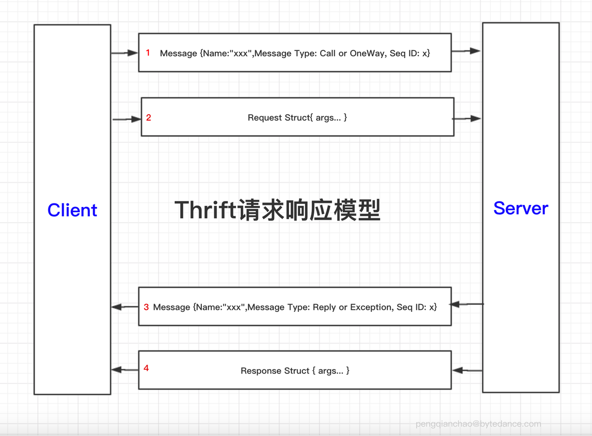
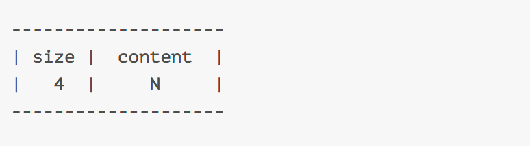
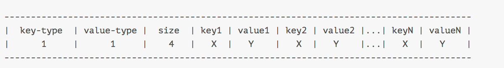
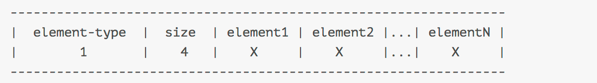
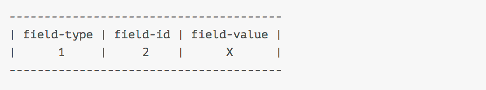
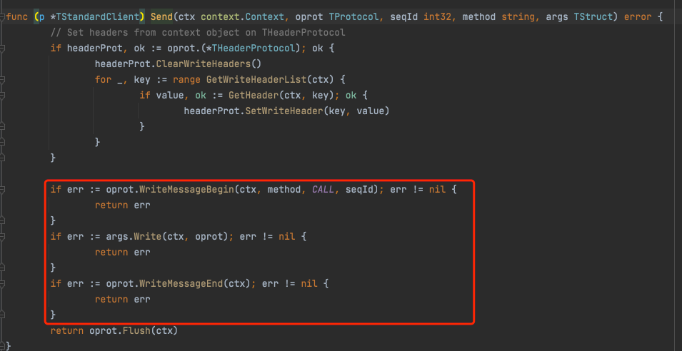
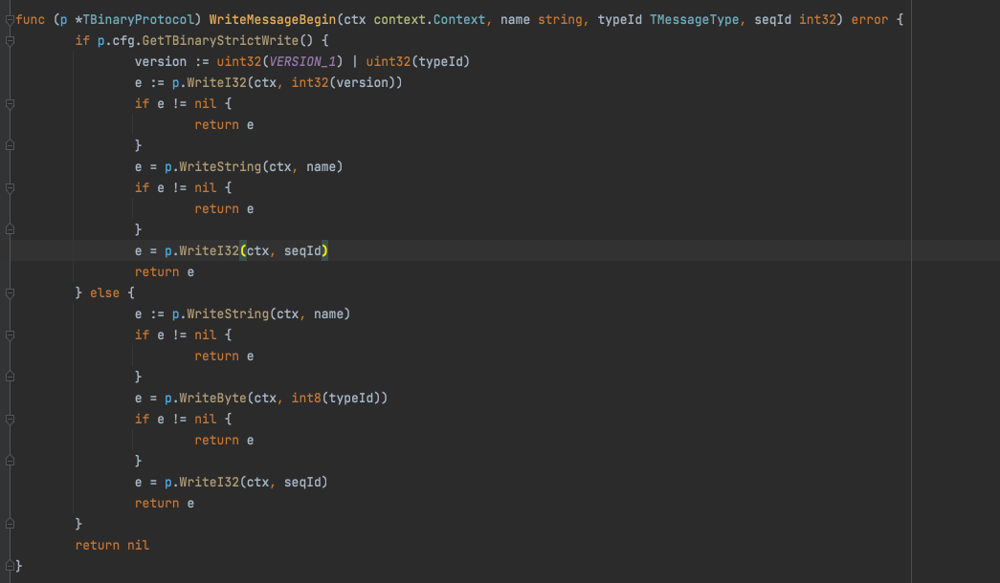

# Thrift请求响应模型

thrift的官方Doc中将thrift的请求响应描述为上述的四个步骤。最外层只有Message和Struct。这里可以将Message和Struct类比为TCP中的首部和负载，Message中放的事元信息(metadata)，Struct则包含的是具体传递的数据(payload)。
这里应该理解为字节流，2的字节流紧跟在1的数据后面，4的数据紧跟在3的数据后面。

# 深入Message和Struct
## Message
message中包含Name，Message Type， Sequence Id等数据。
* Name：调用方法的名字
* Message Type：

      INVALID_TMESSAGE_TYPE TMessageType = 0 // 无效type
  
      CALL                  TMessageType = 1 // 调用远程方法，并且期待对方发送响应
  
      REPLY                 TMessageType = 2 // 调用远程方法，不期待响应，即没有3，4步
  
      EXCEPTION             TMessageType = 3 // 表明处理完成，响应正常返回
  
      ONEWAY                TMessageType = 4 // 表明处理出错

* Sequence Id：序列号，有符号的四字节整数，在一个传输层的连接上所有未完成的请求必须有唯一的序列号，客户端使用序列号来处理响应失序到达，实现请求和响应的匹配。服务端不需要检查序列号，也不能对序列号有任何逻辑依赖。只需要响应的时候将其原样返回即可。

## Struct
在上面的Thrift请求响应模型中，有两种Struct：
* Request Struct
* Response Struct

这两种Struct结构是一样，都是由多个Field组成。

# Thrift序列化协议
Thrift支持多种序列化协议，常用的有：Binary，Compact，json。我们这里只分析下Binary和Compact
## Binary序列化
binary序列化是一种二进制序列化方式。不可读，但是传输效率高。头条的绝大部分都kite服务都是采用的Binary序列化方式。

## Message的序列化
Message的序列化分位2种，strict encoding和old encoding。在有些视线中，会通过检查thrift消息的第一个bit来判断使用了使用那种encoding：
* 1 ：strict encoding
* 0 ：old encoding

todo 待补充图片

## Struct的序列化
Struct装的是thrift通信的实际参数，一个Struct由许多基本类型组合而成，要了解Struct怎么序列化，就必须知道这些基本类型的序列化。

| 类型名 | idl类型名| 占用字节数 | 类型ID |
| ----  | ----    | ----     | ----   |
| bool  | bool    | 1        |  2     |
| byte  | byte    | 1        |  3     |
| short | i16     | 2        |  6     |
| int   | i32     | 4        |  8     |
| long  | i64     | 8        |  10    |
| double| double  | 8        |  4     |
| string| string  | 4+N      |  11    |
| []byte| binary  | 4+N      |        |
| list  | list    | 1+4+N    |  15    |
| set   | set     | 1+4+N    |  14    |
| field |         | 1+2+X    |  13     |
| struct| struct  | N * X    |  12    |
| enum  |         |          |        |
| union |         |          |        |
| exception  |    |          |        |

### 定长编码
上表中bool，byte，short，int，long，double采用的是固定字节编码，各类型占用的字节数见上表

### 长度前缀编码(4+N)

string，byte，array采用的是长度前缀编码，前四个字节(无符号四字节整数)表示长度，后面跟着的就是实际的内容。

### map的编码(1+1+4+NX+NY)

其中key-type和value-type可是是任意基本类型。注意将此处的map与python中的dict区分，这里的key和value各自都必须是同种类型，而python中的dict是多态字典

### list和set的编码(1+4+N*X)

这里的list和set中的元素都必须是同一种类型

### field的编码(1+2+X)

field不是一个实际存在的类型，而是一个抽象概念。field不独立出现，而是出现在struct内部，其中field-type可以是任何类型，field-id就是定义IDL时该field在struct的编号，field-value是对应类型的值得序列化结果。
struct的编码，一个struct就是多个field编码而成，最后一个field排列完成之后就是一个stop field，这个field是一个8bit全为0的字节，他标志着一条thrift消息的结束。
```go
---------------------------------------------
| field1 | field2 |...| fieldN | stop field |        stop field: 00000000 
|    M   |    M   |...|    M   |   00000000 |   所以Message Type编码的时候不能用0
---------------------------------------------
```
thrift序列化的时候并没有将字段名序列化进去，所以在idl文件中更改字段名是没有任何影响的。因为客户端和服务端使用的是同一个IDL文件，所以在对应的时候可以根据Sequence ID进行对应

# Transport
基于帧传输和不基于帧传输是在二进制协议的情况下谈的，文本协议不谈这个。

早期，thrift使用的是不基于帧的传输，在这种情况下，处理器是直接想socket中读写数据。之后，thrift引入了基于帧的传输(FramedTransport)：client/server会首先在内存中缓存完整的请求/响应，
当将request struct/response struct的最后一个字节缓存完成之后，会计算该消息的长度，然后向socket中写入该长度(4字节有符号整数)，接着写入消息实际内容。长度前缀+消息内容就组成了一个帧
(frame)。基于帧的传输主要是为了简化异步处理器的实现。


## 客户端具体实现

关于golang的客户端序列化以及socket发送信息，主要是上述三个方法的底层实现。
### WriteMessageBegin(TBinaryProtocol)

上图方法开始先判断二进制协议对象TBinaryProtocol是否包含对应的写配置
如果包含则写入版本号，方法名，序列号等，我们看下这块是如何写入的，以WriteI32为例。

* WriteI32
  ```go
  func (p *TBinaryProtocol) WriteI32(ctx context.Context, value int32) error {
      v := p.buffer[0:4]
      binary.BigEndian.PutUint32(v, uint32(value))
      _, e := p.trans.Write(v)
      return NewTProtocolException(e)
  }

  func (bigEndian) PutUint32(b []byte, v uint32) {
    _ = b[3] // early bounds check to guarantee safety of writes below
    
    b[0] = byte(v >> 24)
    b[1] = byte(v >> 16)
    b[2] = byte(v >> 8)
    b[3] = byte(v)
  }
  
  func (p *TSocket) Write(buf []byte) (int, error) {
    // 判断当前连接是否可用
	if !p.conn.isValid() {
		return 0, NewTTransportException(NOT_OPEN, "Connection not open")
	}
    
	p.pushDeadline(false, true)
	return p.conn.Write(buf)
  }
  
  func (p *TSocket) pushDeadline(read, write bool) {
	var t time.Time
	if timeout := p.cfg.GetSocketTimeout(); timeout > 0 {
		t = time.Now().Add(time.Duration(timeout))
	}
	if read && write {
		p.conn.SetDeadline(t)
	} else if read {
		p.conn.SetReadDeadline(t)
	} else if write {
		p.conn.SetWriteDeadline(t)
    }
  }
  ```
方法PutUint32：
  
    每个二进制协议对象都有一个64字节的buffer，在内存中，假如v的大小是1，v的存储格式如下：0x1, 0x0, 0x0, 0x0。 从左到右内存地址依次降低，按照大端存储的方式进行存储。
    这里， b[0], ...b[n]在内存中的地址是依次增大，上述v位操作之后，在b[3]低地址中会存储v的低位数据。涉及到大小端存储一般情况下，socket编程中的网络字节序都是大端存储。
    X86，ARM都是小端存储。
  
方法WriteI32：
  
    现在v中已经存有变量value，然后将value通过socket套接字发送给服务端，这里的trans在golang中底层其实是一个socket连接。

方法Write：
  
    p.trans的本质是一个socket连接，他的底层实现是TSocket对象，对应的他的Write方法如上。可以看到首先连接是否有效，pushDeadline用来设置读或者写socket的超时设置，在初始化socket transport时其实已经就设置好了，如果未设置，默认为当前时间。
    p.conn.Write(buf)就开始往文件描述符fd上写入数据。这里奇怪的点在于，我记得golang在这里的传输是基于帧传输的，所以只有当前帧数据满了之后才会发送，但是这里看起来是直接发送，这个后续再看下。

* WriteString
```go
func (p *TBinaryProtocol) WriteString(ctx context.Context, value string) error {
	e := p.WriteI32(ctx, int32(len(value)))
	if e != nil {
		return e
	}
	_, err := p.trans.WriteString(value)
	return NewTProtocolException(err)
}
```
WriteString方法和WriteI32方法我们会看到有明显的不同，WriteString方法在最开始会写入当前变量值的长度，之后在想socket中写入当前变量值，而WriteI32是直接写入了当前变量值。
p.trans.WriteString(value)方法底层调用的也是上述的Write方法。只不过中间用RichTransport的WriteString包装了下。


自此我们看到WriteMessageBegin方法已经执行完毕，写入方法名，版本号，序列号等

### args.Write
这个方法是用来写入请求参数，具体实现如下：
```go
func (p *GreeterSayHelloArgs) Write(ctx context.Context, oprot thrift.TProtocol) error {
	// WriteStructBegin在TBinaryProtocol下是个空方法，不会写入任何东西
  if err := oprot.WriteStructBegin(ctx, "SayHello_args"); err != nil {
    return thrift.PrependError(fmt.Sprintf("%T write struct begin error: ", p), err) }
  if p != nil {
    if err := p.writeField1(ctx, oprot); err != nil { return err }
  }
  if err := oprot.WriteFieldStop(ctx); err != nil {
    return thrift.PrependError("write field stop error: ", err) }
  if err := oprot.WriteStructEnd(ctx); err != nil {
    return thrift.PrependError("write struct stop error: ", err) }
  return nil
}
```
可以看到writeField1方法执行了写入操作
* writeField1
  ```go
  func (p *GreeterSayHelloArgs) writeField1(ctx context.Context, oprot thrift.TProtocol) (err error) {
    if err := oprot.WriteFieldBegin(ctx, "user", thrift.STRUCT, 1); err != nil {
      return thrift.PrependError(fmt.Sprintf("%T write field begin error 1:user: ", p), err) }
    if err := p.User.Write(ctx, oprot); err != nil {
      return thrift.PrependError(fmt.Sprintf("%T error writing struct: ", p.User), err)
    }
    if err := oprot.WriteFieldEnd(ctx); err != nil {
      return thrift.PrependError(fmt.Sprintf("%T write field end error 1:user: ", p), err) }
    return err
  }
  
  func (p *TBinaryProtocol) WriteFieldBegin(ctx context.Context, name string, typeId TType, id int16) error {
	e := p.WriteByte(ctx, int8(typeId))
	if e != nil {
		return e
	}
	e = p.WriteI16(ctx, id)
	return e
  }
    
  func (p *User) Write(ctx context.Context, oprot thrift.TProtocol) error {
    if err := oprot.WriteStructBegin(ctx, "User"); err != nil {
        return thrift.PrependError(fmt.Sprintf("%T write struct begin error: ", p), err) }
    if p != nil {
        if err := p.writeField1(ctx, oprot); err != nil { return err }
        if err := p.writeField2(ctx, oprot); err != nil { return err }
        if err := p.writeField3(ctx, oprot); err != nil { return err }
        if err := p.writeField4(ctx, oprot); err != nil { return err }
        if err := p.writeField5(ctx, oprot); err != nil { return err }
    }
    if err := oprot.WriteFieldStop(ctx); err != nil {
        return thrift.PrependError("write field stop error: ", err) }
    if err := oprot.WriteStructEnd(ctx); err != nil {
        return thrift.PrependError("write struct stop error: ", err) }
    return nil
  }
  
  func (p *User) writeField2(ctx context.Context, oprot thrift.TProtocol) (err error) {
    if p.IsSetName() {
        if err := oprot.WriteFieldBegin(ctx, "name", thrift.STRING, 2); err != nil {
            return thrift.PrependError(fmt.Sprintf("%T write field begin error 2:name: ", p), err) }
        if err := oprot.WriteString(ctx, string(*p.Name)); err != nil {     
            return thrift.PrependError(fmt.Sprintf("%T.name (2) field write error: ", p), err) }
        if err := oprot.WriteFieldEnd(ctx); err != nil {
            return thrift.PrependError(fmt.Sprintf("%T write field end error 2:name: ", p), err) }
    }
    return err
  }
  ```
我们可以看到WriteFieldBegin方法的入参包括，变量名，变量类型编号，IDL文件中的序号。具体实现上和上面WriteMessageBegin方法的写入基本类似，都是会将参数写入到socket中。
p.User.Write方法是绑定在User结构体上的方法，在实现上和前面的WriteFieldBegin也是基本类似的，

这里我列举了writeField2方法，我们可以看到WriteFieldBegin入参包括变量名，类型，IDL文件中的序列编号。这里变量名是不会写入传输的，写入传输的只有类型和序列号。WriteFieldEnd
方法TBinaryProtocol的实现是空方法


经过上述几个方法，在客户端的参数序列化和send动作就基本完成了，接下来我们看下服务端是如何反序列化的

## 服务端具体实现
服务端在监听到请求时，会开启一个goroutine来处理对应的请求。这里我们直接看当前服务端是怎么针对当前请求进行反序列化。
```go
func (p *SimpleServiceProcessor) Process(ctx context.Context, iprot, oprot thrift.TProtocol) (success bool, err thrift.TException) {
  name, _, seqId, err2 := iprot.ReadMessageBegin(ctx)
  if err2 != nil { return false, thrift.WrapTException(err2) }
  if processor, ok := p.GetProcessorFunction(name); ok {
    return processor.Process(ctx, seqId, iprot, oprot)
  }
  iprot.Skip(ctx, thrift.STRUCT)
  iprot.ReadMessageEnd(ctx)
  x24 := thrift.NewTApplicationException(thrift.UNKNOWN_METHOD, "Unknown function " + name)
  oprot.WriteMessageBegin(ctx, name, thrift.EXCEPTION, seqId)
  x24.Write(ctx, oprot)
  oprot.WriteMessageEnd(ctx)
  oprot.Flush(ctx)
  return false, x24
}


func (p *TBinaryProtocol) ReadMessageBegin(ctx context.Context) (name string, typeId TMessageType, seqId int32, err error) {
  size, e := p.ReadI32(ctx)
  if e != nil {
    return "", typeId, 0, NewTProtocolException(e)
  }
  if size < 0 {
	  //解析typeId，typeId代表了上游需要立刻返回还是异步返回
	  //解析对应的thrift版本号
    typeId = TMessageType(size & 0x0ff)
    version := int64(int64(size) & VERSION_MASK)
    if version != VERSION_1 {
        return name, typeId, seqId, NewTProtocolExceptionWithType(BAD_VERSION, fmt.Errorf("Bad version in ReadMessageBegin"))
    }
	// 读取方法名
    name, e = p.ReadString(ctx)
    if e != nil {
        return name, typeId, seqId, NewTProtocolException(e)
    }
	// 读取序列号
    seqId, e = p.ReadI32(ctx)
    if e != nil {
        return name, typeId, seqId, NewTProtocolException(e)
    }
    return name, typeId, seqId, nil
  }
  if p.cfg.GetTBinaryStrictRead() {
    return name, typeId, seqId, NewTProtocolExceptionWithType(BAD_VERSION, fmt.Errorf("Missing version in ReadMessageBegin"))
  }
  name, e2 := p.readStringBody(size)
  if e2 != nil {
    return name, typeId, seqId, e2
  }
  b, e3 := p.ReadByte(ctx)
  if e3 != nil {
    return name, typeId, seqId, e3
  }
  typeId = TMessageType(b)
  seqId, e4 := p.ReadI32(ctx)
  if e4 != nil {
    return name, typeId, seqId, e4
  }
  return name, typeId, seqId, nil
}

func (p *TBinaryProtocol) ReadI32(ctx context.Context) (value int32, err error) {
  buf := p.buffer[0:4]
  err = p.readAll(ctx, buf)
  // readAll方法会返回buf长度的字节数，binary.BigEndian.Uint32方法会将该长度，进行反向位操作，之后将各个字节的对应位进行异或操作，
  value = int32(binary.BigEndian.Uint32(buf))
  return value, err
}

func (bigEndian) Uint32(b []byte) uint32 {
  _ = b[3] // bounds check hint to compiler; see golang.org/issue/14808
  return uint32(b[3]) | uint32(b[2])<<8 | uint32(b[1])<<16 | uint32(b[0])<<24
}

func (p *TBinaryProtocol) readAll(ctx context.Context, buf []byte) (err error) {
  var read int
  _, deadlineSet := ctx.Deadline()
  for {
	  // 会从socket中读取长度为len(buf)字节的内容到buf中。只有在n == len(buf)时不会出错。除此之外都会报错。
      read, err = io.ReadFull(p.trans, buf)
      if deadlineSet && read == 0 && isTimeoutError(err) && ctx.Err() == nil {
        // This is I/O timeout without anything read,
        // and we still have time left, keep retrying.
        continue
      }
     // For anything else, don't retry
	 break
  }
  return NewTProtocolException(err)
}
func safeReadBytes(size int32, trans io.Reader) ([]byte, error) {
  if size < 0 {
    return nil, nil
  }
  
  buf := new(bytes.Buffer)
  _, err := io.CopyN(buf, trans, int64(size))
  return buf.Bytes(), err
}

```
因为client在序列化时，是会执行WriteMessageBegin，args.Write，WriteMessageEnd这三个方法。在执行WriteMessageBegin方法时会写入方法名，序列号，版本号等。
服务端ReadMessageBegin方法会进行反序列化读取出client的传参。这里最关键的是上述safeReadBytes方法，我们可以看到该方法会从网络io接口上读取固定长度的内容到新
开辟的内存buf上，这里即方法名。在拿到对应的方法名，序列号等信息后Process方法回去check当前这个方法是否在一个map中，这个map中会存储当前服务提供的方法名。


如果存在对应的方法名，则会转到对应方法的处理方法上，如下SayHello的procrss方法
```go

func (p *greeterProcessorSayHello) Process(ctx context.Context, seqId int32, iprot, oprot thrift.TProtocol) (success bool, err thrift.TException) {
  args := GreeterSayHelloArgs{}
  var err2 error
  if err2 = args.Read(ctx, iprot); err2 != nil {
    iprot.ReadMessageEnd(ctx)
    x := thrift.NewTApplicationException(thrift.PROTOCOL_ERROR, err2.Error())
    oprot.WriteMessageBegin(ctx, "SayHello", thrift.EXCEPTION, seqId)
    x.Write(ctx, oprot)
    oprot.WriteMessageEnd(ctx)
    oprot.Flush(ctx)
    return false, thrift.WrapTException(err2)
  }
  iprot.ReadMessageEnd(ctx)

  tickerCancel := func() {}
  // Start a goroutine to do server side connectivity check.
  if thrift.ServerConnectivityCheckInterval > 0 {
    var cancel context.CancelFunc
    ctx, cancel = context.WithCancel(ctx)
    defer cancel()
    var tickerCtx context.Context
    tickerCtx, tickerCancel = context.WithCancel(context.Background())
    defer tickerCancel()
    go func(ctx context.Context, cancel context.CancelFunc) {
      ticker := time.NewTicker(thrift.ServerConnectivityCheckInterval)
      defer ticker.Stop()
      for {
        select {
        case <-ctx.Done():
          return
        case <-ticker.C:
          if !iprot.Transport().IsOpen() {
            cancel()
            return
          }
        }
      }
    }(tickerCtx, cancel)
  }

  result := GreeterSayHelloResult{}
  var retval *Response
  if retval, err2 = p.handler.SayHello(ctx, args.User); err2 != nil {
    tickerCancel()
    if err2 == thrift.ErrAbandonRequest {
      return false, thrift.WrapTException(err2)
    }
    x := thrift.NewTApplicationException(thrift.INTERNAL_ERROR, "Internal error processing SayHello: " + err2.Error())
    oprot.WriteMessageBegin(ctx, "SayHello", thrift.EXCEPTION, seqId)
    x.Write(ctx, oprot)
    oprot.WriteMessageEnd(ctx)
    oprot.Flush(ctx)
    return true, thrift.WrapTException(err2)
  } else {
    result.Success = retval
  }
  tickerCancel()
  if err2 = oprot.WriteMessageBegin(ctx, "SayHello", thrift.REPLY, seqId); err2 != nil {
    err = thrift.WrapTException(err2)
  }
  if err2 = result.Write(ctx, oprot); err == nil && err2 != nil {
    err = thrift.WrapTException(err2)
  }
  if err2 = oprot.WriteMessageEnd(ctx); err == nil && err2 != nil {
    err = thrift.WrapTException(err2)
  }
  if err2 = oprot.Flush(ctx); err == nil && err2 != nil {
    err = thrift.WrapTException(err2)
  }
  if err != nil {
    return
  }
  return true, err
}
```
方法在最开始会从网络io中读取args，并且序列化到GreeterSayHelloArgs{}对象上，之后在去调用p.handler.SayHello(ctx, args.User)方法，来处理对应的业务逻辑。
在拿到返回后就会执行服务端发送的序列化逻辑，这里和client的发送序列化基本一致。

## Client反序列化返回
```go

func (p *TStandardClient) Call(ctx context.Context, method string, args, result TStruct) (ResponseMeta, error) {
	p.seqId++
	seqId := p.seqId

	if err := p.Send(ctx, p.oprot, seqId, method, args); err != nil {
		return ResponseMeta{}, err
	}

	// method is oneway
	if result == nil {
		return ResponseMeta{}, nil
	}

	err := p.Recv(ctx, p.iprot, seqId, method, result)
	var headers THeaderMap
	if hp, ok := p.iprot.(*THeaderProtocol); ok {
		headers = hp.transport.readHeaders
	}
	return ResponseMeta{
		Headers: headers,
	}, err
}
```
client接收下游返回主要是Recv方法
```go
func (p *TStandardClient) Recv(ctx context.Context, iprot TProtocol, seqId int32, method string, result TStruct) error {
	rMethod, rTypeId, rSeqId, err := iprot.ReadMessageBegin(ctx)
	if err != nil {
		return err
	}

	if method != rMethod {
		return NewTApplicationException(WRONG_METHOD_NAME, fmt.Sprintf("%s: wrong method name", method))
	} else if seqId != rSeqId {
		return NewTApplicationException(BAD_SEQUENCE_ID, fmt.Sprintf("%s: out of order sequence response", method))
	} else if rTypeId == EXCEPTION {
		var exception tApplicationException
		if err := exception.Read(ctx, iprot); err != nil {
			return err
		}

		if err := iprot.ReadMessageEnd(ctx); err != nil {
			return err
		}

		return &exception
	} else if rTypeId != REPLY {
		return NewTApplicationException(INVALID_MESSAGE_TYPE_EXCEPTION, fmt.Sprintf("%s: invalid message type", method))
	}

	if err := result.Read(ctx, iprot); err != nil {
		return err
	}

	return iprot.ReadMessageEnd(ctx)
}
```
recv方法首先序列化出来对应的方法名，序列号id，版本号等，判断是否和发送时一致。如果一致则会读取对应的返回
```go
func (p *GreeterSayHelloResult) Read(ctx context.Context, iprot thrift.TProtocol) error {
  if _, err := iprot.ReadStructBegin(ctx); err != nil {
    return thrift.PrependError(fmt.Sprintf("%T read error: ", p), err)
  }


  for {
    _, fieldTypeId, fieldId, err := iprot.ReadFieldBegin(ctx)
    if err != nil {
      return thrift.PrependError(fmt.Sprintf("%T field %d read error: ", p, fieldId), err)
    }
    if fieldTypeId == thrift.STOP { break; }
    switch fieldId {
    case 0:
      if fieldTypeId == thrift.STRUCT {
        if err := p.ReadField0(ctx, iprot); err != nil {
          return err
        }
      } else {
        if err := iprot.Skip(ctx, fieldTypeId); err != nil {
          return err
        }
      }
    default:
      if err := iprot.Skip(ctx, fieldTypeId); err != nil {
        return err
      }
    }
    if err := iprot.ReadFieldEnd(ctx); err != nil {
      return err
    }
  }
  if err := iprot.ReadStructEnd(ctx); err != nil {
    return thrift.PrependError(fmt.Sprintf("%T read struct end error: ", p), err)
  }
  return nil
}
```
这里的读取和服务端读取客户端的请求参数是一致的。在拿到对应的返回后，会序列化对应的respone参数上，这样最外成就拿到了需要的返回值。
```go
 var _result5 GreeterSayHelloResult
```