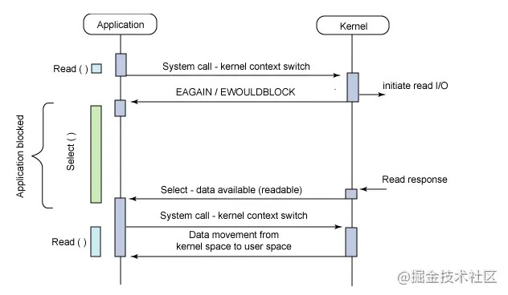
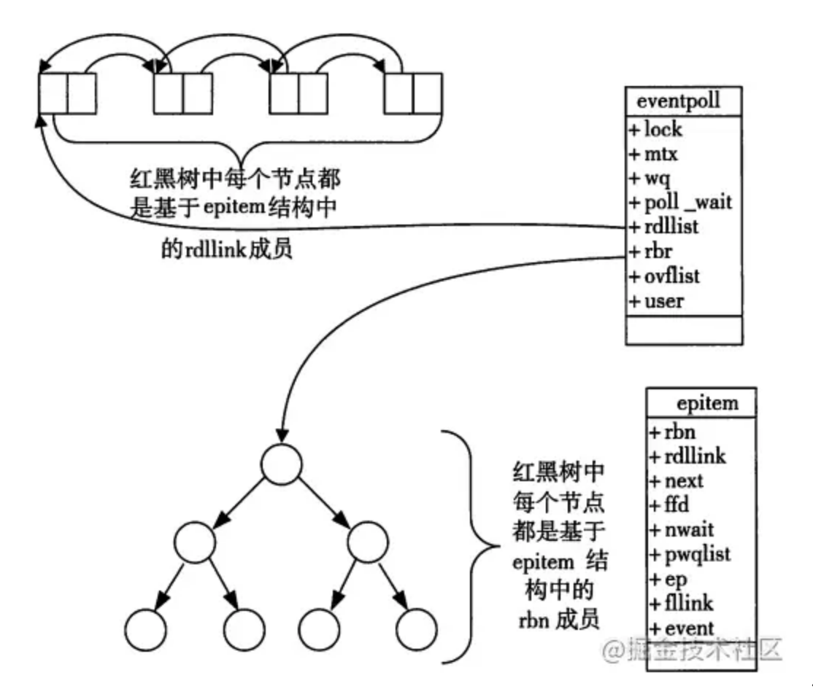

## 文件描述符和文件句柄
1.  文件描述符（file descriptor, fd）是Linux系统中对已打开文件的一个抽象标记，所有的IO系统调用对已打开的文件的操作都要使用到它，这里的文件仍然是广义的，除了普通的文件和目录外，还包括管道、FIFO（命名管道）、Socket、终端、设备等。

## 什么是io多路复用     
* io多路复用是一种同步io模型，实现一个线程可以监听多个文件句柄；
* 一旦某个文件句柄就绪了，就能够通知应用程序进行相应的读写操作
* 没有文件句柄就绪就会阻塞应用程序，交出cpu
> 多路指的是网络连接，复用指的的是一个线程

## 为什么有io多路复用机制       
没有io多路复用机制时，有bio，nio两种实现方式
### 同步阻塞（bio） 
* 服务端采用单线程，当acceot一个请求后，在recv或者send调用阻塞时，将无法accpet其他请求  
    ```golang
    // 伪代码描述
    while (true) {
        // accept阻塞
        client_fd = accept(listen_fd);
        fds.append(client_fd);
        for (fd in fds) {
            // recv阻塞（会影响上面的accept）
            if (recv(fd)) {
                // logic
            }
        }
    }
    ```
* 服务端采用多线程，当accept一个请求之后，开启线程进行recv，可以完成并发处理。但随着请求数的增加需要增加洗头膏线程，大量线程占用大量的内存空间，并且线程切换会带来很大的开销，10000个线程真正发生读写实际的线程数不会超过20%，每次accept都开一个线程也是一种浪费资源
    ```golang
    // 伪代码描述
    while(true) {
    // accept阻塞
    client_fd = accept(listen_fd)
    // 开启线程read数据（fd增多导致线程数增多）
    new Thread func() {
        // recv阻塞（多线程不影响上面的accept）
        if (recv(fd)) {
        // logic
        }
    }  
    }
    ```  

### 同步非阻塞（nio）
* 服务器端当accept一个请求以后，加入fds集合，每次轮训fds集合recv（非阻塞）数据，没有数据则立即返回错误，每次轮训所有fd（包括没有发生读写实际的fd）会很浪费cpu
    ```golang
    // 伪代码描述
    while(true) {
    // accept非阻塞（cpu一直忙轮询）
    client_fd = accept(listen_fd)
    if (client_fd != null) {
        // 有人连接
        fds.append(client_fd)
    } else {
        // 无人连接
    }  
    for (fd in fds) {
        // recv非阻塞
        setNonblocking(client_fd)
        // recv 为非阻塞命令
        if (len = recv(fd) && len > 0) {
        // 有读写数据
        // logic
        } else {
        无读写数据
        }
    }  
    }
    ```

### io多路复用       
服务端采用单线程通过select/poll/epoll等系统调用获取fd列表，遍历有事件的fd进行accpet/recv/send/使其能支持更多的并发连接请求数

```golang
// 伪代码描述
while(true) {
  // 通过内核获取有读写事件发生的fd，只要有一个则返回，无则阻塞
  // 整个过程只在调用select、poll、epoll这些调用的时候才会阻塞，accept/recv是不会阻塞
  for (fd in select(fds)) {
    if (fd == listen_fd) {
        client_fd = accept(listen_fd)
        fds.append(client_fd)
    } elseif (len = recv(fd) && len != -1) { 
      // logic
    }
  }  
}
```

## io多路复用的三种实现        
* select
* poll
* epoll

## select
他仅仅知道了，有io事件发生了，并不知道是哪几个流，我们只能无差别的轮询所有的流，找出能读出数据，或者写入数据的流，对他们进行操作。所有select具有O(n)的无差别轮询复杂度，同时处理的流越多，轮询的时间越长

### select调用过程  

 
  
    1）使用copy_from_user从用户态空间拷贝fd_set到内核态     
    2）注册回调函数_pollwait    
    3) 遍历所有fd，调用其对应的poll方法(对于socket，这个poll方法是sock_poll，sock_poll根据情况会调用到tcp_poll,udp_poll或者datagram_poll)   
    4）以tcp_poll为例，其核心就是_pollwait，也就是上面注册的回调函数。      
    5）_poolwait的主要工作就是把current（当前进程）挂到设备的等待队列中，不同的设备有不同的等待队列，对于tcp_poll来说，其等待队列是sk->sk_sleep（注意把进程挂到等待队列中并不代表进程已经睡眠了）。在设备收到一条消息（网络设备）或填写完文件数据（磁盘设备）后，会唤醒设备等待队列上睡眠的进程，这时current便被唤醒了。
    6）poll方法返回时会返回一个描述读写操作是否就绪的mask掩码，根据这个掩码给fd_set赋值     
    7）如果遍历完所有的fd，还没有返回一个可读写的mask掩码，则会调用schedule_timeout是调用select的进程(也就是current)进入睡眠，当设备驱动发现自身资源可读写后，会唤醒其等待队列上睡眠的进程。如果超过一定的超时时间(schedule_timeout指定)，还是没人唤醒，则调用select的进程会重新被唤醒获得cpu，今年而重新遍历fd，判断有没有就绪的fd     
    8）把fd_set从内核空间拷贝到用户空间

### select函数接口
```golang
#include <sys/select.h>
#include <sys/time.h>

#define FD_SETSIZE 1024
#define NFDBITS (8 * sizeof(unsigned long))
#define __FDSET_LONGS (FD_SETSIZE/NFDBITS)

// 数据结构 (bitmap)
typedef struct {
    unsigned long fds_bits[__FDSET_LONGS];
} fd_set;

// API
int select(
    int max_fd, 
    fd_set *readset, 
    fd_set *writeset, 
    fd_set *exceptset, 
    struct timeval *timeout
)                              // 返回值就绪描述符的数目

FD_ZERO(int fd, fd_set* fds)   // 清空集合
FD_SET(int fd, fd_set* fds)    // 将给定的描述符加入集合
FD_ISSET(int fd, fd_set* fds)  // 判断指定描述符是否在集合中 
FD_CLR(int fd, fd_set* fds)    // 将给定的描述符从文件中删除  

```

### select使用示例
```golang
int main() {
  /*
   * 这里进行一些初始化的设置，
   * 包括socket建立，地址的设置等,
   */

  fd_set read_fs, write_fs;
  struct timeval timeout;
  int max = 0;  // 用于记录最大的fd，在轮询中时刻更新即可

  // 初始化比特位
  FD_ZERO(&read_fs);
  FD_ZERO(&write_fs);

  int nfds = 0; // 记录就绪的事件，可以减少遍历的次数
  while (1) {
    // 阻塞获取
    // 每次需要把fd从用户态拷贝到内核态
    nfds = select(max + 1, &read_fd, &write_fd, NULL, &timeout);
    // 每次需要遍历所有fd，判断有无读写事件发生
    for (int i = 0; i <= max && nfds; ++i) {
      if (i == listenfd) {
         --nfds;
         // 这里处理accept事件
         FD_SET(i, &read_fd);//将客户端socket加入到集合中
      }
      if (FD_ISSET(i, &read_fd)) {
        --nfds;
        // 这里处理read事件
      }
      if (FD_ISSET(i, &write_fd)) {
         --nfds;
        // 这里处理write事件
      }
    }
  }
```
### select缺点      
select本质上是通过设置或检查存放fd标示位的数据结构进行下一步处理。这样带来的缺点是：
* 单个进程所打开的fd是有限制的，通过fd_setsize设置，默认是1024
* 每次调用select，都需要吧fd集合从用户态拷贝到内内核态，这个开销在fd很多时会很大
* 对socket扫描时是O(n)，采用轮询的方法，效率较低


## poll
poll本质上和和select没有区别，他将用户传入的数组拷贝到内核空间，然后查询每个fd对应的设备状态，但是他没有最大连接数的限制，原因是他基于链表来存储的      

### poll函数接口        
```golang
#include <poll.h>
// 数据结构
struct pollfd {
    int fd;                         // 需要监视的文件描述符
    short events;                   // 需要内核监视的事件
    short revents;                  // 实际发生的事件
};

// API
int poll(struct pollfd fds[], nfds_t nfds, int timeout);

```


### poll的使用示例      
```golang
// 先宏定义长度
#define MAX_POLLFD_LEN 4096  

int main() {
  /*
   * 在这里进行一些初始化的操作，
   * 比如初始化数据和socket等。
   */

  int nfds = 0;
  pollfd fds[MAX_POLLFD_LEN];
  memset(fds, 0, sizeof(fds));
  fds[0].fd = listenfd;
  fds[0].events = POLLRDNORM;
  int max  = 0;  // 队列的实际长度，是一个随时更新的，也可以自定义其他的
  int timeout = 0;

  int current_size = max;
  while (1) {
    // 阻塞获取
    // 每次需要把fd从用户态拷贝到内核态
    nfds = poll(fds, max+1, timeout);
    if (fds[0].revents & POLLRDNORM) {
        // 这里处理accept事件
        connfd = accept(listenfd);
        //将新的描述符添加到读描述符集合中
    }
    // 每次需要遍历所有fd，判断有无读写事件发生
    for (int i = 1; i < max; ++i) {     
      if (fds[i].revents & POLLRDNORM) { 
         sockfd = fds[i].fd
         if ((n = read(sockfd, buf, MAXLINE)) <= 0) {
            // 这里处理read事件
            if (n == 0) {
                close(sockfd);
                fds[i].fd = -1;
            }
         } else {
             // 这里处理write事件     
         }
         if (--nfds <= 0) {
            break;       
         }   
      }
    }
  }
```
### poll的缺点      
他没有最大连接数的限制，原因是他基于链表来存储的，但是同样有缺点：  
* 每次调用poll，都需要将fd集合从用户态拷贝到内核态，这个开销在fd很多时会很大        
* 对socket扫描是基于线性扫描，采用轮询的方式，效率较低


## epoll        
epoll可以理解成event poll，不同于忙轮询和无差别轮询，epoll会把哪个流发生了怎样的io事件通知我们，所以说epoll实际上是事件驱动的，此时我们对这些流的操作才是有意义的       

### epoll函数接口       
当某一进程调用epoll_create方法时，linux内核会创建一个eventpoll结构体，这个结构体中有两个成员与epoll的使用方式密切相关。eventpoll结构体如下所示：

```golang
#include <sys/epoll.h>

// 数据结构
// 每一个epoll对象都有一个独立的eventpoll结构体
// 用于存放通过epoll_ctl方法向epoll对象中添加进来的事件
// epoll_wait检查是否有事件发生时，只需要检查eventpoll对象中的rdlist双链表中是否有epitem元素即可
struct eventpoll {
    /*红黑树的根节点，这颗树中存储着所有添加到epoll中的需要监控的事件*/
    struct rb_root  rbr;
    /*双链表中则存放着将要通过epoll_wait返回给用户的满足条件的事件*/
    struct list_head rdlist;
};

// API
int epoll_create(int size); // 内核中间加一个 ep 对象，把所有需要监听的 socket 都放到 ep 对象中
int epoll_ctl(int epfd, int op, int fd, struct epoll_event *event); // epoll_ctl 负责把 socket 增加、删除到内核红黑树
int epoll_wait(int epfd, struct epoll_event * events, int maxevents, int timeout);// epoll_wait 负责检测可读队列，没有可读 socket 则阻塞进程

```

1） 每一个epoll对象都有一个独立的eventpoll结构体，用于存放通过epoll_ctl方法向epoll对象中添加进来的事件。这些事件会挂在红黑树中，如此，重复添加事件就可以通过红黑树而高效的识别出来（红黑树的插入时间效率时lgn，其中n为红黑树的元素个数）    

2） 所有添加到epoll中的事件都会与设备（网卡）驱动程序建立回调关系，也就是说，当相应的事件发生时会回调这个回调方法。这个回调方法在内核中叫ep_poll_callback，他会将发生的是事件添加到rdlist双链表中。

3）在epoll中，对于每一个事件，都会建立一个epitem结构体

```golang
struct epitem{
    struct rb_node  rbn;//红黑树节点
    struct list_head    rdllink;//双向链表节点
    struct epoll_filefd  ffd;  //事件句柄信息
    struct eventpoll *ep;    //指向其所属的eventpoll对象
    struct epoll_event event; //期待发生的事件类型
}
```
当调用epoll_wait检查是否有事件发生时，只检查eventpoll对象中的rdlist双链表中是否有epitem元素即可，如果rdlist不为空，则把发生的事件数量返回给用户
 

从上面的讲解可知：通过红黑树和双链表数据结构，并结合回调机制，造就了epoll的高效。讲解完epoll的机理，我们便很容易掌握epoll的用法。：
* 第一步，epoll_create()系统调用。此调用返回一个句柄，之后所有的使用都依靠这个句柄来标示。
* 第二步，epoll_ctl() 系统调用。通过此调用向epoll对象中添加，删除，修改感兴趣的事件，返回0 标示成功，返回-1表示失败。
* 第三步，epoll_wait()系统调用。通过此调用收集在epoll监控中已发生的事件

### epoll的使用示例

```golang
int main(int argc, char* argv[])
{
   /*
   * 在这里进行一些初始化的操作，
   * 比如初始化数据和socket等。
   */

    // 内核中创建ep对象
    epfd=epoll_create(256);
    // 需要监听的socket放到ep中
    epoll_ctl(epfd,EPOLL_CTL_ADD,listenfd,&ev);
 
    while(1) {
      // 阻塞获取
      nfds = epoll_wait(epfd,events,20,0);
      for(i=0;i<nfds;++i) {
          if(events[i].data.fd==listenfd) {
              // 这里处理accept事件
              connfd = accept(listenfd);
              // 接收新连接写到内核对象中
              epoll_ctl(epfd,EPOLL_CTL_ADD,connfd,&ev);
          } else if (events[i].events&EPOLLIN) {
              // 这里处理read事件
              read(sockfd, BUF, MAXLINE);
              //读完后准备写
              epoll_ctl(epfd,EPOLL_CTL_MOD,sockfd,&ev);
          } else if(events[i].events&EPOLLOUT) {
              // 这里处理write事件
              write(sockfd, BUF, n);
              //写完后准备读
              epoll_ctl(epfd,EPOLL_CTL_MOD,sockfd,&ev);
          }
      }
    }
    return 0;
}
```

### epoll的优点     
* 没有最大并发连接的限制，能打开的FD的上限远大于1024（1G的内存上能监听约10万个端口）；
* 效率的提升，不是轮询的方法，不会随fd的数目的增加效率下降。只有活跃可用的FD才会调用callback函数；，即epoll最大的优点就在于他只管你“活跃”的连接，而跟连接总数无关。因此在实际的网络环境中，Epoll的效率就会远远高于select和poll
* 内存拷贝，利用mmap()文件映射内存加速与内核空间的消息传递；即epoll使用mmap减少复制开销

### epoll缺点
epoll只能工作在 linux 下

### epoll LT(水平触发)与ET(边缘触发)模式的区别      
epoll有 EPOLLLT和EPOLLET两种触发模式，LT 是默认的模式，ET 是 “高速” 模式。
* LT模式下，只要这个fd还有数据可读，每次epoll_wait都会返回他的事件，提醒用户程序去操作。
* ET模式，只会提示一次，直到下次再有数据流入之前都不会在提示了，无论fd是否还有数据可读。所以在ET模式下read 一个 fd 的时候一定要把它的buffer读完，或者遇到EAGIN错误。

epoll使用事件的就绪通知方式，通过epoll_ctl注册fd，一旦该fd就绪了，内核就会采取类似callback的回调机制来激活该fd，epoll_wait便可以收到通知

## select/poll/epoll之间的区别
select，poll，epoll都是IO多路复用的机制。IO多路复用就通过一种机制，可以监视多个描述符，一旦描述符就绪了(一般是读就绪或者写就绪)，能够通过程序进行相应的读写操作。但select，poll， epoll本质上
都是同步IO，，因为他们都需要在读写事件就绪后自己负责读写，也就是说这个读写过程时阻塞的，而异步IO则无须自己负责读写，一步IO的实现会负责把数据从内核态拷贝到用户态


## 支持一个进程所能打开的最大连接数     
* select ： 单个进程所能打开的最大连接数有FD_SETSIZE宏定义，其大小是32个整数的大小

* poll：poll本质上和select没有区别，但是它没有最大连接数的限制，原因是它是基于链表来存储的。

* epoll：虽然连接数有上限，但是很大，1G内存的机器上可以打开10万左右的连接，2G内存的机器可以打开20万左右的连接。

## FD剧增后带来的IO效率问题     
* select：因为每次调用时都会对连接进行线性遍历，所以随着FD的增加会造成遍历速度慢的“线性下降性能问题”。
* poll：同上
* epoll： 因为epoll内核中实现是根据每个fd上的callback函数实现的，只有活跃的socket才会主动调用callback，所以在活跃socket较少的情况下，使用epoll没有前两者的线性下降的性能问题，但是所有socket都很活跃的情况下，可能会有性能问题。

## 消息传递方式
* select：内核需要将消息传递到用户空间，都需要内核拷贝动作
* poll：同上
* epoll：epoll通过内核和用户空间共享一块内存来实现的。

## 总结
select, poll实现需要自己不断轮询所有fd集合，直到设备就绪，期间可能要睡眠和唤醒多次交替。而epoll其实也需要调用epoll_wait不断轮询就绪链表，期间也可能多次睡眠和唤醒交替，但是他是设备就绪时，调用回调函数，把就绪fd放入就绪链表，并唤醒在epoll_wait中进入睡眠的进程。 虽然都要睡眠和交替，但是select和poll在“醒着”的时候要遍历整个fd集合，epoll只要判断下 就绪链表是否为空就好了，节省了大量cpu时间，这就是回调机制带来的性能提升。

select，poll每次调用都要把fd集合从用户态往内核态拷贝一次，并且要把current往设备等待队列中挂一次，而epoll只要一次拷贝，而且把current往等待队列挂也只挂一次（epoll_wait的开始，注意这里等待队列并不是设备等待队列，只是一个epoll内部定义的等待队列）


## 高频面试题

### nginx/redis 所使用的IO模型是什么？

1. Nginx的IO模型    

    nginx支持多种并发模型，并发模型的具体实现根据系统平台而有所不同

    1）select
IO多路复用、标准并发模型。在编译 nginx 时，如果所使用的系统平台没有更高效的并发模型，select 模块将被自动编译。configure 脚本的选项：–with-select_module 和 --without-select_module 可被用来强制性地开启或禁止 select 模块的编译

    2）poll
IO多路复用、标准并发模型。与 select 类似，在编译 nginx 时，如果所使用的系统平台没有更高效的并发模型，poll 模块将被自动编译。configure 脚本的选项：–with-poll_module 和 --without-poll_module 可用于强制性地开启或禁止 poll 模块的编译

    3）epoll
IO多路复用、高效并发模型，可在 Linux 2.6+ 及以上内核可以使用

    4）kqueue
IO多路复用、高效并发模型，可在 FreeBSD 4.1+, OpenBSD 2.9+, NetBSD 2.0, and Mac OS X 平台中使用

2. RedisIO多路复用技术
redis是一个单线程却性能非常好的内存数据库，主要用来做缓存系统。redis采用网络IO多路复用技术保证多连接的时候，系统的高吞吐量。redis的io模型主要基于epoll实现的，默认是采用epoll

### 为什么 Redis 中要使用 I/O 多路复用这种技术呢？
redis是跑在单线程中的，所有的操作都是按照顺序线性执行的，但是由于读写操作等待用户输入和输出都是阻塞的，所以IO操作在一般情况下往往不能直接返回，这会导致某一文件的IO阻塞导致整个进程无法对其他客户提供服务，而 I/O 多路复用 就是为了解决这个问题而出现的。


