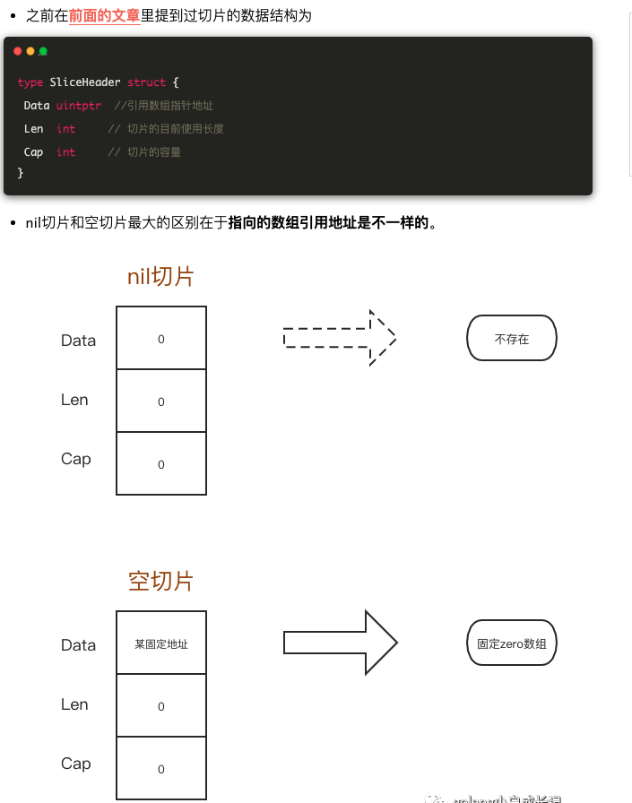
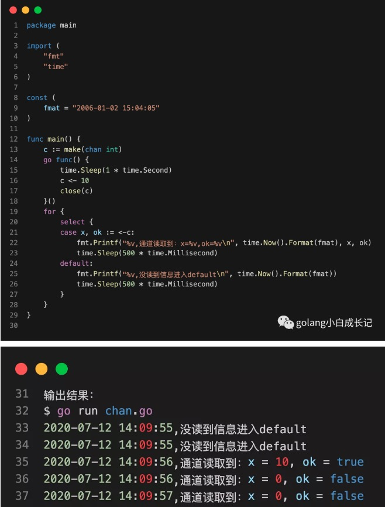
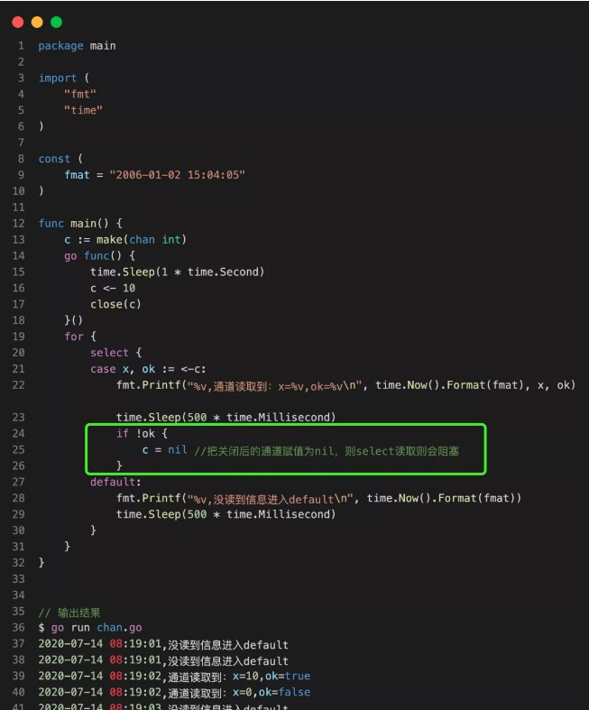

1. golang的nil切片和空切片  

    * nil切片和空切片指向的地址是不一样的。nil空切片引用数组指针地址为0(无指向任何时机地址)
    * 空切片的引用数组指针地址是有的，且固定为一个值。
     
2. for循环
    ```golang
    package main

    import "fmt"

    func main() {
    s := []int{1,2,3,4,5}
    for _, v:=range s {
        s =append(s, v)
        fmt.Printf("len(s)=%v\n",len(s))
        }
    }
    ```
    这个写法会造成死循环吗？        
    答：不会，for range是golang的语法糖，再循环开始前会获取切片的长度len(切片)，然后再执行len(切片)次数的循环

    for range 的源码：
    ```golang
    // The loop we generate:
    //   for_temp := range
    //   len_temp := len(for_temp)
    //   for index_temp = 0; index_temp < len_temp; index_temp++ {
    //           value_temp = for_temp[index_temp]
    //           index = index_temp
    //           value = value_temp
    //           original body
    //   }
    ```
3. 字符串不允许使用nil值        
在golang中，nil只能赋值给指针、channel、func、interface、map或slice类型的变量
    ```golang
    var x string = nil  //error
    if x == nil {       //error
        x = "default"
    }

    //var x string      //defaults to "" (zero value)
    if x == "" {
       x = "default"
    }
    ```
4. 数组用于函数传参时是值复制       
    注意：方法或函数调用时，传入参数都是值复制（跟赋值一致），除非是map、slice、channel、指针类型这些特殊类型是引用传递。
    ```golang
    x := [3]int{1,2,3}

    // 数组在函数中传参是值复制
    func(arr [3]int) {
        arr[0] = 7
        fmt.Println(arr) //prints [7 2 3]
    }(x)
    fmt.Println(x)       //prints [1 2 3] (not ok if you need [7 2 3])

    // 使用数组指针实现引用传参
    func(arr *[3]int) {
       (*arr)[0] = 7
      fmt.Println(arr) //prints &[7 2 3]
    }(&x)
    fmt.Println(x)       //prints [7 2 3]
    ```
5. 从不存在key的map中取值时，返回的总是"0值"        
6. 字符串和[]byte之间的转换时复制(有内存耗损)，可以用map[string][]byte建立字符串和[]byte之间的映射，也可range来避免内存分配来提高性能
7. switch的case默认匹配规则不同于其它语言的是，匹配case条件后默认退出，除非使用fallthrough继续匹配；而其它语言是默认继续匹配，除非使用break退出匹配。
8. cjannel  

    * 对于无缓存区的channel，写入channel的goroutine会阻塞直到被读取，读取channel的goroutine会阻塞直到有数据写入。
    * 从一个closed状态的channel读取数据是安全的，可通过返回状态（第二个返回参数）判断是否关闭；而向一个closed状态的channel写数据会导致panic。
    * 向一个nil值（未用make分配空间）的channel发送或读取数据，会导致永远阻塞
    ```golang
    package main

    import (  
        "fmt"
        "time"
    )

    func main() {  
        var ch chan int
        for i := 0; i < 3; i++ {
            go func(idx int) {
                ch <- (idx + 1) * 2
            }(i)
        }

        //get first result
        fmt.Println("result:",<-ch)
        //do other work
        time.Sleep(2 * time.Second)
    }
    ```
9. Struct、Array、Slice、Map的比较
    * 如果struct结构体的所有字段都能够使用==操作比较，那么结构体变量也能够使用==比较，但是如果struct字段不能使用==比较，那么结构体变量使用==比较会导致编译错误。
    * array只有在它的每个元素能够使用==比较时，array变量才能够比较。
    * go提供了一些用于比较不能直接使用==比较的函数，其中最常用的是reflect.DeepEqual()函数。DeepEqual函数对于nil值的slice与空元素的slice是不相等的，这点和byte.equal函数不同

10. 如果要忽略大小写来比较含文字数据的字节切片(byte slice)      

        不建议使用bytes包和strings包里的tuupper和toLower这些函数转换后在用==，byte.equal(),bytes.compare等比较      

        ToUpper，ToLower只能处理英文文字，对其他语言无效。因此建议使用strings.equalfold和bytes.equalfold

        如果要比较用于验证用户数据密钥信息的字节切片时，使用reflact.DeepEqual()、bytes.Equal()、bytes.Compare()会使应用程序遭受计时攻击(Timing Attack)，可使用crypto/subtle.ConstantTimeCompare()避免泄漏时间信息。

11. Slice中的隐藏数据   
    从一个slice上在生成一个切片slice，新的slice将直接引用原始slice的那个数组，两个slice对同一数组的操作，会互相影响。可通过为新切片slice重新分配空间，从slice中copy部分的数据来避免相互之间的影响
    ```golang
    raw := make([]byte,10000)
    fmt.Println(len(raw),cap(raw),&raw[0])      //prints: 10000 10000 <byte_addr_x>

    data := raw[:3]
    fmt.Println(len(data),cap(data),&data[0])   //prints: 3 10000 <byte_addr_x>

    res := make([]byte,3)
    copy(res,raw[:3])
    fmt.Println(len(res),cap(res),&res[0])      //prints: 3 3 <byte_addr_y>
    ```
12. 更新map值的字段         
    如果map的值类型是结构体类型，那么不能更新从map中取出的结构体的字段值。但是对于结构体类型的slice却是可以
    ```golang
    package main

    type data struct {  
        name string
    }

    func main() {  
        m := map[string]data {"x":{"one"}}
        //m["x"].name = "two" //error
        r := m["x"]
        r.name = "two"
        m["x"] = r
        fmt.Println(s)       // prints: map[x:{two}]

        mp := map[string]*data {"x": {"one"}}
        mp["x"].name = "two" // ok

        s := []data{{"one"}}
        s[0].name = "two"    // ok
        fmt.Println(s)       // prints: [{two}]
    }
    ```
13. nil值的interface{}不等于nil     

            在golang中，nil只能赋值给指针、channel、func、interface、map或slice类型的变量。

            interface{}表示任意类型，可以接收任意类型的值。interface{}变量在底是由类型和值两部分组成，表示为(T,V)，interface{}变量比较特殊，判断它是nil时，要求它的类型和值都是nil，即(nil, nil)。其它类型变量，只要值是nil，那么此变量就是nil（为什么？变量类型不是nil，那当然只能用值来判断了）

            声明变量interface{}，它默认就是nil，底层类型与值表示是(nil, nil)。当任何类型T的变量值V给interface{}变量赋值时，interface{}变量的底层表示是(T, V)。只要T非nil，即使V是nil，interface{}变量也不是nil。
13. 变量内存的分配  

            go编译器使用new()和make()分配内存的卫视到底是stack还是heap，取决于变量的大小和逃逸分析的结果。这意味着Go语言中，返回本地变量的引用也不会有问题。
    
            要想知道变量内存分配的位置，可以在go build、go run命令指定-gcflags -m即可：
            go run -gcflags -m app.go
14. 字符串转程byte数组，会发生内存拷贝吗            
字符串转成切片，会发生拷贝。严格来说只要发生了类型强转都会发生内存拷贝。频繁的内存拷贝对性能是不友好的，有什么方法可以不用发生拷贝呢？

    ```golang
    package main

    import (
     "fmt"
     "reflect"
     "unsafe"
    )

    func main() {
     a :="aaa"
     ssh := *(*reflect.StringHeader)(unsafe.Pointer(&a))
     b := *(*[]byte)(unsafe.Pointer(&ssh))  
     fmt.Printf("%v",b)
    }
    ```
    * StringHeader是字符串在go的底层结构
    ```golang
    type StringHeader struct {
        Data uintptr
        Len  int
    }
    ```
    * SliceHeader是切片在go的底层结构
    ```golang
    type SliceHeader struct {
        Data uintptr
        Len  int
        Cap  int
    }
    ```
    那么如果想要在底层转换二者，只需要把stringheader的地址强转成sliceheader就行。 那么go有个很强的包叫unsafe    
    > 1.unsafe.Pointer(&a)方法可以得到变量a的地址。    
    2.(*reflect.StringHeader)(unsafe.Pointer(&a)) 可以把字符串a转成底层结构的形式。                
    3.(*[]byte)(unsafe.Pointer(&ssh)) 可以把ssh底层结构体转成byte的切片的指针。         
    4.再通过 *转为指针指向的实际内容。
16. 翻转含有中文、数字、英文字母的字符串

    ```golang
    package main

    import"fmt"

    func main() {
     src := "你好abc啊哈哈"
     dst := reverse([]rune(src))
     fmt.Printf("%v\n", string(dst))
    }

    func reverse(s []rune) []rune {
     for i, j := 0, len(s)-1; i < j; i, j = i+1, j-1 {
      s[i], s[j] = s[j], s[i]
     }
     return s
    }

    ```
    * rune关键字，从 golang源码中看出，它是int32的别名，比起byte(-18～127)，可以表示更大的字符范围。
    * 由于rune可表示的范围更大，所以能处理一切字符，当然也包括中文字符。在平时计算中文字符，可用rune。
    * 因此将字符串转为rune的切片，再进行翻转，完美解决。
17. 拷贝大切片一定比小切片代价大吗？        
    并不是，所有的切片的大小相同：三个字段（一个uintptr，两个int）。切片中的第一个字段是指向切片底层数组的指针，这是切片的存储空间，第二个字段是切片的长度，第三个字段是容量。将一个slice变量分配给另一个变量只会复制三个字段，所以拷贝大切片跟小切片的代价应该是一样的。
18. Map的注意事项       
    * 可以对未初始化的map进行取值操作，但是取出来的是空
    * 不能对未初始化的map进行赋值操作，这样会抛出异常panic
    * 通过fmt打印map时，空map和nil map结果是一样的，都为map[]，所以，这个时候别判定map时空还是nil，而通过map==nil来判断
    * 未初始化的map是nil，和一个空map等价，

    * 普通map如何不用锁解决协程安全问题？           

            除了比较常见的互斥锁sync.mutex和读写锁sync.RWMutex和线程安全的sync.map（要求场景比较苛刻，要么是一写多读，要么是各个协程操作的 key集合没有交集（或者交集很少）sync.map 的整体思路就是用两个数据结构（只读的 read 和可写的 dirty）尽量将读写操作分开，来减少锁对性能的影响）外，另一种是分片加锁。
            

            在常见的方法中加锁的是整个对象map，协程A对map中的key进行修改操作，会导致其它协程无法对其它key进行读写操作。一种解决思路是将整个map分成n块，每个块之间的读写操作都互不干扰，从而降低冲突的可能性     
            
            Go 比较知名的分片 map的实现是 orcaman/concurrent-map，它的定义如下：        

        ```golang
            var SHARD_COUNT = 32
  
            // 分成SHARD_COUNT个分片的map
            type ConcurrentMap []*ConcurrentMapShared
  
            // 通过RWMutex保护的线程安全的分片，包含一个map
            type ConcurrentMapShared struct {
                items        map[string]interface{}
                sync.RWMutex // Read Write mutex, guards access to internal map.
            }
  
            // 创建并发map
            func New() ConcurrentMap {
            m := make(ConcurrentMap, SHARD_COUNT)
            for i := 0; i < SHARD_COUNT; i++ {
                m[i] = &ConcurrentMapShared{items: make(map[string]interface{})}
                }
                return m
            }
  

            // 根据key计算分片索引
            func (m ConcurrentMap) GetShard(key string) *ConcurrentMapShared {
                return m[uint(fnv32(key))%uint(SHARD_COUNT)]
            }
        ``` 
            ConcurrentMap其实就是一个切片，切片的每个元素都是第一种方法种携带了读写锁的map，这里的GetShard方法就是用来计算每个key应该分配到哪个分片上。
        再来看一下 Set 和 Get 操作：
        ```golang
        func (m ConcurrentMap) Set(key string, value interface{}) {
            // 根据key计算出对应的分片
            shard := m.GetShard(key)
            shard.Lock() //对这个分片加锁，执行业务操作
            shard.items[key] = value
            shard.Unlock()
        }

        func (m ConcurrentMap) Get(key string) (interface{}, bool) {
            // 根据key计算出对应的分片
            shard := m.GetShard(key)
            shard.RLock()
            // 从这个分片读取key的值
            val, ok := shard.items[key]
            shard.RUnlock()
            return val, ok
        }       
        ```
            Get 和 Set 方法类似，都是根据 key 用 GetShard 计算出分片索引，找到对应的 map 块，执行读写操作。
19. array 和 slice 的区别       
    array :      
    * array是固定长度的数组，使用前必须确定数组的长度
    * 作为函数参数时，数组传递的是数组的副本
    * 数组是值类型，也就是说，如果你将一个数组赋值给另外一个数组，那么，实际上就是整个数组拷贝了一份        

    slice :         

    * slice是一个引用类型，是一个动态的指向数组切片的指针
    * slice是一个不定长的，总是指向底层的数组array的数据结构
    * 作为函数参数时，slice传递的是指针
20. json包里在使用时，结构体里的变量不加tag能不能正常转成json里的字段？     
    1. 如果变量的首字母是小写，则为private，无论如何都不能转，因为取不到反射信息
    2. 如果变量首字母为大写，则为public         
        * 不加tag，可以正常转为json里的字段，json内字段名跟结构体内字段原名一致
        * 加了tag，从struct转json的时候，json的字段名就是tag里的字段名，原字段名已经没用。
        ```golang
        package main
        import (
            "encoding/json"
            "fmt"
        )
        type J struct {
            a string             //小写无tag
            b string `json:"B"`  //小写+tag
            C string             //大写无tag
            D string `json:"DD"` //大写+tag
        }
        func main() {
            j := J {
            a: "1",
            b: "2",
            C: "3",
            D: "4",
            }
            fmt.Printf("转为json前j结构体的内容 = %+v\n", j)
            jsonInfo, _ := json.Marshal(j)
            fmt.Printf("转为json后的内容 = %+v\n", string(jsonInfo))
        }

        输出如下：
        转为json前j结构体的内容 = {a:1 b:2 C:3 D:4}
        转为json后的内容 = {"C":"3","DD":"4"}
        ```
21. 零切片、空切片、nil 切片是什么？           
* 零切片(声明并初始化，但是未赋值)：        
    
            并不是什么特殊的切片，他只是表示底层数组的二进制内容都是零。比如下面：
            ```golang
            var s = make([]int, 10)
            fmt.Println(s)
            ------------
            [0 0 0 0 0 0 0 0 0 0]
            ```     
            如果是一个指针类型的切片，那么底层数组的内容都是nil
            ```golang
            var s = make([]*int, 10)
            fmt.Println(s)
            ------------
            [<nil> <nil> <nil> <nil> <nil> <nil> <nil> <nil> <nil> <nil>]
            ```


* 空切片&nil切片：

    ```golang
            var s1 []int
            var s2 = []int{}
            var s3 = make([]int, 0)
            var s4 = *new([]int)

            var a1 = *(*[3]int)(unsafe.Pointer(&s1))
            var a2 = *(*[3]int)(unsafe.Pointer(&s2))
            var a3 = *(*[3]int)(unsafe.Pointer(&s3))
            var a4 = *(*[3]int)(unsafe.Pointer(&s4))
            fmt.Println(a1)
            fmt.Println(a2)
            fmt.Println(a3)
            fmt.Println(a4)

            ---------------------
            [0 0 0]
            [824634199592 0 0]
            [824634199592 0 0]
            [0 0 0]
    ```
        其中输出为 [0 0 0] 的 s1 和 s4 变量就是「 nil 切片」，s2 和 s3 变量就是空切片。824634199592这个值是个特殊的内存地址，所有类型的空切片都共享这一个内存地址。

* 空切片和nil切片在使用上有区别吗？

    ```golang
        package main

        import "fmt"

        func main() {
            var s1 []int
            var s2 = []int{}

            fmt.Println(s1 == nil)
            fmt.Println(s2 == nil)

            fmt.Printf("%#v\n", s1)
            fmt.Printf("%#v\n", s2)
        }

        -------
        true
        false
        []int(nil)
        []int{}
    ```
22. slice的浅拷贝和深拷贝       

    我们知道golang中的切片是从数组的基础上发展而来的新类型，当声明一个数组时，如果不指定数组的长度，该类型为切片(动态数组)，切片有自己独立的内部结构字段，并共用底层数组空间。
    例如：
    ```golang   
    var s1 [10]int //数组
    var s2 []int //切片
    ```
    * 浅拷贝    
    源切片和目的切片共享同一底层数组空间，源切片修改，目的切片同样被修改
    ```golang
    package main

    import "fmt"

    func main(){
    slice1 := make([]int, 5, 5)
    slice2 := slice1
    slice1[1] = 1
    fmt.Println(slice1) //[0 1 0 0 0]
    fmt.Println(slice2) //[0 1 0 0 0]
    }
    ```
    * 深拷贝        
    源切片和目的切片各自都有彼此独立的底层数组空间，各自的修改，彼此不影响
    ```golang
    package main

    import "fmt"

    func main(){
    slice1 := make([]int, 5, 5)
    slice1[0]=9
    slice2 := make([]int, 4, 4)
    slice3 := make([]int, 5, 5)
    //拷贝
    fmt.Println(copy(slice2, slice1))//4
    fmt.Println(copy(slice3, slice1))//5
    //独立修改
    slice2[1] = 2
    slice3[1] = 3
    fmt.Println(slice1)//[9 0 0 0 0 0]
    fmt.Println(slice2)//[9 2 0 0]
    fmt.Println(slice3)//[9 3 0 0 0]
    }
    ```
23. golang make和new什么区别        
    * new(T)返回的是T的指针     
    new(T)为一个T类型新值分配空间并将此空间初始化为T的零值，返回的是新值的地址，也就是T类型的指针*T,
    * make(T) 返回的初始化的T，只能用于slice，map， channel   
    make只能用于slice， map，channel三种类型，make(T,args)返回的是初始化之后的T类型的值，这个新值并不是T类型的零值，也不是指针*T，是经过初始化之后的T的引用
        ```golang
        var s1 []int // nil切片
        if s1 == nil {
            fmt.Printf("s1 is nil --> %#v \n ", s1) // []int(nil)
        }

        s2 := make([]int, 3) // 空切片
        if s2 == nil {
            fmt.Printf("s2 is nil --> %#v \n ", s2)
        } else {
            fmt.Printf("s2 is not nill --> %#v \n ", s2)// []int{0, 0, 0}
        }
        ```
    * make(T，args)返回的是T的引用  
    如果不特殊说明，go的函数默认都是按值传参，即通过函数传递的参数是值的副本，在函数内部对值修改不会影响值的本身，但是make(T，args)返回的值通过函数传递参数之后可以直接修改，即map，slice，channel通过函数参之后在函数内部修改将影响函数外部的值。
        ```golang
        func modifySlice(s []int) {
        s[0] = 1
        }

        s2 := make([]int, 3)
        fmt.Printf("%#v", s2) //[]int{0, 0, 0}
        modifySlice(s2)
        fmt.Printf("%#v", s2) //[]int{1, 0, 0}
        ```
24. for循环select时，如果通道已经关闭会怎么样？如果select中的case只有一个，又会怎么样？     
    * for循环select时，如果一个case通道已经关闭，则每次都会执行这个case
    * 如果select里边只有一个case，而这个case被关闭了，则会出现死循环
         
        * C通道是一个缓冲为0的通道，在main开启时，启动一个协程对C通道写入10，然后就关闭了这个通道。
        * 在main中通过x,ok := <-c接受通道c中的值，从输出结果来看，确实从通道里读出了之前塞入通道中的10，但是这个通道关闭之后，还是可以读出东西
    * 怎么样才能不读关闭后通道
      

        * x，ok := <-c 返回的值里第一个x是通道内的值，ok是指通道是否关闭，当通道被关闭后， ok则返回false，因此可以根据这个进行操作。
        * 当返回的ok为false时，执行c= nil 将通道置为nil，相当于读了一个未初始化的通道，则会一直阻塞。select中如果任意某个通道有值可以读，他就会被执行，其他的被忽略。则select会跳过这个阻塞的case，可以解决不断读已关闭通道的问题
    * 如果=select里边只有一个case， 并且在通道关闭后将通道置为nil，在该进程没有其他活动的协程下，整个进程会死锁。
25. 对未初始化的chan进行读写，会怎么样？为什么？      
    * 读写未初始化的channel都会阻塞
    * 对于未初始化的chan进行读写为什么会阻塞？  
        1. 对于写的情况          
        ```golang
        //在 src/runtime/chan.go中
        func chansend(c *hchan, ep unsafe.Pointer, block bool, callerpc uintptr) bool {
        if c == nil {
            // 不能阻塞，直接返回 false，表示未发送成功
            if !block {
                return false
            }
            gopark(nil, nil, waitReasonChanSendNilChan, traceEvGoStop, 2)
            throw("unreachable")
        }
        // 省略其他逻辑
        }
        ```
        * 未初始化的chan就是nil，当他不能阻塞的情况下，直接返回false，表示写chan失败
        * 当chan可以阻塞的情况下，则直接可以阻塞gopark(nil, nil,waitReasonChanSecdNilChan，traceEvGoStop，2)，然后调用throw(s string)抛出错误，其中waitReasonChanSendNilChan 就是对应的报错信息 "chan send (nil chan)"
        2. 对于读的情况 
        ```golang
        //在 src/runtime/chan.go中
        func chanrecv(c *hchan, ep unsafe.Pointer, block bool) (selected, received bool) {
            //省略逻辑...
            if c == nil {
                if !block {
                return
                }
                gopark(nil, nil, waitReasonChanReceiveNilChan, traceEvGoStop, 2)
                throw("unreachable")
            }
            //省略逻辑...
        } 
        ```
        * 未初始化的chan此时是等于nil，当他不能阻塞的情况下直接返回false，表示读chan失败
        * 当chan能阻塞的情况下则直接阻塞。
26. 对已经关闭的chan进行读写会怎样，为什么      
    * 读已经关闭的chan能一直读到东西，但是读到的内容根据通道内关闭前是否有元素而不同。  

        * 如果chan关闭前，buffer内有元素还未读到，会正确读到chan内的值，且返回的第二个bool值(是否读成功)为true
        * 如果chan关闭前，buffer内有元素已经被读完，chan内无值，接下来所有接受的值都会非阻塞直接成功，返回channel元素的零值，但是第二个bool值一直为false，
    * 写已经关闭的chan会panic
27. 简单聊聊内存逃逸               
    golang程序变量会携带一组教研数据，用来证明他的整个生命周期是否在运行时完全可知。如果变量通过了这些校验，他就可以在栈上分配。否则就说它逃逸了，必须再堆上分配。              

    可以引起变量逃逸到堆上的典型情况：  
    * 再方法内把局部变量指针返回                
        > 局部变量原本应该在栈中分配，在栈中回收。但是由于返回时被外部引用，因此其生命周期大于栈，则逃逸
    * 发送指针或带有指针的值到channel中     
        > 在编译时，是没有办法知道哪个goroutine会在channel上接收数据。所以编译器没法知道变量什么时候才会被释放            
    * slice的底层数组被重新分配了，因为append时可能超出器容量(cap)      
        > slice初始化的地方在编译时是可以知道的，它最开始会在栈上分配。如果切片底层数组的容量要基于运行时的数据进行扩充，就会在堆上分配。
    * 在interface类型上调用方法         
        > 在interface类型上调用方法都是动态调度的---方法的真正实现只能在运行时知道，就像一个io.reader类型的变量r，调用r.read(b)会使得r的值和切片b的底层数组的存储都逃逸，所以会在堆上分配。
        ```golang
        package main
        import "fmt"
        type A struct {
            s string
        }
        // 这是上面提到的 "在方法内把局部变量指针返回" 的情况
        func foo(s string) *A {
            a := new(A) 
            a.s = s
            return a //返回局部变量a,在C语言中妥妥野指针，但在go则ok，但a会逃逸到堆
        }
        func main() {
            a := foo("hello")
            b := a.s + " world"
            c := b + "!"
            fmt.Println(c)
        }
        ```
28. 内存泄漏问题            
    ```golang
    package main

    import (
        "fmt"
        "io/ioutil"
        "net/http"
        "runtime"
    )

    func main() {
        num := 6
        for index := 0; index < num; index++ {
            resp, _ := http.Get("https://www.baidu.com")
            _, _ = ioutil.ReadAll(resp.Body)
        }
        fmt.Printf("此时goroutine个数= %d\n", runtime.NumGoroutine())
    }


    问题：上面这段代码在不执行resp.Body.Close()的情况下，泄漏了吗？如果泄漏，泄漏了多少个goroutine?
    ```
    * 不进行resp.body.close()，泄漏是一定存在的。但是泄漏的goroutine个数就让我迷糊了。由于执行了6遍，每次泄漏一个读和写goroutine，就是12个goroutine，加上main函数本身也是一个goroutine，所以答案是13。
    * 然后执行程序，发现答案是3， 为什么呢？
    ```golang
    http.Get()
    

    -- DefaultClient.Get
    ----func (c *Client) do(req *Request)
    ------func send(ireq *Request, rt RoundTripper, deadline time.Time)
    -------- resp, didTimeout, err = send(req, c.transport(), deadline) 
    // 以上代码在 go/1.12.7/libexec/src/net/http/client:174 

    func (c *Client) transport() RoundTripper {
        if c.Transport != nil {
            return c.Transport
        }   
        return DefaultTransport
    }
    ```
    这里说明http.Get默认使用DefaultTransport管理连接的
    ```golang
    func send(ireq *Request, rt RoundTripper, deadline time.Time) 
    --resp, err = rt.RoundTrip(req) // 以上代码在 go/1.12.7/libexec/src/net/http/client:250
    func (t *Transport) RoundTrip(req *http.Request)
    func (t *Transport) roundTrip(req *Request)
    func (t *Transport) getConn(treq *transportRequest, cm connectMethod)
    func (t *Transport) dialConn(ctx context.Context, cm connectMethod) (*persistConn, error) {
            ...
        go pconn.readLoop()  // 启动一个读goroutine
        go pconn.writeLoop() // 启动一个写goroutine
        return pconn, nil
    }
    ```     

    * 一次建立连接，就会启动一个读goroutine和写goroutine，连接每次循环都是复用的，再加上main goroutine，所以就是三个
29. golang的内存分配问题        
    go是内置运行使的编程语言，像这种内置运行时的编程语言通常会抛弃传统的内存分配方式，改为自己管理，这样可以完成类似预分配，内存池等操作，以避开系统调用带来的性能问题，防止每次分配内存都需要系统调用      

    golang的内存分配的核心思想：    
    *   每次从操作系统申请一大块的内存，由golang对这块内存做分配，减少系统调用
    * 内存分配算法采用golang的tcmalloc算法。该算法比较复杂，其核心思想是把内存切分的非常细小。只有在内存闲置过多的时候，才会尝试归还部分内存给操作系统，降低整体的开销